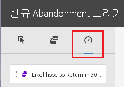

# Triggers

## 트리거 개요 {#topic_4F21FCE9A64E46E8B6D51F494FA652A7}

*트리거*&#x200B;를 통해 주요 소비자 행동을 식별, 정의 및 모니터링한 다음 교차 솔루션 커뮤니케이션을 생성하여 방문자를 다시 참여하도록 할 수 있습니다. 실시간 의사 결정 및 개인화에서 트리거를 사용할 수 있습니다.

* 장바구니 포기 또는 제품이 제거된 장바구니 포기에 대한 재마케팅의 신속한 구성
* 불완전한 양식 및 애플리케이션
* 사이트에서의 모든 작업 또는 작업 순서

**트리거 유형**

일반적으로 트리거는 마케팅 캠페인을 시작하는 데 15-90분 정도 걸릴 수 있습니다. 이것은 데이터 수집 구현, 파이프라인 로드, 정의된 트리거의 사용자 지정 구성 및 Adobe Campaign의 워크플로우에 따라 달라집니다.

* **포기:** 방문자가 제품을 보고 장바구니에 추가하지 않을 경우에 실행할 트리거를 만들 수 있습니다. [성향 점수](../activation/triggers.md#concept_A506150674AD45DB98D3CC07E560D334)를 구성하여 고객이 장바구니를 포기한 후 하지 않을 경향을 이해합니다.
* **작업:** 예를 들어 뉴스레터 등록, 이메일 구독 또는 신용 카드 신청(확인) 후에 실행할 트리거를 만들 수 있습니다. 유통업의 경우 회원 프로그램에 등록한 방문자를 대상으로 트리거를 만들 수 있습니다. 미디어 및 엔터테인먼트에서는 특정 프로그램을 시청하고 설문 조사에 응답하기를 원하는 방문자를 대상으로 트리거를 만들 수 있습니다.
* **세션 시작 및 세션 종료:** 세션 시작 및 세션 종료 이벤트에 대한 트리거를 만듭니다.

## Experience Cloud 트리거 만들기 {#task_821F37183AC045E5AC8EED20317598FE}

포기 트리거를 만들고 해당 트리거 및 성향 점수에 대한 조건을 구성합니다. 예를 들어, 장바구니 포기와 같은 지표 또는 제품 이름과 같은 차원과 같이, 방문 중의 트리거 규칙에 대한 기준을 지정할 수 있습니다. 규칙이 충족되면 트리거가 실행됩니다.

<!-- t_create-trigger.xml -->

>[!NOTE]
>
>현재 트리거는 100개로 기술적 제한이 있습니다.

1. Experience Cloud에서 을 클릭한 다음 **[!UICONTROL 활성화]**&#x200B;를 클릭합니다.
1. [!UICONTROL 트리거] 카드를 찾은 다음 **[!UICONTROL 시작]**&#x200B;을 클릭합니다.

   

1. **[!UICONTROL 새 트리거]**&#x200B;를 클릭한 다음 트리거 유형을 지정합니다.

   

1. 다음 필드를 작성하고 지표 및 차원 항목을 규칙 컨테이너로 드래그하여 트리거를 구성합니다. 

   | 요소 | 설명 |
   |--- |--- |
   | 이름 | 이 트리거의 이름입니다. |
   | 설명 | 사용하는 방식 등 트리거에 대한 설명입니다. |
   | 보고서 세트 | 이 트리거에서 사용하는 Analytics [보고서 세트](https://docs.adobe.com/content/help/en/analytics/implementation/analytics-basics/ref-reports-report-suites.html)입니다. 이 설정은 사용할 보고 데이터를 식별합니다. |
   | 포함 필수 방문 배제 필수 방문 작업 없음 이후의 트리거 메타데이터 포함 | 발생을 원하는 기준이나 방문자 행동과 발생을 원하지 않는 행동을 정의할 수 있습니다.  예를 들어, 다음과 같은 간단한 장바구니 포기 트리거를 만들 수 있습니다.<ul><li>포함 필수 방문: 장바구니 추가 수(지표) 및 존재함. (특정 제품 보기 또는 브라우저 유형과 같은 기준으로 규칙을 세분화할 수 있습니다.)</li><li>배제 필수 방문: 체크아웃</li><li>작업 없음 이후의 트리거: 10분</li><li>메타데이터 포함: 특정 캠페인 차원 또는 방문자 행동에 관련된 변수를 추가할 수 있습니다. 이 필드는 정확한 재마케팅 이메일을 만들기 위해 Adobe Campaign에서 사용할 수 있습니다.</li></ul> 규칙에 중요한 기준에 따라 컨테이너 내에 또는 컨테이너 간에 Any, And 또는 Or 로직을 지정할 수 있습니다. |
   | 컨테이너 | 컨테이너는 트리거를 정의하는 규칙, 조건 또는 필터를 설정하고 저장하는 위치입니다. 동시에 발생하기를 원하는 이벤트의 경우, 동일한 컨테이너에 있어야 합니다. 각 컨테이너는 히트 수준에서 독립적으로 처리됩니다.  예를 들어 AND 연산자로 두 개의 컨테이너가 연결된 경우 두 개의 히트 수가 요구 사항을 충족하면 규칙이 유효할 수 있습니다. |
   | 후에 새로운 세션 시작 | 세션 시작 및 세션 종료 이벤트에 대한 트리거를 만듭니다. |

1. (선택 사항) 포기 트리거에서 [성향 점수](../activation/triggers.md#concept_A506150674AD45DB98D3CC07E560D334)를 적용할 수 있습니다.

   

1. **[!UICONTROL 저장을 클릭합니다]**.
1. Use triggers for [real-time remarketing](https://docs.campaign.adobe.com/doc/standard/en/EMA_Transactional_messaging_Marketing_Cloud_Triggers.html) in [!DNL Adobe Campaign].

### 예제 트리거

**장바구니 포기 트리거**

예를 들어 다음 페이지에서는 방문 중에 본 제품들에 기반한 장바구니 포기 트리거를 사용할 수 있는 규칙을 보여줍니다.

**레퍼러 트리거**

다음 트리거는 제품이 남성용 부츠이고 레퍼러가 Facebook인 히트일 때 동작합니다. 두 개의 기준( *제품* 및 *레퍼러*)은 동일한 히트에서 평가될 수 있도록, 동일한 컨테이너에 추가되어야 합니다.

## 성향 점수 {#concept_A506150674AD45DB98D3CC07E560D334}

<!-- propensity-scoring.xml -->

장바구니를 포기한 다음 되돌아오는 고객의 추세를 이해합니다. 성향 점수는 Experience Cloud 트리거에 빌드되어 있으며 포기 트리거에 사용할 수 있습니다.

예를 들어, 일부 고객은 이메일 인센티브를 활용하기 위해 장바구니를 포기하고 장바구니로 되돌아옵니다. 매출액 손실 감소를 위해 성향 점수 알고리즘은 인센티브 없이 돌아오지 않을 가능성이 높은, 관련된 장바구니 포기 고객을 식별하는 데 도움이 됩니다.

다음을 수행할 수 있습니다.

* 고객을 재마케팅에 과다 노출시키지 않도록 합니다.
* 올바른 장바구니 포기 고객을 식별하고 해당 고객의 활동을 올바른 메시지로 매핑합니다.
* 돌아올 고객과 돌아오지 않을 고객을 식별하여 매출액을 올립니다.

## 성향 점수의 가치 {#section_CA99874A25434CC0BF01D0DA61608889}

데이터 검색을 수행하여 데이터에 걸쳐 존재하는 숨겨진 행동이나 패턴을 식별할 수 있습니다. 특히, 성향 점수는 단순 세그멘테이션이나 필터링보다 더 집중되고 객관적인 수단을 사용하여 유사한 고객 클러스터를 식별하는 데 도움이 됩니다. 또한, 성향 점수를 통해 가치가 높은 고객의 행동을 식별할 수 있는 예측 능력을 갖출 수 있습니다.

가치가 높은 대상을 식별하게 되면 최대의 효과를 위해 해당 고객들과 참여할 수 있습니다. 예를 들어, B2B 기업의 경우 가망 고객 판매 전화를 실시하여 리드를 평가하고 오프라인 전환 가능성을 식별할 수 있습니다. 모든 리드는 비용 증가를 수반하므로 매출 전환 가능성이 가장 큰 잠재고객을 식별하는 인센티브를 만드는 것이 가장 효과적이며 리소스에 집중할 수 있는 가장 저비용의 방법입니다.

성향 점수를 통해 특정 점수의 예측이나 이벤트 발생 가능성을 높이는 요인을 식별할 수 있지만, 다음과 같은 특정 질문에도 적용할 수 있습니다.

* 고객이 전환될 것인가?
* 고객이 이메일 반응할 것인가?
* 고객이 재구매할 것인가?

성향 점수를 통해 이러한 질문에 답할 수 있으며 설정 및 평가할 수 있는 행동에 대한 의향을 가진 고객을 식별할 수 있습니다.
