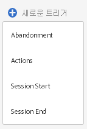
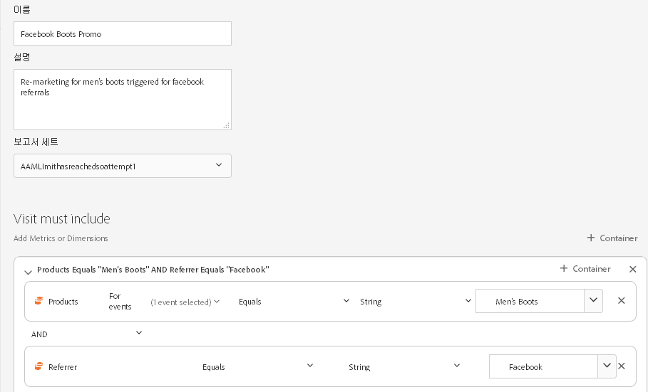

# Triggers

## 트리거 개요 {#topic_4F21FCE9A64E46E8B6D51F494FA652A7}

트리거를 사용하면 주요 소비자 행동을 식별, 정의 및 모니터링한 다음 솔루션 간 커뮤니케이션을 생성하여 방문자의 재참여를 유도할 수 있습니다. 실시간 의사 결정 및 개인화에 트리거를 사용할 수 있습니다.

* 제품을 제거한 장바구니 포기 또는 장바구니 포기에 대한 빠른 재마케팅 구성
* 불완전한 양식 및 애플리케이션
* 사이트의 모든 작업 또는 작업 순서

### 트리거 유형

일반적으로 트리거는 마케팅 캠페인을 시작하는 데 15-90분 정도 걸릴 수 있습니다. 이것은 데이터 수집 구현, 파이프라인 로드, 정의된 트리거의 사용자 지정 구성 및 Adobe Campaign의 워크플로우에 따라 달라집니다.

* **포기:** 방문자가 제품을 보고 장바구니에 추가하지 않을 경우에 실행할 트리거를 만들 수 있습니다.
* **작업:** 예를 들어 뉴스레터 등록, 이메일 구독 또는 신용 카드(확인) 신청 후에 실행하는 트리거를 만들 수 있습니다. 소매업체의 경우 충성도 프로그램에 등록한 방문자에 대한 트리거를 만들 수 있습니다. 미디어 및 엔터테인먼트 업계에서는 특정 쇼를 시청하고 설문 조사에 응답하려는 방문자를 위한 트리거를 만듭니다.
* **세션 시작 및 세션 종료:** 세션 시작 및 세션 종료 이벤트에 대한 트리거를 만듭니다.

## Experience Cloud 트리거 만들기 {#task_821F37183AC045E5AC8EED20317598FE}

트리거를 만들고 트리거에 대한 조건을 구성합니다. 예를 들어 방문 중에 장바구니 포기와 같은 지표나 제품 이름과 같은 차원과 같은 트리거 규칙 기준을 지정할 수 있습니다. 규칙이 충족되면 트리거가 실행됩니다.

>[!NOTE]
>
>현재 트리거는 100개로 기술적 제한이 있습니다.

1. In the Experience Cloud, click , then click **[!UICONTROL Launch]**.
2. Locate the [!UICONTROL Triggers] card, then click **[!UICONTROL Manage Triggers]**.
3. **[!UICONTROL 새 트리거]**&#x200B;를 클릭한 다음 트리거 유형을 지정합니다.

   

4. 다음 필드를 작성하고 지표 및 차원 항목을 규칙 컨테이너로 드래그하여 트리거를 구성합니다. 

   | 요소 | 설명 |
   |--- |--- |
   | 이름 | 이 트리거의 친숙한 이름입니다. |
   | 설명 | 이 트리거에 대한 설명, 트리거 사용 방법 등 |
   | 보고서 세트 | 이 트리거에 사용된 Analytics [보고서](https://docs.adobe.com/content/help/en/analytics/implementation/analytics-basics/ref-reports-report-suites.html) 세트입니다. 이 설정은 사용할 보고 데이터를 식별합니다. |
   | Visit must include Visit must not include Trigger after no action Include meta data | 발생을 원하는 기준이나 방문자 행동과 발생을 원하지 않는 행동을 정의할 수 있습니다.  예를 들어, 다음과 같은 간단한 장바구니 포기 트리거를 만들 수 있습니다.<ul><li>포함 필수 방문: 장바구니 추가 수(지표) 및 존재함. (특정 제품 보기 또는 브라우저 유형과 같은 기준으로 규칙을 세분화할 수 있습니다.)</li><li>배제 필수 방문: 체크아웃</li><li>작업 없음 이후의 트리거: 10분</li><li>메타데이터 포함: 특정 캠페인 차원 또는 방문자 행동에 관련된 변수를 추가할 수 있습니다. 이 필드는 정확한 재마케팅 이메일을 만들기 위해 Adobe Campaign에서 사용할 수 있습니다.</li></ul> 규칙에 중요한 기준에 따라 컨테이너 내에 또는 컨테이너 간에 Any, And 또는 Or 로직을 지정할 수 있습니다. |
   | 컨테이너 | 컨테이너는 트리거를 정의하는 규칙, 조건 또는 필터를 설정하고 저장하는 곳입니다. 이벤트가 동시에 발생하려면 동일한 컨테이너에 넣습니다. 각 컨테이너는 히트 수준에서 독립적으로 처리됩니다.  예를 들어 AND 연산자로 두 개의 컨테이너가 연결된 경우 두 개의 히트 수가 요구 사항을 충족하면 규칙이 유효할 수 있습니다. |
   | 다음 시간 이후에 새 세션 시작 | 세션 시작 및 세션 종료 이벤트에 대한 트리거를 만듭니다. |

5. **[!UICONTROL 저장]**&#x200B;을 클릭합니다.
6. Use triggers for [real-time remarketing](https://docs.campaign.adobe.com/doc/standard/en/EMA_Transactional_messaging_Marketing_Cloud_Triggers.html) in [!DNL Adobe Campaign].

### 예제 트리거

Experience Cloud 트리거 예:

#### 장바구니 포기 트리거

예를 들어 다음 페이지에는 방문 중에 본 제품을 기준으로 장바구니 포기 트리거에 사용할 수 있는 규칙이 표시됩니다.

#### 레퍼러 트리거

다음 트리거는 히트가 남성화 제품 및 Facebook 레퍼러와 함께 들어올 때 발생합니다. For the two criteria (*products* and *referrer*) to be evaluated in the same hit, they should be added to the same container.

