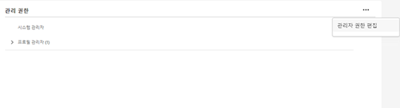
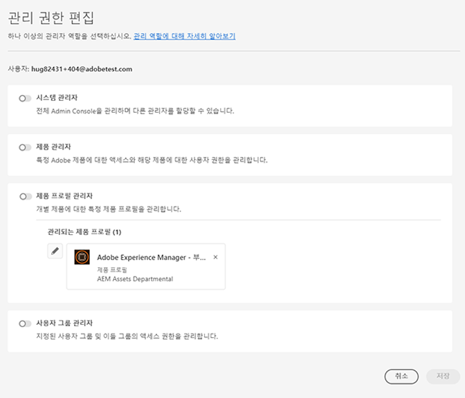

# Experience Cloud 사용자 및 제품 관리

Admin Console에 로그인, Experience Cloud 사용자 권한과 제품 프로필 관리 및 브라우저 지원 방법에 대해 알아봅니다.

>[!IMPORTANT]
>
>다음 정보는 특히 Experience Cloud 응용 프로그램에 대한 정보입니다. 이 정보는 [Enterprise Administration 사용 안내서](https://helpx.adobe.com/kr/enterprise/admin-guide.html)에 있는 모든 Adobe 클라우드 제품에 대한 더 광범위한 관리 정보를 보완합니다.

관리 도구에서 모든 Experience Cloud 사용자의 정렬 및 필터링 가능한 목록과 세부 정보를 볼 수 있습니다. [관리 도구에서 Experience Cloud 사용자 보기](admin-tool-experience-cloud.md)를 참조하십시오.

## 제품 프로필이란 무엇입니까? {#section_AB50558124D541CF80A0D3D76D35A4BF}

[!UICONTROL 제품 ] 프로필은 사용자에게 할당할 수 있는 제품 및 서비스 그룹입니다. Experience Cloud에서 권한은 사용자가 아니라 제품 프로필을 기반으로 합니다. (그러나 특정 사용자에게 관리 권한을 위임할 수 있습니다.)

예를 들어 Analytics에서 보고서 세트, 지표 및 차원과 함께 Analysis Workspace 및 Report Builder과 같은 보고 도구의 컬렉션을 구성할 수 있습니다. 프로필에 사용자를 추가하여 제품 프로필에 권한을 부여할 수 있습니다.

* 이 페이지에서.[제품 프로필에 Analytics 액세스 권한을 지정](../admin-getting-started/admin-getting-started.md#task_040673FE3E3E429B9531FBCB8B6A4391)을 참조하십시오.
* 이 페이지에서 [사용자에게 관리자 역할 위임](#delegate-rights)을 참조하십시오

## Experience Cloud 제품 프로필 관리 {#task_16335111C52D40E9BAC73D0699584DBF}

제품 프로필을 만들어 권한 그룹에 할당할 수 있습니다.

사용자를 조직에 초대할 때 사용자에게 제품 및 제품 프로필에 대한 액세스 권한을 제공할 수 있습니다. 제한된 관리 권한을 사용자에게 위임할 수도 있습니다. 마찬가지로 사용자 그룹을 작성한 후, 제품 프로필에 액세스할 수 있는 그룹을 추가할 수 있습니다.

1. [Admin Console](https://adminconsole.adobe.com/enterprise/)에서 **[!UICONTROL 제품]**&#x200B;을 클릭합니다.
1. 조직 이름을 클릭합니다.
1. **[!UICONTROL 새 프로필]**&#x200B;을 클릭합니다.
1. 프로필 세부 사항을 구성한 다음 **[!UICONTROL 저장]**&#x200B;을 클릭합니다.

자세한 내용(및 Creative Cloud 및 Document Cloud 제품 관리에 대한 도움말을 보려면 [관리 사용 안내서](https://helpx.adobe.com/enterprise/admin-guide.html/enterprise/using/users.ug.html)에서 [Identity](https://helpx.adobe.com/enterprise/admin-guide.html/enterprise/using/identity.ug.html) 를 참조하십시오.

**관련 도움말**

* [관리 사용 ](https://helpx.adobe.com/enterprise/admin-guide.html/enterprise/using/manage-products.ug.html) 안내서에서 제품 및 프로필을 관리합니다.
* 자세한 내용은 Target 도움말의 [Enterprise 사용자 권한](https://experienceleague.adobe.com/docs/target/using/administer/manage-users/enterprise/property-channel.html?lang=en)을 참조하십시오.
* 비디오: [Adobe Admin Console에서 Adobe Target 작업 공간을 구성하는 방법](https://helpx.adobe.com/kr/target/kb/how-to-configure-target-workspaces-in-adobe-admin-console0.html)

<!-- ## What's new in Experience Cloud user management {#concept_06A0A13362F644FB90F947238407637A}

Learn about the latest features in Experience Cloud user and product management.

### Business ID type

Adobe is introducing an identity type called Business ID. This identity type improves the control of user and product management. Adobe is migrating all Adobe IDs (owned by individuals) that are used for business to the new enterprise Business IDs owned by your organization.

If you are an existing Experience Cloud customer, Adobe will migrate all your users with Adobe IDs in the Admin Console to Business IDs. If you are a new enterprise or teams customer, you will add users to the Admin Console using one of the available identity types: Business ID, Enterprise ID, or Federated ID.

What to do

* Your users will need to accept Terms of Use (TOU) changes prior to accounts being migrated to Type2e. 
* Users that belong to multiple organizations might see a Profile Selection screen during the login workflow and need to select the correct one. This ensures that they are logging into the correct organization. (There might be multiple profiles to choose from if a user was a member of multiple organizations before the migration.)

Beginning May 2020, enterprise administrators cannot use the Adobe ID for new organizations created in the Admin Console. Latest: https://wiki.corp.adobe.com/pages/viewpage.action?spaceKey=engage&title=Type2e+DX+GTM-->

## 사용자에게 관리자 역할 위임 {#delegate-rights}

Admin Console에서 조직의 다른 사용자에게 제한된 관리 권한을 위임할 수 있습니다. 위임된 역할을 통해 사용자는 최종 사용자에 대한 소프트웨어 액세스를 관리하고, 액세스 배포 기능을 제공하고, 지원 위임자 역할을 할 수 있습니다.

예를 들어 다음 작업을 수행할 수 있습니다.

* 제작 감독이 Creative Cloud에 대한 액세스 권한을 부여하도록 할 수 있습니다.
* 마케팅 관리자가 Experience Cloud에 대한 액세스 권한을 부여하도록 할 수 있습니다.
* 이러한 두 역할이 서로의 역할을 넘지 않도록 구분합니다.

이러한 역할을 사용하면 필요 이상으로 더 많은 기능을 제공하지 않고 다른 사람에게 관리를 동시에 위임할 수 있습니다.

1. Admin Console에서 **[!UICONTROL 사용자]**&#x200B;를 클릭한 다음 사용자 이름을 클릭합니다.

   

1. **[!UICONTROL 관리 권한 편집]**&#x200B;을 클릭합니다.

   

1. 사용자의 관리 권한을 지정합니다.
1. **[!UICONTROL 저장]**&#x200B;을 클릭합니다.

## Analytics 사용자 및 제품 관리 {#section_97DE101F92CD494AB073893680992F1A}

Analytics 보고서 액세스 권한(보고서 세트, 지표, 차원 등)을 제품 프로필에 할당할 수 있습니다.

예를 들어 여러 Analytics 도구([!UICONTROL Analysis Workspace], [!UICONTROL Reports &amp; Analytics] 및 [!UICONTROL Report Builder])를 포함하는 제품 프로필을 만들 수 있습니다. 이러한 프로필에는 특정 지표 및 차원(eVar 포함)에 대한 권한 및 세그먼트나 계산된 지표 생성과 같은 기능이 포함되어 있습니다.

1. [Admin Console](https://adminconsole.adobe.com/enterprise)에 로그인한 다음 **[!UICONTROL 제품]**&#x200B;을 클릭합니다.
1. [!UICONTROL 제품] 페이지에서 제품을 클릭한 다음 **[!UICONTROL 권한]**&#x200B;을 클릭합니다(관리자에게만 사용 가능).
1. 프로필의 권한 구성:

| 요소 | 설명 |
|--- |--- |
| 보고서 세트 | 특정 보고서 세트에 대한 권한을 사용하도록 설정합니다. |
| 지표 | 트래픽, 전환, 사용자 지정 이벤트, 솔루션 이벤트, 컨텐츠 인식 등에 대한 권한을 활성화합니다. |
| 차원 | eVar, 트래픽 보고서, 솔루션 보고서 및 경로 보고서를 포함하여 세분된 수준에서 사용자 액세스를 사용자 지정합니다. |
| 보고서 세트 도구 | 웹 서비스, 보고서 세트 관리, 도구 및 보고서, 대시보드 항목에 대한 사용자 권한을 활성화합니다. |
| Analytics 도구 | 일반 항목(청구, 로그 등), 회사 관리, 도구, 웹 서비스 액세스, Report Builder 및 Data Connectors 통합에 대한 사용자 권한을 활성화합니다. 관리 콘솔 사용자 지정 카테고리의 회사 설정이 Analytics 도구로 이동되었습니다. |

<!-- **User Account Migration**

An Analytics user ID migration tool is available to help Analytics administrators migrate user accounts from Analytics User Management to the [Adobe Admin Console](https://adminconsole.adobe.com/enterprise/).

The account migration is being rolled out to customers in phases. Adobe will notify and assist you when it is your time to migrate existing user accounts from **[!UICONTROL Admin Tools]** > **[!UICONTROL User Management]** to the Admin Console.

After the migration, users sign in using their Adobe ID (or Enterprise ID) and authenticate to their Experience Cloud solutions and services at [experience.adobe.com](https://experience.adobe.com). If users attempt to sign in via legacy logins ([!DNL my.omniture.com], [!DNL sc.omniture.com] and [!DNL experiencecloud.adobe.com]) they are redirected to [!DNL experience.adobe.com].

**Related help**  -->

자세한 내용은 [Analytics 사용자 ID 마이그레이션](https://experienceleague.adobe.com/docs/analytics/admin/user-product-management/user-management/migrate-users/c-migration-tool.html?lang=en)을 참조하십시오.

## Adobe Target 관리 - 제품 프로필과 작업 공간 {#section_3860AF177C9E4C7E9C390D36A414F353}

Adobe Target에서 작업 공간은 제품 프로필입니다. 이를 통해 조직에서는 특정 사용자 세트를 특정 속성 세트에 할당할 수 있습니다. 여러 가지 방식에서 작업 공간은 Adobe Analytics의 보고서 세트와 비슷합니다.

다음을 참조하십시오.

* [Enterprise 사용자 권한](https://experienceleague.adobe.com/docs/target/using/administer/manage-users/enterprise/property-channel.html?lang=en)
* [제품 및 프로필 관리](https://helpx.adobe.com/enterprise/admin-guide.html/enterprise/using/manage-products.ug.html)
* 비디오: [Adobe Admin Console에서 Adobe Target 작업 공간을 구성하는 방법](https://helpx.adobe.com/target/kb/how-to-configure-target-workspaces-in-adobe-admin-console0.html)

## Campaign 제품 프로필, 테넌트 및 보안 그룹 관리 {#section_09CDF75366444CF5810CF321B7C712F3}

Campaign의 *테넌트*&#x200B;는 Admin Console 제품 페이지에서 *제품*&#x200B;으로 표시됩니다.

*보안 그룹*&#x200B;은 제품 프로필로 표시됩니다.

보안 그룹과 보안 그룹에 사용자를 지정하는 것에 대한 자세한 내용은 [그룹 및 사용자 관리](https://experienceleague.adobe.com/docs/campaign-standard/using/administrating/users-and-security/managing-groups-and-users.html?lang=en)를 참조하십시오.

## Experience Platform 데이터 수집 관리(시작) {#section_F2DA6778DD2D48AA8F794041971EE6B1}

Experience Platform [!UICONTROL 데이터 수집]([!UICONTROL Launch])이 [!UICONTROL Admin Console]의 [!UICONTROL 제품] 페이지에 표시됩니다. Launch 제품 프로필에 다른 솔루션 및 서비스를 포함할 수 있습니다.

사용자를 [!UICONTROL Platform Launch]에 초대하고 사용자 역할과 권한을 할당합니다.

Admin Console의 사용자 권한 및 프로필에 권한 지정을 포함하여 Launch 관련 옵션 설정에 대한 자세한 내용은 [사용자 권한](https://experienceleague.adobe.com/docs/launch/using/admin/user-permissions.html?lang=ko-KR#admin) 을 참조하십시오.

## Experience Manager as a Cloud Service

Adobe Enterprise 고객은 Adobe [!UICONTROL Admin Console]에서 조직으로 표시됩니다. AEM(Experience Manager) 고객은 Adobe [!UICONTROL Admin Console]을 사용하여 Experience Manager에 대한 제품 권한 및 IMS 인증을 [!UICONTROL Cloud Service]로 관리할 수 있습니다.

[AEM as a Cloud Service를 위한 IMS 지원](https://experienceleague.adobe.com/docs/experience-manager-cloud-service/security/ims-support.html?lang=en)을 참조하십시오.

## Audience Manager {#section_C31E3FA8A1E14463B1B3E07235F1983C}

Audience Manager 사용자를 만들고 그룹에 지정합니다. 제한(트레이트, 세그먼트, 대상 및 [!DNL AlgoModel])을 볼 수도 있습니다.

Audience Manager 도움말의 [관리](https://experienceleague.adobe.com/docs/dtm/using/admin/users.html?lang=en)를 참조하십시오.

## Experience Cloud에서 지원되는 브라우저입니다

* [!DNL Microsoft® Edge] (Microsoft® [는 ](https://www.microsoft.com/en-us/WindowsForBusiness/End-of-IE-support) Internet Explorer 8, 9 및 10에 대한 지원을 종료했습니다. 따라서 Adobe은 이러한 버전의 Internet Explorer에 대해 보고된 문제는 수정하지 않습니다.)
* [!DNL Google Chrome]
* [!DNL Firefox]
* [!DNL Safari]
* [!DNL Opera]

**참고:**  Experience Cloud 인터페이스는 이러한 브라우저를 지원하지만 개별 애플리케이션은 모든 브라우저를 지원하지 않습니다. (예를 들어 [Analytics](https://experienceleague.adobe.com/docs/analytics/admin/sys-reqs.html?lang=en)는 [!DNL Opera]를 지원하지 않으며, [Adobe Target](https://experienceleague.adobe.com/docs/target/using/implement-target/before-implement/supported-browsers.html?lang=en)은 [!DNL Safari]를 지원하지 않습니다.)

### 솔루션 및 제품 요구 사항

* [Analytics](https://experienceleague.adobe.com/docs/analytics/admin/sys-reqs.html?lang=en)
* [Report Builder](https://experienceleague.adobe.com/docs/analytics/analyze/report-builder/report-builder-setup/system-requirements.html?lang=en)
* [Adobe Target](https://experienceleague.adobe.com/docs/target/using/implement-target/before-implement/supported-browsers.html?lang=en)
