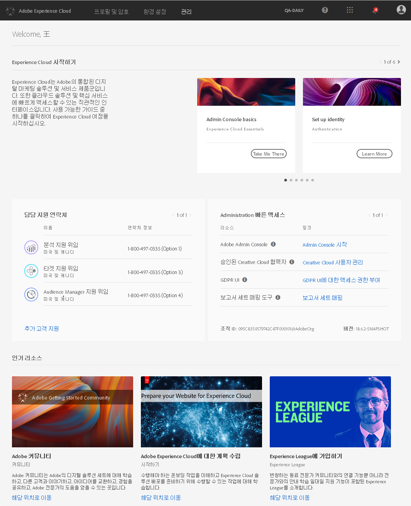
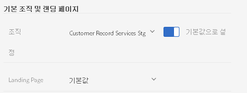
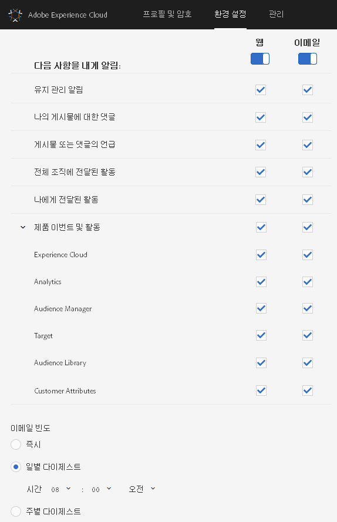

# 로그인 및 프로필 설정 관리

단일 솔루션에 로그인하지 않고 Experience Cloud에 로그인하면 사용자가 소유한 모든 솔루션 및 핵심 서비스에 단일 사인온을 사용할 수 있습니다. Experience Cloud에 로그인하고, 암호 및 알림을 관리하고, 기본 랜딩 페이지를 지정하는 방법을 알아봅니다.

<!-- t_sign_in.xml -->

<!-- notifications.xml -->

<!-- t_get_access.xml -->

>[!IMPORTANT]
>
>관리자는 [관리](../admin-getting-started/admin-getting-started.md#topic_3FCB4099640647E3B2411ADBFCE81909)에서 사용자 및 제품 관리 업데이트에 대한 정보를 참조하십시오.

## Experience Cloud에 로그인(관리자) {#task_034FC955031347F3B02B686A09801A08}

로그인한 다음 올바른 [조직](../admin-getting-started/organizations.md#topic_C31CB834F109465A82ED57FF0563B3F1)에 속해 있는지 확인하십시오.

1. Experience Cloud 풀다운 메뉴()를 클릭한 다음 **[!UICONTROL 관리]**&#x200B;를 클릭합니다.

   

   **[!UICONTROL 관리]** 링크가 표시되지 않으면 표시된 [조직](../admin-getting-started/organizations.md#topic_C31CB834F109465A82ED57FF0563B3F1)(이 예제의 경우 Adobe Corp)의 Experience Cloud 관리자가 아닌 것입니다. 관리자가 되는 것과 관련하여 지원이 필요한 경우 귀사의 고객 지원 또는 기존 Experience Cloud 관리자에게 문의하십시오.
1. **[!UICONTROL 관리]**&#x200B;를 클릭합니다.

   
1. 링크 중 하나를 클릭하여 계속하십시오. 

| 요소 | 설명 |
|--- |--- |
| [Admin Console 기본 사항](https://helpx.adobe.com/marketing-cloud/how-to/first-time-setup.html) | Experience Cloud 솔루션을 사용하여 시작하는 데 필요한 초기 단계에 대해 알아봅니다. |
| [ID 설정](https://helpx.adobe.com/enterprise/using/set-up-identity.html) | 최종 사용자를 인증할 ID 시스템을 정의하고 설정합니다. |
| [사용자 관리](https://helpx.adobe.com/enterprise/using/users.html) | Admin Console에 로그인 및 Experience Cloud 사용자 권한 및 제품 프로필 관리 방법에 대해 알아봅니다. |
| [Admin Console 시작](../admin-getting-started/admin-getting-started.md) | Admin Console은 전체 조직에서 Adobe 사용자 및 제품 자격을 관리하는 중앙 위치입니다. [직접 연결되는 링크](https://adminconsole.adobe.com)를 사용하여 Admin Console에 로그인할 수도 있습니다. |
| [Creative Cloud 사용자 관리](../experience-cloud-assets/t-admin-add-cc-user.md) | Experience Cloud Assets를 통해 마케터는 Creative Cloud를 사용하여 디자이너 및 다른 창의적인 자산과 폴더를 공유, 동기화 및 공동 작업할 수 있습니다. 여기서 조직과 공동 작업하도록 승인된 Creative Cloud 사용자를 관리할 수 있습니다. |
| [보고서 세트 매핑](../core-services/core-services.md) | (Analytics 전용) Experience Cloud 핵심 서비스는 개별 보고서 세트 대신 조직과 연결됩니다. 이러한 서비스가 올바르게 작동하도록 하려면 각 Analytics 보고서 세트를 조직에 매핑해야 합니다. (이 작업은 [핵심 서비스용 Analytics 활성화](../core-services/core-services.md#concept_07ED1D5C64234E77976E6D572E78FB9C)에 대한 광범위한 작업 과정의 일부입니다.) |
| [조직 ID](../admin-getting-started/organizations.md) | *조직 ID*&#x200B;는 관리 페이지의 맨 아래에 있습니다. 이 ID는 공급된 Experience Cloud 회사와 연관된 ID입니다. 이 ID는 24자의 영숫자 문자열과 @AdobeOrg(포함 필수)로 구성됩니다. |

## Experience Cloud에 로그인(사용자) {#task_1BFE87E20DCB44078CAC82F3CD44B985}

Experience Cloud에 로그인하는 관리자 이외의 사용자를 위한 도움말입니다.

1. [조직](../admin-getting-started/getting-started-experience-cloud.md#concept_384D169B0B724B799D573B8ECB5C39BF)이 Experience Cloud에서 프로비저닝되었는지 관리자에게 확인합니다.

1. [Adobe Experience Cloud](https://experiencecloud.adobe.com)([!DNL experiencecloud.adobe.com])로 이동합니다. 
1. **[!UICONTROL Adobe ID로 로그인]**&#x200B;을 클릭합니다.

   Experience Cloud 관리자가 계정 유형(Adobe ID 또는 Enterprise ID)을 확인하는 데 도움을 줄 수 있습니다.

1. 피드 페이지(또는 기본 랜딩 페이지)에서 선택기 아이콘 을 클릭하여 풀다운 메뉴에 액세스합니다.

   

   이 메뉴에 표시되는 솔루션 및 서비스는 [관리자](../admin-getting-started/admin-getting-started.md#topic_3FCB4099640647E3B2411ADBFCE81909)가 정의한 애플리케이션 권한에 따라 다릅니다.

## 기본 개인 계정 설정 구성 {#task_73CBCAE6C91749D19C95421E5AC311BA}

Experience Cloud에 로그인한 후 개인 세부 사항을 편집하고, 표시할 기본 [조직](../admin-getting-started/admin-getting-started.md#concept_705C626560A54CA2A4215F1C870C42B2) 및 랜딩 페이지를 지정할 수 있습니다.

1. Experience Cloud에 로그인한 다음, 프로필 아이콘을 클릭합니다.

   
1. **[!UICONTROL 프로필 편집]**&#x200B;을 클릭합니다.

   
1. 개인 정보를 계속 구성 및 편집한 후 **[!UICONTROL 변경 사항 저장]**&#x200B;을 클릭합니다.

## 알림 활성화 {#concept_0105453AD71847B8BFCAF4A40915F157}

시스템 업데이트, 유지 관리 알림, 게시물, 언급 및 공유된 자산에 대한 알림(전자 메일을 통해 또는 제품 내에서)을 받습니다. 고객 속성에 대한 업로드 상태를 포함하여 알림을 받으려는 제품 및 솔루션을 지정할 수도 있습니다.

알림으로 이동하려면 **[!UICONTROL 알림]** 아이콘 을 클릭한 다음 **[!UICONTROL 설정]** 아이콘 을 클릭합니다.

본인에게 중요한 메시지 유형을 기반으로 하여 알림 표시를 정렬하고 알림을 검색할 수 있습니다. 또한:

* 본인에게 중요한 메시지 유형별로 정렬합니다.
* 알림을 검색합니다.

**알림을 사용하도록 설정하려면**

<!-- 
 <b>Analytics</b> 
 
<ul id="ul_91BF597858124FA5BF338C36F6C5533F"> 
 <li id="li_FAD3E93CDE6242F58F14D55C8A6E23D7">Contribution analysis completed </li> 
 <li id="li_03D33D3228884CECA371B58656B2F3E7">Guided analysis shared </li> 
 <li id="li_DCF710F89317487B8DAA86CC05C694CA">Scheduled report failure </li> 
</ul> 

 <b>Target</b> 
 

Test started or stopped 
 

 <b>Media Optimizer</b> 
 

Performance alerts 
 

 <b>Dynamic Tag Manager</b> 
 
<ul id="ul_9ACDA418933E40918744D9C32A57DD4B"> 
 <li id="li_4DD0FFD3D9F84A428703611EF767D4D0">New web property created </li> 
 <li id="li_C6B923012E9D40BA91F4CBF7D2D72986">New user added </li> 
 <li id="li_EB0B9D1CFDE24E6987935CCCBFC7892A">Approvals - publishing and approval status for new rules, data elements, and tools </li> 
 <li id="li_17B0B176FF85435FB7EDD4317BC18201">Property has been published </li> 
</ul> -->

## 프로필 및 암호 관리 {#task_7B89F4F38E5A4C4EB0FF842953856382}

Experience Cloud 프로필을 편집하고 기본 조직 및 랜딩 페이지 등을 지정할 수 있습니다.

1. [Experience Cloud에 로그인](../admin-getting-started/getting-started-experience-cloud.md#task_1BFE87E20DCB44078CAC82F3CD44B985).

1. Experience Cloud 메뉴에서 프로필 사진을 클릭합니다.

   
1. **[!UICONTROL 프로필 편집]**&#x200B;을 클릭합니다.

   프로필 및 암호 페이지의 개인 세부 정보 아래의 필드 및 옵션을 작성합니다.

## 암호 복구 {#task_46541A2806164CB1A4AE8239604E4EB1}

1. 솔루션 로그인 페이지로 이동합니다.
1. **[!UICONTROL 암호 분실을 클릭합니다]**.

   솔루션 암호를 재설정하면 Experience Cloud에 대한 암호 연결 문제가 해결됩니다.

   Adobe Analytics 사용자의 경우 [https://sc2.omniture.com/password_recovery.html](https://sc2.omniture.com/password_recovery.html)로 이동합니다.

## 직접 연결되는 링크를 사용하여 솔루션 로그인 구성 {#concept_8BE493A08786469B88B210E13F78FF2F}

선택적으로, Experience Cloud 인터페이스에서 제공한 인증을 사용하여 솔루션의 특정 페이지에 로그인할 수 있습니다.

### URL 템플릿

`https://<tenantId>.experiencecloud.adobe.com/<solutionname>?destURL=<fullURL>`

샘플 URL:

`https://aem62tenant.experiencecloud.adobe.com/analytics?destURL=https%3A%2F%2Fsc.omniture.com%2Freports%2F11562.html`

>[!NOTE]
>
>URL을 `destURL` 매개 변수에 전달하기 전에 인코딩해야 합니다. (Encoder sites like [URL Decoder / Encoder](https://meyerweb.com/eric/tools/dencoder/) are available.)

| 매개 변수 | 설명 | 예 | 필수/선택적 |
|--- |--- |--- |--- |
| tenantId | 사용자가 로그인해야 하는 테넌트의 이름입니다. | aem62tenant | 선택 사항입니다 |
| destURL | 사용자가 이동해야 하는 위치의 전체 URL입니다. | https://sc.omniture.com/x/1_7xxzf | 선택 사항입니다 |
| solutionname | destURL 매개 변수의 소유자인 MAC 솔루션의 이름입니다. 사용자가 URL 소유자인 솔루션에 액세스할 수 있음을 확인하는 데 사용됩니다.  solutionname이 destURL 매개 변수와 동기화 상태임을 확인하는 것은 솔루션입니다.  예: URL에 solutionname이 소셜로 포함되어 있고 제공된 destURL이 Analytics URL인 경우, 사용자가 Analytics에 액세스할 수 없는 경우에도 이 URL로 리디렉션됩니다. MAC에서는 destURL의 소유자가 솔루션 이름과 동기화 상태인지 확인하지 않습니다. | analytics | destURL 매개 변수가 사용되는 경우 필수입니다. |
