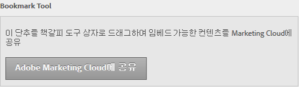

# 컨텐츠 포함

웹 페이지의 컨텐츠를 Experience Cloud에 포함할 수 있습니다.

[!UICONTROL 관리]에서 **[!UICONTROL Adobe Experience Cloud에 공유]단추를 브라우저의 책갈피 도구 모음으로 드래그합니다.**

포함된 컨텐츠(예로는 도움말 항목)를 지원하는 웹 페이지에 있는 경우, 도구 모음에서 **[!UICONTROL Adobe Experience Cloud에 공유]를 클릭합니다.**
