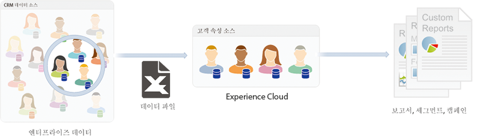

# 고객 속성 개요

**[!DNL Experience Platform]** > **[!UICONTROL 사용자]** > **[!UICONTROL 고객 속성]**&#x200B;으로 이동합니다.

CRM(고객 관계 관리) 데이터베이스에서 엔터프라이즈 고객 데이터를 캡처하는 경우, 이 데이터를 Experience Cloud의 고객 속성 데이터 소스에 업로드할 수 있습니다. 업로드했으면 [!DNL Adobe Analytics] 및 [!DNL Adobe Target]의 데이터를 활용합니다.

## 고객 속성을 업로드하기 위한 사전 요구 사항 {#section_BD38693AFBF34926BA28E964963B4EA0}

* **솔루션 지원:** [Experience Platform 서비스용 솔루션을 사용하도록 설정](../core-services/core-services.md#concept_07ED1D5C64234E77976E6D572E78FB9C)합니다.

* **그룹 멤버십:** 고객 속성 데이터를 업로드하려면 사용자가 [고객 속성 그룹](../admin-getting-started/admin-getting-started.md#task_3295A85536BF48899A1AB40D207E77E9)의 멤버여야 합니다. 또한 Adobe Analytics 그룹 또는 Adobe Target 그룹에 속해야 합니다.

   고객 속성에 액세스할 수 있는지 확인하려면 [!DNL Experience Cloud] 관리자가 [Experience Cloud](https://experience.adobe.com)에 로그인해야 합니다. **[!UICONTROL 관리]** > **[!UICONTROL Admin Console]** > **[!UICONTROL 제품]**&#x200B;으로 이동합니다. *고객 속성*&#x200B;이 [!UICONTROL 제품 프로필] 중 하나로 표시되면 작업을 시작할 수 있습니다.

   고객 속성에 추가된 사용자의 경우 Experience Cloud 인터페이스 왼쪽에 [!UICONTROL 고객 속성] 메뉴 항목이 표시됩니다.

* **Adobe Target** 고객 속성에 [!DNL at.js](임의 버전) 또는 [!DNL mbox.js] 버전 58 이상이 필요합니다.

   [at.js 배포 방법](https://docs.adobe.com/content/help/ko-KR/target/using/implement-target/client-side/deploy-at-js/how-to-deployatjs.html) 또는 [Mbox.js 구현](https://docs.adobe.com/content/help/ko-KR/target/using/implement-target/client-side/mbox-implement/mbox-download.html)을 참조하십시오.

## 엔터프라이즈 고객 데이터란? {#section_6F34C29F11414842AA57D2B1248FA3C6}

엔터프라이즈 데이터는 다른 시스템에 있습니다. 이 데이터는 복잡할 수 있고 사용자마다 다른 의미일 수 있습니다. 이 데이터에는 멤버십, 충성도 수준, 연령, 성별, 소유 제품, 관심사 및 라이프타임 값과 같은 정보가 포함될 수 있습니다.

다음 이미지는 멤버 ID, 권한 있는 제품, 가장 최근에 실행한 제품 등을 비롯한 제품에 대한 가입자 데이터를 나타내는 데이터 파일의 예입니다.

데이터 파일을 만든 후에 **[!UICONTROL Experience Cloud]** > **[!UICONTROL 고객 속성]**&#x200B;에서 만든 고객 속성 소스에 업로드할 수 있습니다.

이 워크플로우에 대한 자세한 내용은 [고객 속성 데이터 업로드](../attributes/t-crs-usecase.md#task_BCC327B2A0EF4A1BBB2934013AB92B78)를 참조하십시오.

## 솔루션 사용 사례 {#section_4E77650F6CEE4C4ABCD0B3221A5AE5D9}

데이터가 Experience Cloud에 있으면 사용자 정의하여, 보고, 세그멘테이션, 활동 및 캠페인을 위해 솔루션에 공유할 수 있습니다.

예:

| 솔루션 | 장점 및 사용 사례 |
|--- |--- |
| Adobe Analytics | 마케터와 분석가는 다음을 이해할 수 있습니다.<ul><li>Gold 수준 고객에게 가장 효과적인 온라인 캠페인.</li><li>Gold 수준 고객이 검색하는 제품과 Platinum 수준 고객이 검색하는 제품.</li><li>사이트 재디자인이 이전 고객의 전환율에 긍정적인 영향을 주고 있는지 여부.</li><li>낮은 라이프타임 값을 갖는 고객의 경우 내 사이트에서 나타내는 제품 검색 경향.</li></ul> |
| Adobe Target | 특성 데이터를 사용하면 Adobe Target 사용자가 다음을 수행할 수 있습니다.<ul><li>충성도 클럽 구성원에게 특별한 할인 및 특별 제공 서비스를 보여줍니다.</li><li>고급 상품을 선호하는 고객에게 고가의 제품을 권장합니다.</li><li>이미 이메일을 받는 고객의 경우 이메일 등록용으로 예약된 공간에 상향 판매 제공 서비스를 보여줍니다.</li></ul> |
