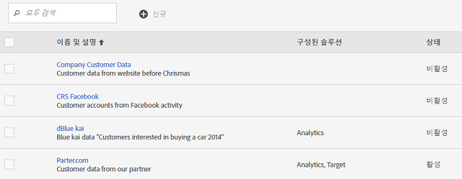
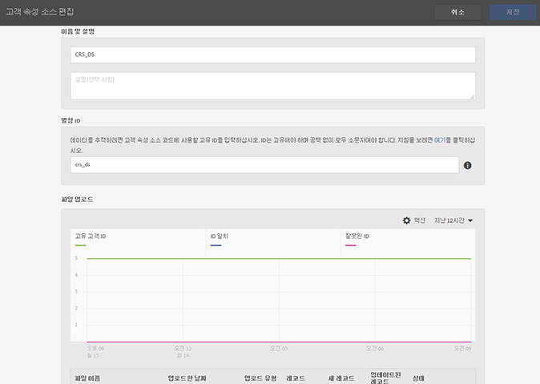
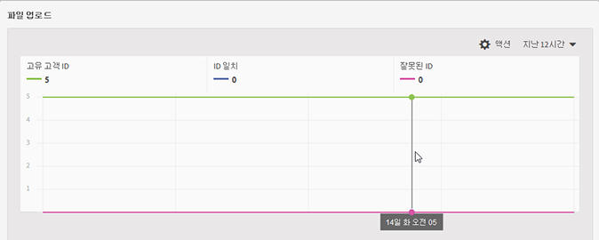
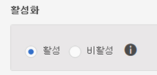

# 고객 속성 소스를 만들고 데이터 파일 업로드

고객 속성 소스(CSV 및 FIN 파일)를 생성하고 데이터를 업로드하십시오. 준비가 되면 데이터 소스를 활성화할 수도 있습니다. 데이터 소스가 활성화되면 속성 데이터를 Analytics 및 Target과 공유합니다.

## 고객 속성 워크플로우 {#concept_BF0AF88E9EF841219ED4D10754CD7154}


1. [데이터 파일 만들기](../attributes/t-crs-usecase.md#task_B5FB8C0649374C7A94C45DCF2878EA1A)
1. [속성 소스를 만들고 데이터 파일 업로드](../attributes/t-crs-usecase.md#task_09DAC0F2B76141E491721C1E679AABC8)
1. [스키마 유효성 검사](../attributes/t-crs-usecase.md#task_09DAC0F2B76141E491721C1E679AABC8)
1. [가입 구성 및 속성 소스 활성화](../attributes/t-crs-usecase.md#task_1ACA21198F0E46A897A320C244DFF6EA)


데이터 소스가 활성 상태가 되면 다음을 수행할 수 있습니다.

* [Adobe Analytics에서 고객 속성 사용 ](../attributes/t-crs-usecase.md#task_7EB0680540CE4B65911B2C779210915D)
* [Adobe Target에서 고객 속성 사용 ](../attributes/t-crs-usecase.md#task_FC5F9D9059114027B62DB9B1C7D9E257)


>[!IMPORTANT]
>
>이 기능에 액세스하려면 고객 속성 제품 프로필(고객 속성 - 기본 액세스)에 사용자를 지정해야 합니다. ( **[!UICONTROL 관리]** &gt; **[!UICONTROL Admin Console]** &gt; **[!UICONTROL 사용자]** &gt; ). 고객 속성 그룹에 추가된 사용자의 경우 Experience Cloud 인터페이스 왼쪽에 [!UICONTROL 대상]의 [!UICONTROL 고객 속성] 메뉴 항목이 표시됩니다.
>
>솔루션 그룹 멤버십도 필요합니다.

고객 속성 기능을 사용하려면 사용자가 사용자 관리의 Adobe 고객 속성 그룹 및 솔루션 레벨 그룹(Analytics 또는 Target)에 속해야 합니다.

[사용자 및 그룹](../admin-getting-started/admin-getting-started.md#task_3295A85536BF48899A1AB40D207E77E9)을 참조하십시오.

## 데이터 파일 만들기 {#task_B5FB8C0649374C7A94C45DCF2878EA1A}

이 데이터는 CRM에서 가져온 엔터프라이즈 고객 데이터입니다. 이 데이터에는 멤버 ID, 권한 있는 제품, 최근에 실행한 제품 등을 비롯하여 제품에 대한 가입자 데이터가 포함될 수 있습니다.


1. 웹 사이트에 있는 각각의 고유한 랜딩 위치에 대해 `.csv`.


   >[!NOTE]
   >
   >이 프로세스 뒷부분에서 `.csv`를 드래그 앤 드롭하여 파일을 업로드합니다. 하지만 [FTP를 통해 업로드](../attributes/t-upload-attributes-ftp.md#task_591C3B6733424718A62453D2F8ADF73B)하는 경우 `.fin`와 같은 이름의 `.csv` 파일도 필요합니다.


   샘플 엔터프라이즈 고객 데이터 파일:

   

1. 계속하기 전에 파일을 업로드하려면 [데이터 파일 요구 사항](../attributes/crs-data-file.md#concept_DE908F362DF24172BFEF48E1797DAF19)의 중요 정보를 검토하십시오.
1. 아래 설명된 대로 [고객 속성 소스를 만들고 데이터를 업로드](../attributes/t-crs-usecase.md#task_BCC327B2A0EF4A1BBB2934013AB92B78)합니다.

## 특성 소스를 만들고 데이터 파일 업로드 {#task_09DAC0F2B76141E491721C1E679AABC8}

Experience Cloud의 새 고객 속성 소스 만들기 페이지에서 이러한 단계를 수행합니다.


>[!IMPORTANT]
>
>고객 속성 소스를 만들거나, 수정하거나 삭제할 때, ID가 새 데이터 소스와의 동기화를 시작하기 전에 최대 한 시간이 지연됩니다. 고객 속성 소스를 만들거나 수정하려면 Audience Manager에 관리 권한이 있어야 합니다. 관리 권한을 얻으려면 Audience Manager 고객 지원 센터 또는 컨설팅 팀에 문의하십시오.


1. [!DNL Experience Cloud]에서 메뉴  아이콘을 클릭합니다.
1. **[!DNL Experience Platform]**&#x200B;에서 **[!UICONTROL 사람]** &gt; **[!UICONTROL 고객 속성]**&#x200B;을 클릭합니다.

   [!UICONTROL 고객 속성] 페이지에서 기존 특성 데이터 소스를 관리 및 편집할 수 있습니다.

   
1. **[!UICONTROL 새로 만들기]**&#x200B;를 클릭합니다.

   
1. [!UICONTROL 고객 속성 소스 편집] 페이지에서 다음 필드를 구성합니다.


   * **[!UICONTROL Name:]** 데이터 소성 소스의 이름입니다. [!DNL Adobe Target]의 경우, 속성 이름에는 공백을 포함할 수 없습니다. 공백이 있는 속성이 전달되면 [!DNL Target]이 이를 무시합니다. 지원되지 않는 다른 문자는 `< , >, ', "`입니다.

   * **[!UICONTROL Description:]** (선택 사항) 데이터 속성 소스에 대한 설명입니다.

   * **[!UICONTROL Alias ID:]** 특정 CRM 시스템과 같은 고객 속성 데이터의 소스를 나타냅니다. 고객 속성 소스 코드에 사용되는 고유한 ID입니다. ID는 고유해야 하고 공백 없는 소문자로 이루어져야 합니다. Experience Cloud UI에서 고객 속성 소스에 대한 별칭 ID 필드에 입력한 값은 구현(모바일 SDK의 Dynamic Tag Management 또는 JavaScript를 통해 구현)에서 전달되는 값과 일치해야 합니다.

      별칭 ID는 추가 고객 ID 값을 설정하는 특정 영역에 해당합니다. 예:

      * **** 다이내믹 태그 관리:별칭 ID는 Experience Cloud ID 서비스 *도구의 고객 설정* 아래에 [!UICONTROL 있는]통합 코드 [값에 해당합니다](https://marketing.adobe.com/resources/help/en_US/dtm/?f=macid) .

      * **방문자 API:**&#x200B;별칭 ID는 각 방문자에게 연결할 수 있는 [고객 ID](https://marketing.adobe.com/resources/help/en_US/mcvid/?f=mcvid_customer_ids)에 해당합니다.

         예를 들어 *"crm_id"*:


         ```
         "crm_id":"67312378756723456"
         ```


      * **** iOS:별칭 ID는 visitorSyncIdentifiers:identifiers의 *"idType"* 에 [해당합니다](https://marketing.adobe.com/resources/help/en_US/mobile/ios/?f=methods).

         예:

         `[ADBMobile visitorSyncIdentifiers:@{@<`**`"idType"`**`:@"idValue"}];`


      * **Android:** 별칭 ID는 syncIdentifiers의 *"idType"*[을 참조하십시오](https://marketing.adobe.com/resources/help/en_US/mobile/android/?f=methods).

         예:

         `identifiers.put(`**`"idType"`**`, "idValue");`

         별칭 ID 필드 및 고객 ID와 관련된 데이터 처리에 대한 자세한 내용은 [여러 데이터 소스 활용](../attributes/crs-data-file.md#section_76DEB6001C614F4DB8BCC3E5D05088CB)을 참조하십시오.
   * **[!UICONTROL File Upload:]** `.csv` 데이터 파일을 드래그 앤 드롭하거나 FTP를 통해 데이터를 업로드할 수 있습니다. (FTP를 사용하려면 `.fin` 파일도 필요합니다.) [FTP를 통해 데이터 업로드](../attributes/t-upload-attributes-ftp.md#task_591C3B6733424718A62453D2F8ADF73B)를 참조하십시오.


      >[!IMPORTANT]
      >
      >특정 데이터 파일 요구 사항이 있습니다. 자세한 내용은 [데이터 파일 요구 사항](../attributes/crs-data-file.md#concept_DE908F362DF24172BFEF48E1797DAF19)을 참조하십시오.


      파일을 업로드한 후에는 이 페이지의 [!UICONTROL 파일 업로드] 제목 아래에 있는 표 데이터가 표시됩니다. 스키마의 유효성을 검사하거나, 가입을 구성하거나, FTP를 설정할 수 있습니다.


      **파일 업로드 그래픽**

      

   * **[!UICONTROL Unique Customer ID:]** 이 속성 소스에 업로드한 고유한 ID 수를 표시합니다.

   * **[!UICONTROL 고객 제공 ID가 Experience Cloud 방문자 ID로 별칭 지정됨:]** 몇 개의 ID가 Experience Cloud ID에 별칭이 지정되었는지 표시합니다.

   * **[!UICONTROL 별칭 개수가 많은 고객 제공 ID:]** 500개 이상의 별칭 지정된 Experience Cloud 방문자 ID가 있는 고객 제공 ID 개수를 표시합니다. 이러한 고객 제공 ID는 개인을 나타내기보다는 일종의 공유 로그인을 나타낼 수 있습니다. 시스템은 이러한 ID와 연결된 특성을 최근에 별칭으로 지정된 500개의 Experience Cloud 방문자 ID에 배포하며 별칭 수가 10,000개가 될 때까지 이 작업을 계속합니다. 이 수에 도달하면 시스템은 고객 제공 ID를 무효화하고 더 이상 연결된 속성을 배포하지 않습니다.


## 스키마 유효성 검사 {#task_404AAC411B0D4E129AB3AC8B7BE85859}

유효성 검사 프로세스를 사용하여 표시 이름 및 설명을 업로드된 속성(문자열, 정수, 숫자 등)에 매핑할 수 있습니다. 스키마를 업데이트하여 속성을 삭제할 수도 있습니다.

[스키마 유효성 검사](../attributes/validate-schema.md#concept_B3A01A15D04E4F998118E09B3A9B5043)를 참조하십시오.

속성을 삭제하려면 [(선택 사항) 스키마를 업데이트(속성 삭제)](../attributes/t-crs-usecase.md#task_6568898BB7C44A42ABFB86532B89063C)를 참조하십시오.

## (선택 사항) 스키마 업데이트(속성 삭제) {#task_6568898BB7C44A42ABFB86532B89063C}

스키마에서 속성을 삭제 및 교체하는 방법.


1. [!UICONTROL 고객 속성 소스 편집] 페이지에서 **[!UICONTROL Target]** 또는 **[!UICONTROL Analytics]** 가입([!UICONTROL 가입 구성] 아래)을 제거합니다.
1. [업데이트된 필드가 있는 새 데이터 파일을 업로드합니다](../attributes/t-crs-usecase.md#task_09DAC0F2B76141E491721C1E679AABC8).

## 가입 구성 및 속성 소스 활성화 {#task_1ACA21198F0E46A897A320C244DFF6EA}

가입을 구성하면 Experience Cloud와 솔루션 간에 데이터 흐름이 설정됩니다. 속성 소스를 활성화하면 데이터가 구독 중인 솔루션으로 유입될 수 있습니다. 업로드한 고객 레코드는 웹 사이트 또는 애플리케이션에서 들어오는 ID 신호와 대조됩니다.

[가입 구성](../attributes/subscription.md#concept_ECA3C44FA6D540C89CC04BA3C49E63BF)을 참조하십시오.

**속성 소스를 활성화하려면**

[!UICONTROL 고객 속성 소스 만들기 [또는] 고객 속성 소스 편집] 페이지에서 [!UICONTROL 활성화] 제목을 찾은 후 **[!UICONTROL 활성]**&#x200B;을 클릭합니다.



## Adobe Analytics에서 고객 속성 사용 {#task_7EB0680540CE4B65911B2C779210915D}

이제
<keyword>
Adobe Analytics
</keyword>와 같은 솔루션에서 사용 가능한 데이터로 마케팅 캠페인에서 데이터를 보고하고 분석하며 적절한 작업을 수행할 수 있습니다.

다음 예에서는 업로드한 속성에 따른 [!DNL Analytics] 세그먼트를 보여줍니다. 이 세그먼트는 최근에 실행한 제품이 Photoshop인 Photoshop Lightroom 가입자를 보여줍니다.


Experience Cloud에 게시한 세그먼트는 Experience Cloud 대상 및 Audience Manager에서 사용할 수 있습니다.

자세한 내용은 Analytics 도움말의 [고객 속성 보고서](https://marketing.adobe.com/resources/help/en_US/reference/?f=reports_customer_attributes)를 참조하십시오.

## Adobe Target에서 고객 속성 사용 {#task_FC5F9D9059114027B62DB9B1C7D9E257}

Target에서는 대상을 만들 때 방문자 프로필 섹션에서 고객 속성을 선택할 수 있습니다. 모든 고객 속성은 목록에 접두사 [!DNL crs.]을 갖게 됩니다. 필요에 따라 이러한 특성을 다른 데이터 특성과 결합하여 대상을 구성합니다.


Target 도움말의 [새 대상 만들기](https://marketing.adobe.com/resources/help/en_US/target/target/?f=t_creating_a_new_audience)를 참조하십시오.
