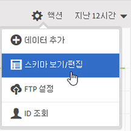
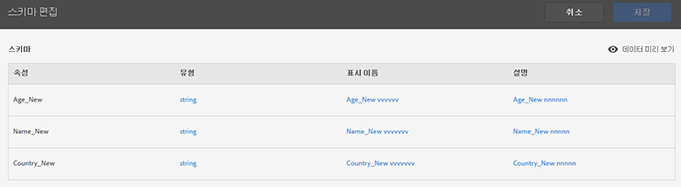

# 스키마 유효성 검사

유효성 검사 프로세스를 사용하여 표시 이름 및 설명을 업로드된 속성(문자열, 정수, 숫자 등)에 매핑할 수 있습니다. 스키마는 이러한 설정에 따라 만들어집니다. 이 스키마는 앞으로 이 데이터 소스로 업로드되는 모든 데이터의 유효성을 검사하는 데 사용됩니다. 이 매핑 프로세스 때문에 원본 데이터가 변경되지는 않습니다.

>[!NOTE]
>
>유효성 검사 후 스키마를 업데이트하면 고객 속성이 삭제됩니다. [스키마 업데이트(속성 삭제)](../attributes/t-crs-usecase.md#task_6568898BB7C44A42ABFB86532B89063C)를 참조하십시오.

**[!UICONTROL 고객 속성 소스]** &gt; **[!UICONTROL 새 고객 속성 소스 만들기]** &gt; **[!UICONTROL 스키마 보기/편집]**

[!UICONTROL 스키마 유효성 확인] 페이지에서 각 스키마 행은 업로드된 CSV 파일의 열을 나타냅니다.

* **[!UICONTROL 데이터 추가:]** 새 속성 데이터를 이 데이터 소스에 업로드합니다.

* **[!UICONTROL 스키마 보기/편집:]** 다음 단계에 설명된 대로 표시 이름을 속성 데이터에 매핑합니다.

* **[!UICONTROL FTP 설정:]** [FTP를 통해 데이터를 업로드합니다](../attributes/t-upload-attributes-ftp.md#task_591C3B6733424718A62453D2F8ADF73B).

* **[!UICONTROL ID 조회:]** `.csv`의 CID(고객 ID)를 입력하여 해당 ID에 대한 Experience Cloud 정보를 조회합니다. 이 기능은 방문자에 대한 특성 데이터가 표시되지 않는 문제를 해결하는 데 유용합니다.

   * **[!UICONTROL MCID(Experience Cloud ID):]** 최신 Experience Cloud ID 서비스를 사용하는 경우에 표시됩니다. MCID 서비스를 사용하고 있지만 ID가 표시되지 않는 경우 Experience Cloud가 해당 CID에 대한 별칭을 수신하지 못한 것입니다. 방문자가 로그인되어 있지 않거나 해당 ID가 구현되지 않은 것입니다.

   * **[!UICONTROL CID(Customer ID):]** 이 CID와 연결된 속성입니다. prop 또는 eVar을 사용하여 CID(AVID)를 업로드하며 속성은 표시되지만 AVID는 표시되지 않는 경우 방문자가 사이트에 로그인되어 있지 않은 것입니다.

   * **[!UICONTROL AVID(Analytics visitor ID):]** prop 또는 eVar을 사용하여 CID를 업로드하는 경우에 표시됩니다. 그러한 ID가 Experience Cloud로 전달되면 입력한 CID와 연결된 모든 방문자 ID가 여기에 표시됩니다.

Experience Cloud에서 고객 속성 소스 및 FTP 계정을 만든 후에 FTP를 통해 데이터를 업로드할 수도 있습니다. 속성 소스당 FTP 계정을 1개 만듭니다. 업로드한 파일은 해당 계정의 루트 폴더에 저장됩니다. 데이터는 .csv 형식이어야 하며 업로드가 완료되었음을 나타내는 .fin 파일도 있어야 합니다.

문자열, 정수 및 숫자에 적용하는 이름은 [!DNL Analytics] 지표를 만드는 데 사용됩니다. 자세한 내용은 도움말의 [고객 속성 보고서](https://marketing.adobe.com/resources/help/en_US/reference/?f=reports_customer_attributes)를 참조하십시오.[!DNL Analytics]

* **[!UICONTROL 속성:]** 업로드한 `.csv` 파일에서 읽어오는 속성 데이터입니다.

* **[!UICONTROL 유형:]** 다음과 같은 데이터 유형:

   * **문자열:** 일련의 문자들.

   * **정수:** 범자연수.

   * **숫자:** 최대 2개의 소수 자리를 가질 수 있습니다.

* **[!UICONTROL 이름 표시:]** 속성의 이름입니다. 예를 들어, 속성 *customer age*&#x200B;를 *Customer Since*&#x200B;로 변경할 수 있습니다.

* **[!UICONTROL 설명:]** 속성에 대한 설명입니다.

