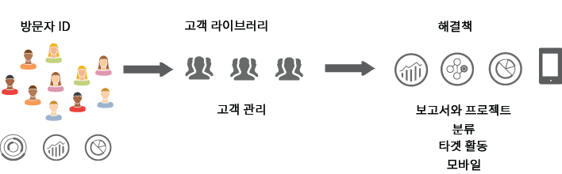
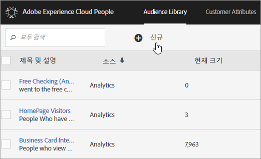

# Experience Cloud Audiences {#topic_679810123CAA4E0CA4FA3417FB0100C7}

다음 [!DNL Audience Library] 은 Experience Cloud에 대상을 표시합니다. 대상은 방문자의 컬렉션입니다(목록). [!DNL Experience Cloud] ID). 방문자 데이터를 대상자 세분화로 변환하는 작업을 관리할 수 있습니다. 따라서 대상을 만들고 관리하는 것은 세그먼트를 만들고 사용하는 것과 비슷합니다. 대상 세그먼트를 제품 및 서비스에 공유할 수도 있습니다 [!DNL Experience Cloud].

다음과 같은 다양한 소스에서 대상을 만들거나 파생할 수 있습니다.

* [!DNL Experience Cloud]에서 대상을 새로 만드는 경우
* [!DNL Analytics] 세그먼트를 [!DNL Experience Cloud]에 게시
* [!DNL Audience Manager]

**실시간 및 기존 대상**

실시간 타기팅 사용 사례를 파악하기 위해 소스에 관계없이 모든 대상에 액세스할 수 있습니다. 하지만 Analytics에서 Audience Manager로 공유한 대상은 실시간 타기팅에 액세스할 수 없습니다. 시스템은 다음과 같은 두 가지 방식으로 대상을 평가합니다.

* Analytics에서 가져온 기존 대상은 4시간마다 평가됩니다. 처리 및 공유에 걸리는 총 시간은 최대 8시간입니다. 기존 대상에는 항상 재방문자가 포함됩니다.
* 실시간 대상은 Experience Cloud 대상에서 공급되고 실시간으로 평가됩니다.

## 애플리케이션에서 대상이 사용되는 방식 {#concept_01EB9345C5344597BC94A864EDD38EE1}

다음 표에서는 Experience Cloud 애플리케이션에서 대상이 어떻게 사용되는지에 대해 설명합니다.

| 솔루션 | 설명 |
|--- |--- |
| Experience Cloud Audiences | 를 사용하여 대상을 기본적으로 만들고, 관리하고, 공유합니다. [[!DNL Audience Library]](audience-library.md). 다음을 수행할 수 있습니다.<ul><li>원시 분석 속성을 사용하여 실시간 대상 사용</li><li>대상을 조합하여 복합 대상을 만들고 실시간 및 내역 데이터 연결</li><li>예상되는 대상 크기의 그래픽 보기 참조</li></ul> 만들려는 대상 유형에 대한 추천 사항은 을 참조하십시오. [대상자 만들기 옵션](https://experienceleague.adobe.com/docs/experience-cloud-kcs/kbarticles/KA-16471.html?lang=ko-KR). |
| Analytics | 세그멘테이션에서 세그먼트를 빌드하여 보고서 세트와 함께 결합한 다음 세그먼트를 Experience Cloud에 게시할 수 있습니다. 세그먼트를 게시하면 [!DNL Audience Library] Experience Cloud의 페이지. (참조: [Experience Cloud에 세그먼트 게시](https://experienceleague.adobe.com/docs/analytics/components/segmentation/segmentation-workflow/seg-publish.html?lang=ko-KR) 위치: [!DNL Analytics] 자세한 내용은 도움말을 참조하십시오.) 대상자는에서 제공하는 캠페인 경험의 타겟팅된 대상자로도 사용할 수 있습니다. [!DNL Adobe Target], 및 [!DNL Audience Manager]. 대상을 공유한 후 [!DNL Adobe Analytics]을 누르고 활성 캠페인에 사용하도록 선택하면 지난 90일 동안 세그먼트 정의 기준을 충족한 방문자 프로필이 다음으로 전송됩니다. [!UICONTROL Audience Services]. 공유 대상에 대한 제한이 75개로 늘어났습니다. 다음에서 Experience Cloud으로 공유된 대상자: [!DNL Analytics] 은(는) 2천만 명의 고유 구성원을 초과할 수 없습니다. 또한 캐싱으로 인해, Analytics에서 삭제된 보고서 세트는 삭제가 Experience Cloud에 표시되는 데 12시간이 필요합니다. |
| Mobile Services | [!UICONTROL 디바이스 유형] 보고서의 썬버스트 시각화 기능을 사용하여 모바일 트래픽을 분석합니다. |
| [!DNL Target] | [ID 서비스](https://experienceleague.adobe.com/docs/id-service/using/home.html?lang=ko-KR)는 방문자 ID 및 데이터를 여러 애플리케이션에서 사용하기 위해 실행 가능한 하나의 프로필에 통합합니다. 다음 [Experience Cloud에 게시](audience-library.md) Adobe Analytics의 세그먼트 작성 프로세스 동안 확인란을 선택하면 Adobe Target의 사용자 지정 대상 라이브러리 내에서 세그먼트를 사용할 수 있습니다. 다음에서 생성된 세그먼트 [!DNL Analytics] 또는 [!DNL Audience Manager] 은 의 활동에 사용할 수 있습니다. [!DNL Target]. 예를 들어 [!DNL Analytics]에서 만들어진 대상 세그먼트 및 [!DNL Analytics] 전환 지표에 따라 캠페인 활동을 만들 수 있습니다. |
| [!DNL Audience Manager] | 공유 대상은에서 사용할 수 있습니다. [!DNL Audience Manager] 세그먼테이션. 모든 Experience Cloud 대상은에서 기본적으로 사용할 수 있습니다 [!DNL Audience Manager], 이는 다음을 제공합니다.<ul><li>내장된 자동화(애플리케이션 워크플로에서 공유 및 소비되는 방식에 관계없음)</li><li>오프사이트 대상</li><li>유사 잠재고객 모델링</li></ul> |
| Campaign | <ul><li>다양한 Adobe Experience Cloud 애플리케이션의 공유 대상을 Adobe Campaign에 가져오기.</li><li>공유 대상의 양식에서 받는 사람 목록 내보내기. 이러한 공유 대상은 사용하는 여러 Adobe Experience Cloud 애플리케이션에서 사용할 수 있습니다.</li></ul> |
| Advertising Cloud | 대상을 타겟으로 사용합니다. |

{style="table-layout:auto"}

>[!IMPORTANT]
>
>방문자가 Analytics에서 공유한 대상 자격을 얻으면 4~8시간이 지연된 후에 [!DNL Target], Ad Cloud 및 Campaign Standard에서 정보를 실행할 수 있습니다.

## 추가 도움말 - 질문, 지침 및 사용 사례 {#section_C7F151644D8A45F7B6FC54F58845635D}

| 도움말 | 리소스 |
|--- |--- |
| 대상을 찾을 수 없습니까? | 프로비저닝되었는지 확인합니다. [시작하기 - 핵심 서비스용 애플리케이션을 사용하도록 설정](core-services.md)을 참조하십시오. 프로필 및 대상(통합 프로비저닝 양식)에 대한 액세스를 요청하려면 [여기](https://adobe.allegiancetech.com/cgi-bin/qwebcorporate.dll?idx=X8SVES)로 이동합니다. |
| 포럼 | [대상 포럼](https://experienceleaguecommunities.adobe.com/t5/Adobe-Experience-Cloud-Audiences/ct-p/experience-cloud-audiences-community)은 대상 관련 지원을 받을 수 있는 또 다른 리소스입니다. |

{style="table-layout:auto"}

## 대상 라이브러리 인터페이스 요소 {#section_D04ACEF61CEF4B189AE6BA9F40D0DBF4}

[!DNL Experience Cloud]는 기본적인 실시간 대상 식별을 사용하여 대상을 만들고 관리하기 위한 라이브러리를 제공합니다.

**[!UICONTROL Experience Cloud]** > **[!UICONTROL Experience Platform]** > **[!UICONTROL 사용자]** > **[!UICONTROL 대상 라이브러리]**

| 요소 | 설명 |
|--- |--- |
| 신규 | [대상자 만들기](audience-library.md). |
| 제목 및 설명 | 대상을 식별하고 설명하는 열 머리글입니다. |
| 작성자 | 대상 세그먼트를 만든 사용자입니다. |
| 소스 | 대상이 만들어진 위치를 식별합니다.<ul><li>**분석:** Adobe Analytics에서 만든 다음 [Experience Cloud에 게시됨](audience-library.md).</li><li>**Experience Cloud:** [Experience Cloud Audiences에서 생성된](audience-library.md) 새 대상입니다.</li><li>**Audience Manager:** Audience Manager에서 생성된 대상은 Experience Cloud 대상에 자동으로 표시됩니다.</li></ul> |
| 현재 크기 | 현재 대상 크기입니다. |
| 활성 | 세그먼트의 활성 상태입니다. |

{style="table-layout:auto"}
