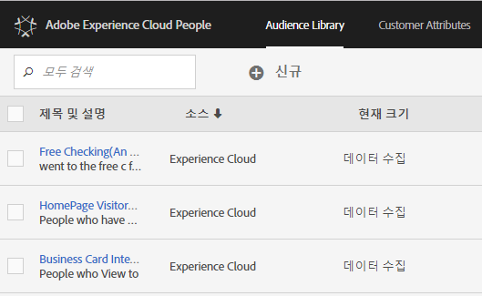

# 대상자{#topic_679810123CAA4E0CA4FA3417FB0100C7}

대상은 방문자 모음입니다(방문자 ID 목록). Adobe 고객 서비스는 방문자 데이터를 고객 세그먼테이션으로 변환하는 작업을 관리합니다. 이와 같이 대상을 만들고 관리하는 작업은 세그먼트를 만들고 사용하는 것과 비슷하며, [!DNL Experience Cloud]에 대상 세그먼트를 공유하는 기능이 추가되었다고 생각하면 됩니다.

다음과 같은 다양한 소스에서 대상을 만들거나 파생할 수 있습니다. 

* [!DNL Experience Cloud]에서 대상을 새로 만드는 경우
* [!DNL Analytics] 세그먼트를 [!DNL Experience Cloud]에 게시하는 경우
* [!DNL Audience Manager]에서 대상을 만드는 경우

**실시간 및 기존 대상**

실시간 타깃팅 사용 사례를 파악하기 위해 소스에 관계없이 모든 대상에 액세스할 수 있습니다. 하지만 Analytics에서 Audience Manager로 공유한 대상은 실시간 타깃팅에 액세스할 수 없습니다. 시스템은 다음 두 가지 방법으로 대상을 평가합니다.

* Analytics의 내역 대상은 4시간마다 평가됩니다. 처리 및 공유 총 시간은 최대 8시간이 소요될 수 있습니다.  이전 대상에는 항상 재방문자가 포함됩니다.
* Experience Cloud 대상에서 가져온 실시간 대상은 실시간으로 평가됩니다.

## 솔루션에서 대상이 사용되는 방식 {#concept_01EB9345C5344597BC94A864EDD38EE1}

다음 표에서는 Experience Cloud 솔루션에서 대상이 사용되는 방식을 설명합니다.

| 솔루션 | 설명 |
|--- |--- |
| Experience Cloud 대상 | [대상 라이브러리](../audience-library/audience-library.md) 인터페이스를 사용하여 대상을 기본적으로 만들고, 관리하고, 공유합니다. 다음을 수행할 수 있습니다.<ul><li>원시 분석 특성을 사용하여 실시간 고객 사용</li><li>대상을 결합하여 복합 대상을 만들고 실시간 및 내역 데이터 연결</li><li>예상 고객 규모의 그래픽 뷰 보기</li></ul> 만들 대상 유형에 대한 제안 사항은 다음을 참조하십시오.Experience [Cloud 대상](https://helpx.adobe.com/marketing-cloud-core/kb/People/Audience-Creation-Options.html). |
| Analytics | 세그멘테이션에서 세그먼트를 만들고, 보고서 세트와 결합한 다음, 세그먼트를 Experience Cloud에 [게시할 수 있습니다](../audience-library/audience-library.md). 세그먼트를 게시하면 [대상](../audience-library/audience-library.md) 페이지에 세그먼트가 표시됩니다. 또한 대상을 Adobe Target에서 전달된 캠페인 환경의 타깃팅된 대상으로 그리고 Audience Manager에서 사용할 수 있습니다.   대상을 Analytics에서 공유하고 활성 캠페인에서 사용하기 위해 선택하면, 지난 90일 동안의 세그먼트 정의 기준을 충족한 모든 방문자 프로필이 Experience Cloud 대상 서비스 플랫폼으로 전송됩니다.   공유 대상에 대한 제한이 75개로 늘어났습니다.  Analytics에서 Experience Cloud에 공유된 대상은 2천만 명의 고유 구성원을 초과할 수 없습니다. 또한 캐싱으로 인해 Analytics에서 삭제된 보고서 세트는 삭제가 Experience Cloud에 표시되기 12시간이 필요합니다. |
| Mobile Services | 장치 유형 보고서의 선버스트 시각화를 사용하여 모바일 [!UICONTROL 트래픽을] 분석합니다. |
| Target | The [ID service](https://docs.adobe.com/content/help/en/id-service/using/home.html) unifies visitor IDs and data into a single, actionable profile for use across solutions. Adobe Analytics의 세그먼트 작성 프로세스 동안 [Marketing Cloud에 게시](../audience-library/audience-library.md) 확인란을 선택하면 Adobe Target의 사용자 지정 대상 라이브러리 내에서 세그먼트를 사용할 수 있습니다. Analytics나 Audience Manager에서 만들어진 세그먼트는 Target의 활동에 사용할 수 있습니다.  예를 들어 Analytics에서 만들어진 대상 세그먼트 및 Analytics 전환 지표에 따라 캠페인 활동을 만들 수 있습니다. |
| Audience Manager | 공유 대상은 Audience Manager 세그멘테이션에서 사용할 수 있습니다. 모든 Experience Cloud 대상은 기본적으로 다음 기능을 제공하는 Audience Manager에서 사용할 수 있습니다.<ul><li>솔루션 워크플로우에서 공유 및 사용되는 방식과 관련된 내장된 자동화</li><li>오프사이트 대상</li><li>유사 모델링</li></ul> |
| 캠페인 | <ul><li>다양한 Adobe Experience Cloud 솔루션의 공유 대상을 Adobe Campaign에 가져오기.</li><li>공유된 대상자 형태로 수신자 목록을 내보냅니다. 이러한 공유 대상은 사용하는 다른 Adobe Experience Cloud 솔루션에서 사용할 수 있습니다.</li></ul> |
| Media Optimizer | 대상을 타겟으로 사용합니다. |

>[!IMPORTANT]
>
>방문자가 Analytics에서 공유한 대상에 자격을 얻게 되면 Target, Ad Cloud 및 Campaign Standard에서 해당 정보를 실행할 수 있기 전에 4-8시간 지연이 발생합니다.

## 추가 도움말 - 질문, 지침 및 사용 사례 {#section_C7F151644D8A45F7B6FC54F58845635D}

| 도움말 | 리소스 |
|--- |--- |
| 대상을 찾을 수 없습니까? | 프로비저닝되었는지 확인합니다. See [Getting started - enable your solutions for core services](../core-services/core-services.md). 프로필 및 대상에 대한 액세스(통합 프로비저닝 양식)를 요청하려면 [여기를](https://www.adobe.com/go/audiences) 클릭하십시오. |
| 사용 사례 | 사용할 솔루션에 대한 자세한 내용은 기술 자료의 [고객](https://helpx.adobe.com/marketing-cloud-core/kb/People/Audience-Creation-Options.html) 생성 옵션을 참조하십시오. |
| 포럼 | The [Audiences forum](https://forums.adobe.com/community/experience-cloud/platform/core-services/people-service/audiences) is an additional resource to get help with audiences. |

## 대상 라이브러리 인터페이스 요소 {#section_D04ACEF61CEF4B189AE6BA9F40D0DBF4}

[!DNL Experience Cloud]는 기본적인 실시간 대상 식별을 사용하여 대상을 만들고 관리하기 위한 라이브러리를 제공합니다.

**[!UICONTROL Experience Cloud]** > **[!UICONTROL Experience]** Platform **[!UICONTROL >]** 사람 **[!UICONTROL > 대상라이브러리]**

| 요소 | 설명 |
|--- |--- |
| 신규 | [대상자 만들기](../audience-library/audience-library.md). |
| 제목 및 설명 | 대상을 식별하고 설명하는 열 머리글입니다. |
| Author | 대상 세그먼트를 만든 사람입니다. |
| 소스 | 대상이 만들어진 위치를 식별합니다.<ul><li>**Analytics:** Reports &amp; Analytics나 애드혹 분석에서 만든 다음, [Experience Cloud에 게시된](../audience-library/audience-library.md) 세그먼트입니다.</li><li>**Experience Cloud:** [Experience Cloud 대상에서 생성된](../audience-library/audience-library.md) 새 대상입니다.</li><li>**Audience Manager:** Audience Manager에서 만든 대상은 Experience Cloud 대상에 자동으로 표시됩니다.</li></ul> |
| 현재 크기 | 현재 대상 크기입니다. |
| 활성 | 세그먼트의 활성 상태입니다. |
