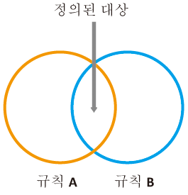
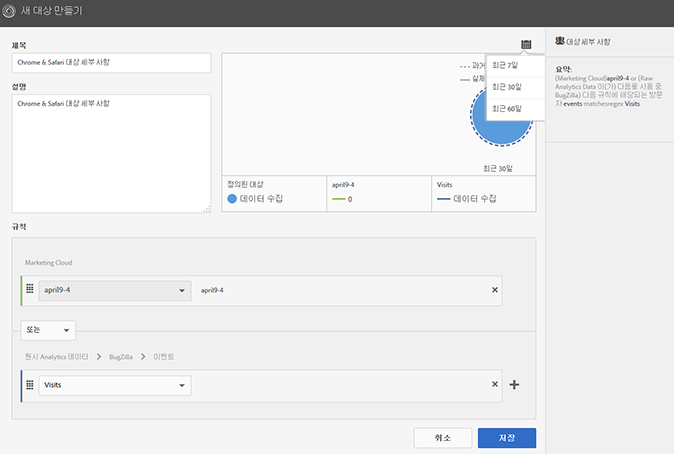
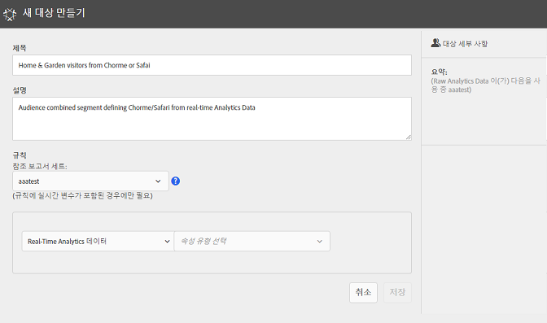
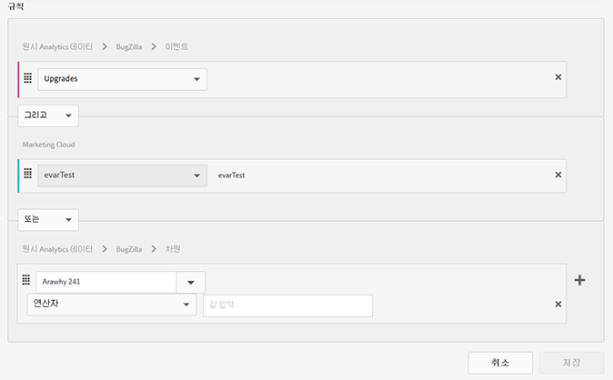
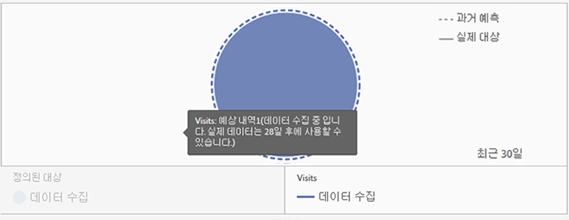

# 대상자 만들기

특성 규칙을 사용하여 Experience Cloud에서 대상을 만들고 복합 대상을 정의하는 방법을 알아봅니다.

이 문서는 다음 방법을 이해하는 데 도움이 됩니다.

* 대상자 만들기
* 규칙 만들기
* 규칙을 사용하여 복합 대상 정의

다음 그래픽은 복합 대상의 두 가지 규칙을 나타냅니다.

각 원은 대상 멤버십을 정의하는 규칙을 나타냅니다. 두 대상 규칙 모두에서 멤버로 자격을 갖춘 방문자는 겹쳐서 정의된 복합 대상이 됩니다.

>[!NOTE]
>
>대상은 지정된 기간 동안의 데이터 수집이 완료된 후에 완전히 정의됩니다.
다음 예는 복합 대상을 위한 규칙을 만드는 방법을 보여줍니다. 이 대상은 다음과 같이 구성됩니다.

* 페이지 데이터 또는 원시 분석 데이터에서 파생된 홈 및 가든 섹션.
* [!DNL Experience Cloud]에 [게시된](../audience-library/audience-library.md#task_32FEEFE0B32E4E388CD4D892D727282A) [!DNL Adobe Analytics]세그먼트에서 파생된 Chrome 및 Safari 사용자.

   

1. In the [!DNL Experience Cloud], under [!DNL Experience Platform], click **[!UICONTROL People]** > **[!UICONTROL Audience Library].**
1. On the [!UICONTROL Audiences] page, click **[!UICONTROL New]**. 

   

1. [!UICONTROL 새 대상 만들기] 페이지에서 제목 및 설명을 지정합니다.
1. [!UICONTROL 규칙]에서 다음과 같은 속성 소스를 선택합니다. 

   * **[!UICONTROL 실시간 Analytics 데이터:]** (또는 원시 데이터) 실시간 Analytics 이미지 요청에서 파생된 특성 데이터이며, eVars 및 이벤트와 같은 데이터를 포함합니다. 이 속성 소스를 사용할 때 보고서 세트를 선택하고 포함할 차원이나 이벤트를 정의해야 합니다. 이 보고서 세트 선택은 보고서 세트에 사용되는 변수 구조를 제공합니다.
   >[!NOTE]
   >
   >캐싱으로 인해, Analytics에서 삭제된 보고서 세트는 삭제가 Experience Cloud에 표시되는 데 12시간이 필요합니다.

   * **[!UICONTROL Experience Cloud:]**[!DNL Experience Cloud] 소스에서 파생된 특성 데이터입니다. 예를 들어 [!DNL Analytics]에서 만든 대상 세그먼트의 데이터이거나 [!DNL Audience Manager]의 데이터일 수 있습니다.

1. 대상 규칙을 정의한 다음 저장을 **[!UICONTROL 클릭합니다].**

>[!NOTE]
>
>이러한 규칙을 작성할 때 구현 변수를 이해해야 합니다.

[!UICONTROL 규칙]에서 *`Home & Garden`* 속성 선택 사항을 정의합니다.

* **[!UICONTROL 속성 소스:]** 원시 Analytics 데이터
* **[!UICONTROL 보고서 세트:]** 보고서 세트 31
* Dimension = **[!UICONTROL Store (Merch) (v6)]** > **[!UICONTROL Equals]** > **[!UICONTROL Home &amp; Garden]**

*Chrome 및 Safari 방문자*&#x200B;는 Analytics에서 공유되는 대상 세그먼트입니다.

* **[!UICONTROL 특성 소스:]** Experience Cloud
* **[!UICONTROL 차원:]** Chrome/Safari 방문자

비교를 위해 *OR* 규칙을 추가하여 뜰/가구와 같은 사이트 섹션의 모든 방문자를 볼 수 있습니다.

결과 규칙은 홈 및 가든을 방문한 Chrome 및 Safari 사용자로 구성된 정의된 대상입니다. 뜰/가구 세그먼트는 해당 사이트 섹션을 방문하는 모든 방문자에 대한 추가 통찰력을 제공합니다.

* **이전 예상:**(점선 원) [!DNL Analytics] 데이터를 기반으로 만들어진 규칙을 나타냅니다.
* **실제 대상:** (단색 원) Audience Manager의 30일 데이터가 있는 모든 규칙. Audience Manager 데이터가 30일이 되면 선은 실선이 되고 실제 수치를 나타냅니다.

지정된 기간 동안 데이터 수집이 완료되면 원이 결합하여 정의된 대상을 표시합니다.

대상이 저장되면 다른 솔루션에 사용할 수 있습니다. 예를 들어 Adobe Target 활동에 공유 대상을 포함할 수 있습니다.
