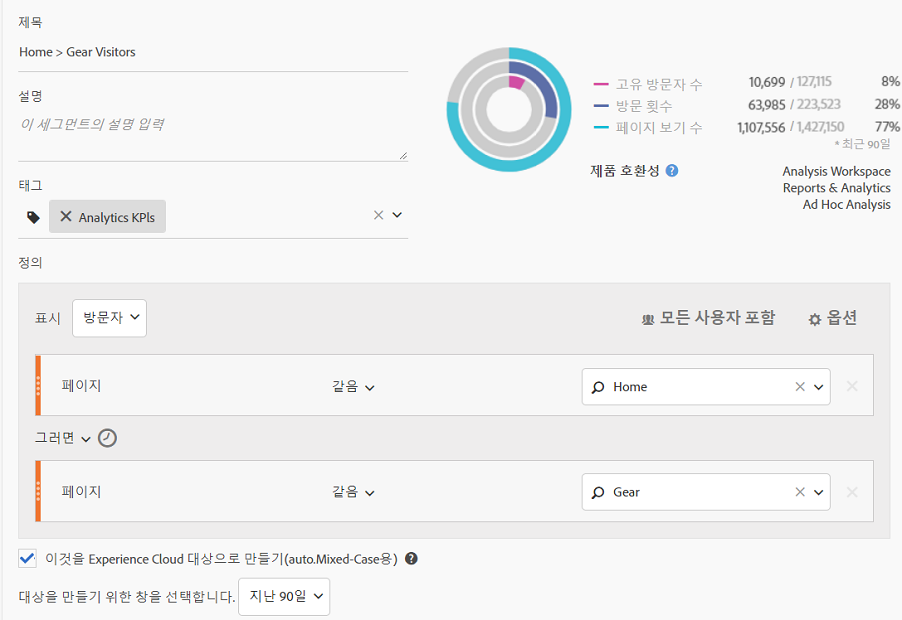

# Analytics 대상 세그먼트 게시

대상 마케팅 활동을 위해 Analytics 대상 세그먼트를 Experience Cloud 및 Adobe Target에 게시합니다.

1. Analytics에서 [세그먼트 만듭니다](https://marketing.adobe.com/resources/help/en_US/analytics/segment/seg_build.html).
1. 세그먼트 빌더에서 **[!UICONTROL 이 세그먼트를 Experience Cloud에 게시]** 옵션을 활성화합니다.

   

   | 요소 | 설명 |
   |--- |---|
   | 이 세그먼트를 Experience Cloud에 게시(&lt;보고서 세트 이름&gt;용) | 이 세그먼트를 Experience Cloud에 게시합니다. Adobe Target, Audience Manager, Advertising Cloud, Campaign 및 Audience Analytics의 마케팅 및 세그먼트 활동에 대상을 사용할 수 있습니다. 세그먼트를 게시하려면 제목 및 설명 필드가 필요합니다. 이 옵션이 활성화되면 제목 및 대상 세그먼트 정의가 공유되지만 실제 데이터는 공유되지 않습니다. 해당 대상이 Target의 활동과 연결되면 Analytics에서는 해당 Experience Cloud 및 Target 대상의 자격을 규정하는 방문자용 ID를 전송하기 시작합니다. 이때 대상 이름 및 해당 데이터가 Experience Cloud 대상 페이지에 표시되기 시작합니다. Analytics에서 Experience Cloud로 공유하는 대상은 2천만 명의 대상 구성원을 초과할 수 없습니다. 캐싱으로 인해, Analytics에서 삭제된 보고서 세트는 삭제가 Experience Cloud에 표시되는 데 12시간이 필요합니다. Experience Cloud에 게시된 세그먼트를 삭제하려면 먼저 게시를 취소해야 합니다. 세그먼트 게시를 취소하려면 게시할 때 사용한 확인란을 **클릭하여 선택 취소**&#x200B;하면 됩니다. 현재 다음 Adobe 솔루션에서 사용 중인 세그먼트를 게시 취소&#x200B;**할 수 없습니다**. [!DNL Analytics]([!DNL Audience Analytics]에서), [!DNL Campaign], [!DNL Advertising Cloud]([!DNL Core Service] 및 [!DNL Audience Manager] 고객용) 및 기타 모든 외부 파트너([!DNL Audience Manager] 고객용). [!DNL Target]에서 사용 중인 세그먼트의 게시를 취소&#x200B;**할 수 있습니다**. 방문자가 Analytics에서 공유한 대상 자격을 얻으면 24~48시간이 지연된 후에 Target, Advertising Cloud 및 Campaign에서 정보를 실행할 수 있습니다. **데이터 개인 정보** 대상은 방문자의 인증 상태에 따라 필터링되지 않습니다. 방문자가 인증되지 않음 및 인증됨 상태의 사이트를 검색할 수 있는 경우 방문자가 인증되지 않음 상태일 때 발생하는 작업 때문에 여전히 방문자가 대상에 포함될 수 있습니다. 대상을 공유할 때 파생되는 전반적인 개인 정보 문제를 이해하려면 [Analytics 개인 정보 개요](https://docs.adobe.com/help/en/analytics/technotes/privacy-overview.html)를 검토하십시오. |
   | 대상을 만들기 위한 창 선택 | 이것은 고정된 시간 창이 아니라 **롤링** 시간 창입니다. |

1. **[!UICONTROL 저장]**&#x200B;을 클릭합니다.
1. [!DNL Adobe Target]에 액세스하여 [!UICONTROL 대상]을 클릭합니다.
1. [!UICONTROL 대상] 페이지에서 Experience Cloud에서 가져온 대상을 찾습니다.

   이러한 대상은 활동에서 사용할 수 있습니다.
