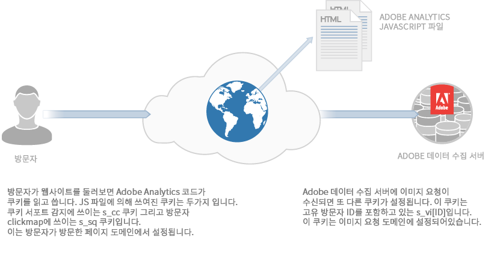
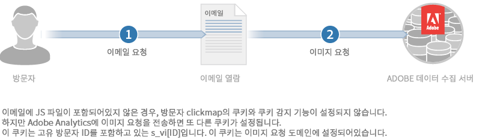

# 쿠키 및 개인 정보에 대한 정보{#about-cookies-and-privacy}

고객 개인정보 보호 및 데이터 보안을 유지 관리하는 것은 Adobe의 최우선 과제입니다. Adobe는 여러 개인정보 보호 조직에 참여하고 개인정보 규제 기관 및 자체 규제 원칙과 협력합니다. 이러한 협력에는 고객의 정보가 사용되는 방식과 정보 사용 관련 선택 사항에 대한 정보를 고객에게 제공하는 Digital Advertising Alliance AdChoices 프로그램도 포함되어 있습니다.

Experience Cloud 제품에서 설정하는 대부분의 쿠키는 개인 식별이 가능한 정보를 포함하지 않습니다. 이러한 쿠키 및 관련 데이터는 안전하게 보호되며 회사의 보고서에만 사용되고 관련 콘텐츠 및 광고를 제공할 목적으로 사용됩니다. 이 데이터는 종합 산업 보고서에서 사용되지 않는 한 서드파티 또는 다른 Adobe 고객에게 제공되지 않습니다. 예를 들어 [!DNL Digital Marketing Insight Report] 는 소매점에서 집계된 익명의 데이터를 분석합니다.

Adobe는 회사 간 브라우저 수준의 정보를 병합하지 않습니다. 고객 데이터의 개인정보 보호 및 보안을 위해 Experience Cloud의 일부 서비스는 추적된 사이트별로 별도의 쿠키 세트를 사용할 수 있는 기능을 제공합니다. 일부 Suite 오퍼는 고객이 자신의 도메인 이름을 쿠키 소유자로 사용할 수 있는 기능도 제공합니다. 이를 통해 Experience Cloud 쿠키를 *자사 쿠키*&#x200B;로 만들어 회사 사이트에 영구적으로 속하도록 함으로써 개인정보 및 보안에 추가 레이어를 생성합니다.

쿠키는 이전에 쿠키에 저장된 정보만 저장하고 제공할 수 있습니다. 코드를 실행하거나 컴퓨터에 저장된 다른 정보에 액세스할 수는 없습니다. 또한 웹 브라우저는 쿠키 데이터에 대한 액세스를 제한합니다. 브라우저는 모든 쿠키 데이터를 원래 정보를 설정한 웹 사이트에만 사용할 수 있도록 하는 쿠키 보안 정책을 적용합니다.

예를 들어, Adobe.com 웹 사이트에서 설정된 쿠키에 포함된 데이터는 Adobe.com 이외의 다른 웹 사이트에서 볼 수 없습니다.

다음 다이어그램은 표준 이미지 요청에 대한 쿠키 사용을 보여 줍니다.

다음 다이어그램은 직접 이미지 요청에 대한 쿠키 사용을 보여 줍니다(JS 파일이 로드되지 않은 시나리오에서 사용됨).

