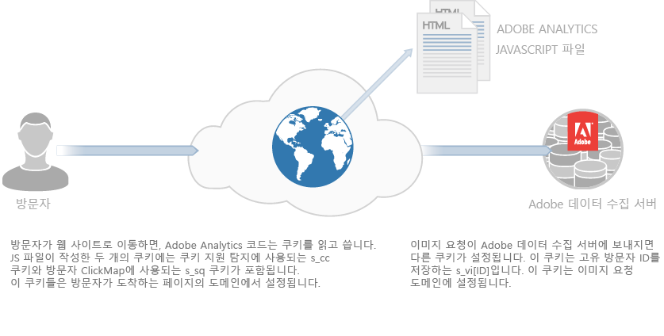
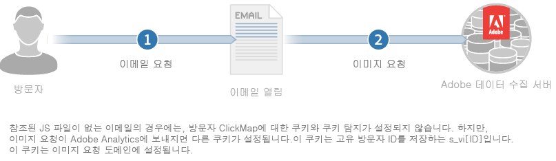

# 쿠키 및 개인 정보에 대한 정보{#about-cookies-and-privacy}

Adobe에서 고객 개인 정보 및 데이터 보안을 유지하는 것이 최우선 과제입니다. Adobe는 여러 개인 정보 보호 조직에 참여하고 있으며 개인 정보 규제 기관 및 자율 규제 원칙(예: Digital Advertising Alliance AdChoices 프로그램)과 협력하여 고객이 자신의 정보를 어떻게 사용하고 있는지 그리고 그 사용에 대한 선택권을 제공할 수 있도록 합니다.

Experience Cloud 제품에서 설정하는 대부분의 쿠키에는 개인 식별 정보가 포함되어 있지 않습니다. 이러한 쿠키와 관련 데이터는 안전하며 회사의 보고서에만 사용되며 관련 컨텐츠 및 광고를 제공하기 위해 사용됩니다. 이 데이터는 집계된 업계 보고서에서 사용되지 않는 한 제3자 또는 다른 Adobe 고객은 사용할 수 없습니다. 예를 들어 [!DNL Digital Marketing Insight Report]는 소매점에서 집계된 익명의 데이터를 분석합니다.

Adobe는 회사 간 브라우저 수준의 정보를 병합하지 않습니다. 고객 데이터의 개인정보 보호 및 보안을 보호하기 위해 Experience Cloud 내의 일부 서비스는 추적된 각 사이트에 대해 별도의 쿠키 세트를 사용할 수 있는 기능을 회사에 제공합니다. 또한 일부 Suite 오퍼는 고객이 자신의 도메인 이름을 쿠키 소유자로 사용할 수 있는 기능도 제공합니다. 이 방법은 Experience Cloud 쿠키를 *자사 쿠키로*&#x200B;만들어 회사 사이트에 영구적으로 속하므로, 개인 정보 및 보안 계층을 추가로 만듭니다.

쿠키는 이전에 쿠키에 저장된 정보만 저장하고 제공할 수 있습니다. 코드를 실행하거나 컴퓨터에 저장된 다른 정보에 액세스할 수 없습니다. 또한 웹 브라우저는 쿠키 데이터에 대한 액세스를 제한합니다. 브라우저는 모든 쿠키 데이터를 원래 정보를 설정한 웹 사이트에서만 사용할 수 있도록 하는 쿠키 보안 정책을 적용합니다.

예를 들어 Adobe.com 웹 사이트에서 설정된 쿠키에 포함된 데이터는 Adobe.com을 제외한 다른 웹 사이트에서 볼 수 없습니다.

다음 다이어그램은 표준 이미지 요청에 대한 쿠키 사용을 보여줍니다.

다음 다이어그램은 직선 이미지 요청에 대한 쿠키 사용을 보여 줍니다(JS 파일이 로드되지 않는 시나리오에서 사용됨).

