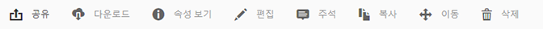
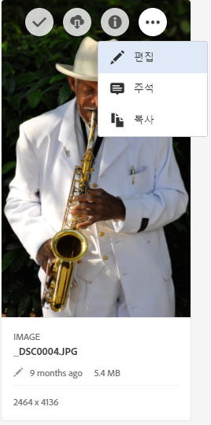
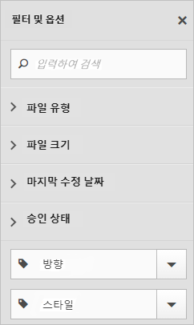
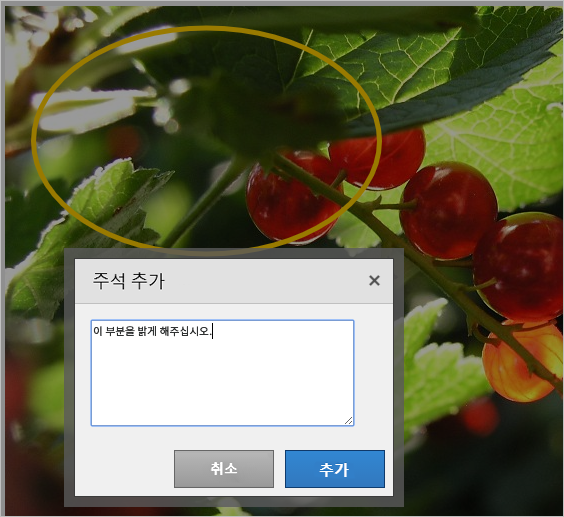

# Experience Cloud Assets 개요

Experience Cloud 자산은 애플리케이션에서 공유할 수 있는 마케팅 준비가 끝난 자산에 대해 중앙 집중식 단일 저장소를 제공합니다. 자산은 디지털 문서, 이미지, 비디오, 오디오 또는 그 일부로, 다양한 표현물과 하위 자산(예: [!DNL Photoshop] 파일의 레이어, [!DNL PowerPoint] 파일의 슬라이드, PDF의 페이지, ZIP에 있는 파일)을 가질 수 있습니다.

자산 서비스에는 다음이 포함됩니다.

* 자산 저장 공간, 관리 인터페이스, 포함된 선택 인터페이스(애플리케이션을 통해 액세스).
* Creative Cloud, Experience Cloud 공동 작업 및 Experience Cloud 애플리케이션과의 통합

자산을 사용하면 일관성 및 브랜드 준수가 향상되며 마켓 출시 속도도 빨라집니다. 애플리케이션의 워크플로우를 간소화할 수 있습니다.

* **[!DNL Social]**: 소셜 속성, Facebook, Twitter, LinkedIn, Google+에 게시
* **[!DNL Target]**: A/B 및 다변량 테스트 환경 만들기
* **[!DNL Media Optimizer]** : 다양한 채널 및 캠페인에서 광고 단위 개발
* **[!DNL Campaign]**: 이메일 소식지 및 캠페인에 자산 배치

[!UICONTROL Experience Cloud Assets]에서 다음 작업을 수행할 수 있습니다.

* [Experience Cloud Assets로 이동](experience-cloud-assets.md#section_3657039DD3524F2AA88753BFF4781125)
* [도구 모음 액세스](experience-cloud-assets.md#section_EC2E401D225148818F3753248556BE6B)
* [Assets 편집](experience-cloud-assets.md#section_CD3C55A9D4574455B94D0955391C8FEC)
* [Assets 검색](experience-cloud-assets.md#section_50FE049010B446FC9640AA6A30E5A730)
* [Assets에 주석 달기](experience-cloud-assets.md#section_67FE1DFAAB744DA5B1CD3AD3CCEABF7A)
* [전체 화면 Assets 보기 및 확대/축소](experience-cloud-assets.md#section_A9F50D7D6BE341A2AB8244A4E42A4EF7)
* [자산 속성 보기](experience-cloud-assets.md#section_FED28711DAB14E1BBEEA7CA890EE9573)
* [사용량 보고서 실행](experience-cloud-assets.md#section_15D782FFB8D74CF4A735116CC03AD902)
* [Experience Manager와의 자산 공유](experience-cloud-assets.md#section_45C1B72F4D274F54BC6CCB64D2580AC5)

## Experience Cloud Assets로 이동 {#section_3657039DD3524F2AA88753BFF4781125}

## 도구 모음 액세스 {#section_EC2E401D225148818F3753248556BE6B}

에셋(또는 에셋 디렉터리)으로 이동한 후 **[!UICONTROL 선택을 선택합니다]**.

도구 모음에서 검색, 타임라인, 렌디션, 편집, 주석 달기 및 다운로드를 포함한 기능에 빠르게 액세스할 수 있습니다.

## Assets 편집 {#section_CD3C55A9D4574455B94D0955391C8FEC}

자산을 편집하면 다음을 포함한 기능을 사용할 수 있습니다.

* 자르기
* 회전
* 뒤집기

## Assets 검색 {#section_50FE049010B446FC9640AA6A30E5A730}

키워드, 파일 형식, 크기, 마지막 수정 날짜, 게시 상태, 방향 및 스타일별로 검색할 수 있습니다.

## Assets에 주석 달기 {#section_67FE1DFAAB744DA5B1CD3AD3CCEABF7A}

이미지에 원이나 화살표를 그려서 **[!UICONTROL 주석]** 을 선택하고 동료가 검토할 수 있도록 에셋에 주석을 답니다.

## 전체 화면 Assets 보기 및 확대/축소 {#section_A9F50D7D6BE341A2AB8244A4E42A4EF7}

**[!UICONTROL 보기]** > **[!UICONTROL 이미지]** 를 선택하여 전체 에셋 이미지를 보고 확대/축소를 활성화합니다.

## 자산 속성 보기 {#section_FED28711DAB14E1BBEEA7CA890EE9573}

속성을 사용한 카드 보기, 목록 보기, 열 보기 중 선택하여 Assets를 쉽게 찾을 수 있습니다.

**[!UICONTROL 보기]** > **[!UICONTROL 속성]** 을 선택하여 에셋의 속성을 확인합니다.

## 사용량 보고서 실행 {#section_15D782FFB8D74CF4A735116CC03AD902}

사용자 수, 사용한 저장소 및 전체 Assets를 참고하십시오.

**[!UICONTROL 도구]** > **[!UICONTROL 보고서]** > **[!UICONTROL 사용량 보고서]**&#x200B;를 선택합니다.

