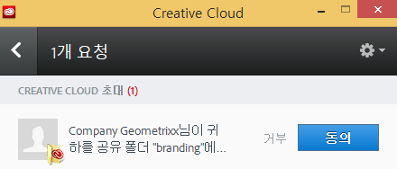
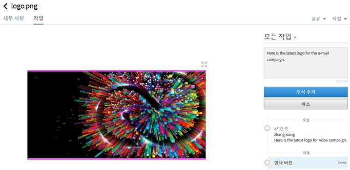
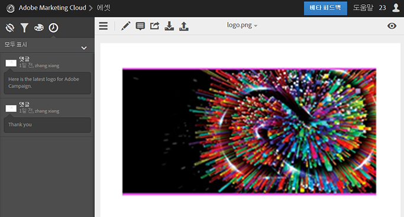
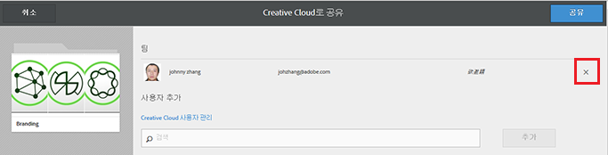
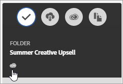

# Experience Cloud 자산 폴더 공유

Creative Cloud 사용자와 Experience Cloud 자산 폴더를 공유합니다.

1. 자산 폴더에서 Creative Cloud에 **[!UICONTROL 공유를]** 클릭합니다.

   
1. Creative Cloud에 공유 페이지에서 사용자를 검색하고 **[!UICONTROL 추가를 클릭합니다]**.

   

1. **[!UICONTROL 공유를 클릭합니다]**.
1. [!DNL Creative Cloud] 데스크탑을 시작하고(또는 브라우저의 [!UICONTROL Creative Cloud 파일] 페이지로 이동) 요청 알림을 찾습니다. 

   
1. 요청을 열고 **[!UICONTROL 승인을 클릭합니다]**.

   
1. 폴더 컨텐츠에 액세스하려면 폴더 **[!UICONTROL 열기]** (또는 웹에서 **[!UICONTROL ]** 보기) 를 클릭합니다.

   
1. 공유 자산에 주석을 추가하여 계속합니다.

   Creative Cloud에서 이미지를 클릭한 후 **[!UICONTROL 활동]을 클릭하여 이미지에 주석을 추가할 수 있습니다.** 주석은 [!DNL Creative Cloud] AND [!DNL Experience Cloud]의 자산에 동기화됩니다.

   

   Experience Cloud에서는 이미지를 클릭한 후 타임라인 아이콘을 클릭하여 이미지에 주석을 추가합니다. 주석은 Creative Cloud 및 Experience Cloud의 자산에서 동기화됩니다.

   

1. 폴더의 공유를 취소하려면 Creative Cloud를 사용하여 **[!UICONTROL 공유]** (3 단계와 [유사](../experience-cloud-assets/t-share-creative-cloud.md#step_BA17CFA185284641A9B878BA29551996)) 를 클릭한 다음 X를 클릭하여 사용자를 제거한 다음 **[!UICONTROL 공유를 클릭합니다]**.

Creative Cloud 사용자를 모두 제거했으면 폴더가 공유 취소되고 Creative Cloud 사용자는 더 이상 액세스할 수 없습니다.
공유 자산을 사용하는 추가 방법에는 다음이 포함됩니다.

* 소셜 게시를 위해 [!UICONTROL 의 ]자산 선택기 [!DNL Adobe Social]에서 자산을 사용합니다. [게시자 페이지](https://marketing.adobe.com/resources/help/en_US/social/?f=c_pub_publisher)를 참조하십시오.
* 활동의 이미지에 대해서는 [의 ](https://marketing.adobe.com/resources/help/en_US/target/target/?f=c_manage_content)컨텐츠 라이브러리[!DNL Adobe Target]에서 자산을 로드하거나 교체합니다.

Creative Cloud에 폴더를 공유하면 폴더에 Creative Cloud 로고가 표시됩니다.

관련 도움말:

* [Creative Cloud 도움말 - 파일 관리 및 동기화](https://helpx.adobe.com/creative-cloud/help/sync-files.html)
* [Creative Cloud 도움말 - 다른 사용자와 공동 작업](https://helpx.adobe.com/creative-cloud/help/collaboration.html)
* [Creative Cloud 도움말 - 공동 작업 FAQ](https://helpx.adobe.com/creative-cloud/help/collaboration-faq.html)
