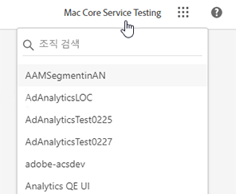
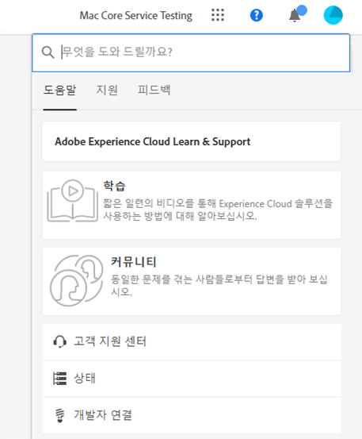
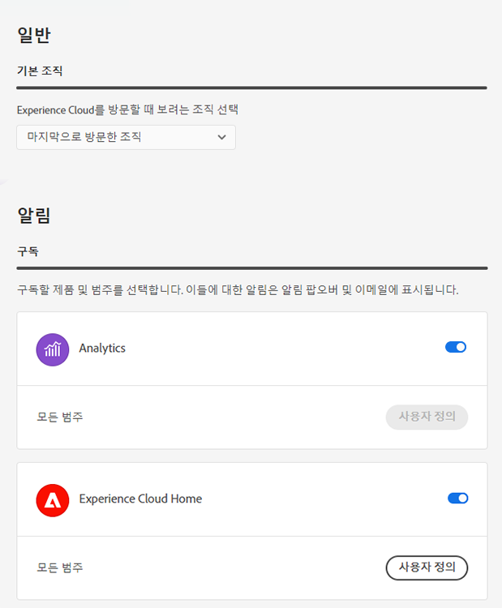
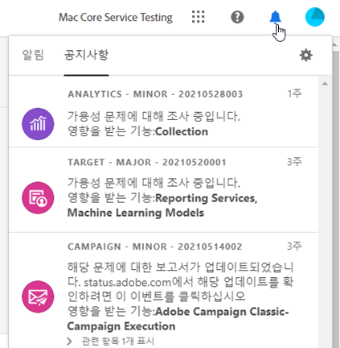

# Experience Cloud 인터페이스 도움말

Experience Cloud의 중앙 인터페이스 구성 요소에는 다음과 같은 기능이 포함되어 있습니다.

* 애플리케이션 및 서비스에 로그인/액세스하기
* 글로벌 검색을 사용하여 제품 도움말 및 비즈니스 개체 찾기
* 계정 환경 설정 관리(경고, 알림 및 구독)

## Experience Cloud의 브라우저 지원 {#browser}

최상의 성능을 위해 Experience Cloud는 최신 버전과 두 개의 이전 버전을 포함하여 가장 많이 사용되는 브라우저에 최적화되었습니다.

* Chrome
* Edge
* Firefox
* Opera
* Safari

브라우저가 목록에 없어도 지원될 수 있지만 목록에 있는 브라우저 중 하나를 선택하는 것이 좋습니다.

>[!NOTE]
>
>Experience Cloud 도메인에서 실행 중인 모든 애플리케이션이 전체 브라우저를 지원하는 것은 아닙니다. 확실치 않다면 특정 애플리케이션의 설명서를 참조하십시오.

## Experience Cloud의 언어 지원 {#languages}

Experience Cloud는 Adobe 사용자 계정 환경 설정에 설정되는 각 사용자의 기본 언어를 지원합니다. 현재 지원되는 언어는 다음과 같습니다.

* 중국어
* 영어
* 프랑스어
* 독일어
* 이탈리아어
* 일본어
* 한국어
* 포르투갈어
* 스페인어
* 대만어

모든 애플리케이션이 전 세계 언어를 지원하고 있지만 모든 애플리케이션이 위에서 언급된 모든 언어로 제공되지 않습니다. 기본 언어가 Experience Cloud 애플리케이션에서 지원되지 않는 경우 보조 언어를 기본값으로 설정할 수 있습니다. [Experience Cloud 사용자 환경 설정](https://experience.adobe.com/preferences)에서 수행할 수 있습니다.

## Experience Cloud에 로그인 {#signin}

로그인한 다음 올바른 [조직](organizations.md)에 속해 있는지 확인하십시오.

1. [Adobe Experience Cloud](https://experience.adobe.com)를 탐색하십시오.
1. **[!UICONTROL Adobe ID로 로그인]**&#x200B;을 선택합니다.
1. 올바른 조직에 속해 있는지 확인합니다.

   

   올바른 [조직](organizations.md)에 로그인했는지 확인하려면 **[!UICONTROL 프로필]**&#x200B;을 클릭하여 조직 이름을 확인하세요. 둘 이상의 조직에 대한 액세스 권한이 있는 경우 **[!UICONTROL 조직]** 선택기를 사용하여 다른 조직을 보고 전환할 수도 있습니다.

   조직이 Federated ID를 사용하는 경우 Experience Cloud를 통해 이메일 주소 및 암호를 입력할 필요 없이 조직의 SSO(Single Sign-On)로 로그인할 수 있습니다. 이 작업을 수행하려면 `#/sso:@domain`을 Experience Cloud URL(`https://experience.adobe.com`)에 추가하십시오.

   예를 들어 조직에 Federated ID와 도메인 `adobecustomer.com`가 있는 경우 URL 링크를 `https://experience.adobe.com/#/sso:@adobecustomer.com`로 설정합니다. 애플리케이션 경로가 첨부된 이 URL을 책갈피로 지정하여 바로 특정 애플리케이션으로 이동할 수도 있습니다. (예: Adobe Analytics의 경우 `https://experience.adobe.com/#/sso:@adobecustomer.com/analytics`.)

## Experience Cloud 애플리케이션 액세스 {#navigation}

Experience Cloud에 로그인하면 통합 헤더에서 모든 애플리케이션, 서비스 및 조직에 빠르게 액세스할 수 있습니다.

소유한 Experience Cloud 서비스에 액세스하려면 응용 프로그램 선택기 를 선택하십시오.

## Experience Cloud의 검색 및 지원 {#search-support}

Experience Cloud 검색을 통해 [Experience League](https://experienceleague.adobe.com/#home)에서 도움말(설명서, 튜토리얼 및 과정)을 검색할 수 있게 되었습니다.

[!UICONTROL 도움말] 메뉴로 또한 다음에 액세스할 수 있습니다.

* **[!UICONTROL 지원]:** 지원 티켓을 만들거나 Twitter를 사용해 [!UICONTROL 지원].
* **[!UICONTROL 피드백]:** 피드백을 통해 Adobe에 연락하여 여러분의 의견을 보내 주십시오.
* **[!UICONTROL 상태]:** `https://status.adobe.com/experience_cloud`로 이동하여 제품 작동 상태 및 [!UICONTROL 구독 관리]를 확인합니다.
* **[!UICONTROL 개발자 연결]:** `adobe.io`로 이동하여 개발자 설명서를 찾습니다.

## 계정 환경 설정 {#account-menu}

계정 환경 설정 메뉴에서 다음을 할 수 있습니다.

* 어두운 테마 지정 (일부 애플리케이션에서는 이 테마를 지원하지 않음)
* [조직](organizations.md) 검색
* 로그아웃
* 계정 [환경 설정, 알림 및 구독](#preferences) 구성

### Experience Cloud [!UICONTROL 환경 설정] 관리 {#preferences}

Experience Cloud 환경 설정에는 알림, 구독 및 경고가 포함됩니다.

환경 설정을 관리하려면 계정 메뉴 에서 **[!UICONTROL 환경 설정]**&#x200B;을(를) 선택하십시오.

[!UICONTROL Experience Cloud 환경 설정]에서 다음 기능을 구성할 수 있습니다.

| 기능 | 설명 |
|--- |--- |
| 기본 [조직](organizations.md) | Experience Cloud를 시작할 때 보려는 조직을 선택합니다. |
| [!UICONTROL 구독] | 구독하기 원하는 제품 및 범주를 선택하십시오. [!UICONTROL 알림] 팝업 및 이메일 알림. |
| [!UICONTROL 우선 순위] | 높은 우선 순위로 고려하고 싶은 범주를 선택하십시오. 이러한 범주는 높음 태그로 표시되며 경고처럼 게재되도록 구성할 수 있습니다. |
| [!UICONTROL 경고] | 브라우저에 경고를 표시할 알림을 선택하십시오. 경고는 창의 오른쪽 상단에 몇 초 동안 표시됩니다. |
| 이메일 | 이메일 알림을 수신할 빈도를 지정합니다. (발송하지 않음, 실시간, 매일 또는 매주) |

{style="table-layout:auto"}

## 알림 및 공지 {#notifications}

본인에게 중요한 알림과 Adobe의 공지를 보려면 **[!UICONTROL 알림]** 을 선택합니다.

[Experience Cloud 환경 설정](#preferences)에서 알림을 구성할 수 있습니다.
