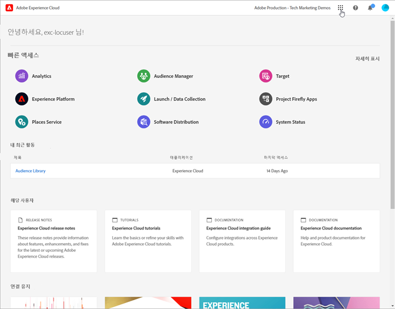

# Experience Cloud 중앙 인터페이스 개요

[Experience Cloud](https://experience.adobe.com)는 Adobe의 디지털 마케팅 애플리케이션, 제품 및 서비스 통합 제품군입니다. 직관적인 인터페이스에서 클라우드 애플리케이션, 제품 기능 및 서비스에 빠르게 액세스할 수 있습니다.

{width="100" zoomable="yes"}

Experience Cloud 헤더에서 다음 작업을 수행할 수 있습니다.

* 모든 Experience Cloud 애플리케이션 및 서비스에 액세스
* 도움말 메뉴에서 제품 설명서, 튜토리얼 및 커뮤니티 게시물 검색 Experience League에서 결과 보기
* 검색 필드에서 글로벌 검색을 사용하여 전역으로 비즈니스 오브젝트 검색 (Experience Platform 사용자만 해당)
* 계정 [환경 설정](features/account-preferences.md) 관리 (경고, 알림 및 구독)

## Experience Cloud에 로그인 {#signin}

로그인한 다음 올바른 [조직](administration/organizations.md)에 속해 있는지 확인하십시오.

1. [Adobe Experience Cloud](https://experience.adobe.com)를 탐색하십시오.
1. Adobe 이메일 주소를 입력한 다음 **[!UICONTROL 계속]**&#x200B;을 선택합니다.
1. 계정을 선택합니다.
1. 암호를 입력합니다.
1. 올바른 조직에 속해 있는지 확인합니다.

   {width="100" zoomable="yes"}

   **조직 확인**

   [조직](administration/organizations.md)은 인터페이스 헤더에 표시됩니다.

   조직이 Federated ID를 사용하는 경우 Experience Cloud를 통해 이메일 주소 및 암호를 입력할 필요 없이 조직의 SSO(Single Sign-On)로 로그인할 수 있습니다. 이 작업을 수행하려면 `#/sso:@domain`을 Experience Cloud URL(`https://experience.adobe.com`)에 추가하십시오.

   예를 들어 조직에 Federated ID와 도메인 `adobecustomer.com`가 있는 경우 URL 링크를 `https://experience.adobe.com/#/sso:@adobecustomer.com`로 설정합니다. 애플리케이션 경로가 첨부된 이 URL을 책갈피로 지정하여 바로 특정 애플리케이션으로 이동할 수도 있습니다. (예: Adobe Analytics의 경우 `https://experience.adobe.com/#/sso:@adobecustomer.com/analytics`.)

## Experience Cloud 애플리케이션 액세스 {#navigation}

Experience Cloud에 로그인하면 통합 헤더에서 모든 애플리케이션, 서비스 및 조직에 빠르게 액세스할 수 있습니다.

조직의 Experience Cloud 애플리케이션 및 서비스에 액세스하려면 애플리케이션 선택기 로 이동하십시오.

{width="100" zoomable="yes"}

## 도움말 및 지원 요청 {#support}

헤더의 **[!UICONTROL 도움말 센터]**()를 사용하여 [Experience League](https://experienceleague.adobe.com/#home)의 도움말 콘텐츠(설명서, 튜토리얼 및 교육 과정)와 개별 애플리케이션의 추가 리소스가 포함된 학습 및 도움말을 이용하십시오. 오픈엔드 피드백을 제출하고 우선 순위가 지정된 지원 티켓을 만들 수도 있습니다.

{width="100" zoomable="yes"}

[!UICONTROL 도움말] 메뉴로 또한 다음에 액세스할 수 있습니다.

* **[!UICONTROL 지원]:** 지원 티켓을 만들거나 Twitter를 사용하여 [!UICONTROL 지원 센터]에 문의합니다.
* **[!UICONTROL 피드백]:** Experience Cloud 경험에 관한 의견을 공유할 수 있습니다. 귀하의 피드백은 Adobe의 제품 및 서비스를 개선하는 데 사용됩니다.
* **[!UICONTROL 상태]:** `https://status.adobe.com/experience_cloud`로 이동하여 제품 작동 상태 및 [!UICONTROL 구독 관리]를 확인합니다.
* **[!UICONTROL 개발자 연결]:** `adobe.io`로 이동하여 개발자 설명서를 찾습니다.

## 사용자 프로필 관리

[!UICONTROL 프로필] 메뉴에서 다음과 같은 작업을 수행할 수 있습니다.

* 어두운 테마 지정 (일부 애플리케이션에서는 이 테마를 지원하지 않음)
* Experience Cloud [환경 설정](features/account-preferences.md) 관리
* [조직](administration/organizations.md) 선택 또는 검색
* [!UICONTROL 법적 고지 사항] 보기
* 로그아웃
* 계정 환경 설정, 알림 및 구독 구성

## 제품 내 알림 및 공지 사항 보기 {#notifications}

알림 및 공지 사항을 보려면 종 모양 아이콘을 클릭하십시오. 공지 사항에는 제품 릴리스, 유지 관리 알림, 공유 항목 및 승인 요청을 포함하여 관련성 있고 실행 가능한 업데이트에 대한 알림이 포함됩니다.

{width="100" zoomable="yes"}

알림 및 경고를 관리하려면 [계정 환경 설정 및 알림](features/account-preferences.md)을 참조하십시오.
