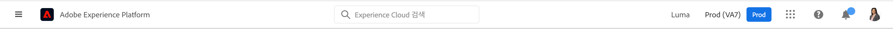

# Experience Cloud 중앙 인터페이스 구성 요소 안내서

[Experience Cloud](https://experience.adobe.com)는 Adobe의 디지털 마케팅 애플리케이션, 제품 및 서비스 통합 제품군입니다. 직관적인 인터페이스에서 클라우드 애플리케이션, 제품 기능 및 서비스에 빠르게 액세스할 수 있습니다.

Experience Cloud 헤더에서 다음 작업을 수행할 수 있습니다.

* 애플리케이션 및 서비스에 액세스하기
* 제품 설명서, 튜토리얼 및 커뮤니티 게시물 검색하기
* 글로벌 검색을 사용하여 전역으로 비즈니스 개체 검색하기(Experience Platform 사용자에게만 제공)
* 계정 환경 설정 관리(경고, 알림 및 구독)

## Experience Cloud에 로그인

로그인한 다음 올바른 [조직](organizations.md)에 속해 있는지 확인하십시오.

1. [Adobe Experience Cloud](https://experience.adobe.com)를 탐색하십시오.
1. **[!UICONTROL Adobe ID]**&#x200B;로 로그인합니다.
1. Adobe Experience Cloud에서 조직을 선택합니다.

   

   올바른 [조직](organizations.md)에 속해 있는지 관리자가 확인해 드릴 수 있습니다.

## Experience Cloud 애플리케이션 액세스 {#navigation}

Experience Cloud에 로그인하면 통합 헤더에서 모든 애플리케이션, 서비스 및 조직에 빠르게 액세스할 수 있습니다.

소유한 Experience Cloud 서비스에 액세스하려면 애플리케이션 선택기 으로 이동하십시오.

## 도움말 및 지원 요청 {#search}

통합 도움말은 제품 내 위치를 제공하여 [Experience League](https://experienceleague.adobe.com/#home)에서 도움말 콘텐츠(설명서, 튜토리얼 및 과정)를 검색하고 콘텐츠에 액세스할 수 있도록 지원합니다. 오픈엔드 피드백을 제출하고 우선 순위가 지정된 지원 티켓을 만들 수도 있습니다.

[!UICONTROL 도움말] 메뉴로 또한 다음에 액세스할 수 있습니다.

* **[!UICONTROL 지원]:** 지원 티켓을 만들거나 Twitter를 사용해 [!UICONTROL 지원].
* **[!UICONTROL 피드백]:** Experience Cloud 경험에 관한 의견을 공유할 수 있습니다. 귀하의 피드백은 Adobe의 제품 및 서비스를 개선하는 데 사용됩니다.
* **[!UICONTROL 상태]:** `https://status.adobe.com/experience_cloud`로 이동하여 제품 작동 상태 및 [!UICONTROL 구독 관리]를 확인합니다.
* **[!UICONTROL 개발자 연결]:** `adobe.io`로 이동하여 개발자 설명서를 찾습니다.

## 개체 및 엔티티를 전역으로 검색

글로벌 검색을 사용하면 원활하고 일관성 있는 원클릭 환경에서 검색 가능한 비즈니스 개체 또는 엔티티를 찾을 수 있습니다. 이 검색은 최근에 액세스한 개체를 표시합니다.

>[!NOTE]
>
>전역 검색은 Experience Platform 및 Journey Orchestration 사용자만 사용할 수 있습니다.

## 계정 환경 설정 관리 {#preferences}

Experience Cloud 환경 설정에는 알림, 구독 및 경고가 포함됩니다. 계정 환경 설정 메뉴에서 다음을 할 수 있습니다.

* 어두운 테마 지정(일부 애플리케이션에서는 이 테마를 지원하지 않음)
* [조직](organizations.md) 검색
* 로그아웃
* 계정 환경 설정, 알림 및 구독 구성

환경 설정을 관리하려면 계정 메뉴 에서 **[!UICONTROL 환경 설정]**&#x200B;을 선택합니다.

[!UICONTROL Experience Cloud 환경 설정]에서 다음 기능을 구성할 수 있습니다.

| 기능 | 설명 |
|--- |--- |
| 기본 [조직](organizations.md) | Experience Cloud를 시작할 때 보려는 조직을 선택합니다. |
| [!UICONTROL 구독] | 구독하기 원하는 제품 및 범주를 선택하십시오. [!UICONTROL 알림] 팝업 및 이메일 알림. |
| [!UICONTROL 우선 순위] | 높은 우선 순위로 고려하고 싶은 범주를 선택하십시오. 이러한 범주는 높음 태그로 표시되며 경고처럼 게재되도록 구성할 수 있습니다. |
| [!UICONTROL 경고] | 브라우저에 경고를 표시할 알림을 선택하십시오. 경고는 창의 오른쪽 상단에 몇 초 동안 표시됩니다. |
| 이메일 | 이메일 알림을 수신할 빈도를 지정합니다. (발송하지 않음, 실시간, 매일 또는 매주) |

{style=&quot;table-layout:auto&quot;}

## 알림 및 공지 {#notifications}

제품 릴리스, 유지 관리 공지, 공유 항목 및 승인 요청 등 관련 및 실행 가능한 업데이트에 대해 경고하려면 **[!UICONTROL 알림]**&#x200B;을 선택합니다.

## 관리 및 교차 애플리케이션 서비스에 대한 도움 받기

이 안내서는 Admin Console의 Experience Cloud 사용자 및 제품 관리에 대한 도움말 액세스를 제공하며 플랫폼 서비스를 위한 솔루션을 활성화합니다. 또한 대상 라이브러리, 고객 속성, Experience Cloud Assets 등의 도움말에 액세스할 수 있습니다.

* [[!UICONTROL 대상 라이브러리]](audience-library.md)
* [[!UICONTROL 고객 속성]](attributes.md)
* [[!UICONTROL 트리거]](triggers.md)
* [Experience Cloud [!UICONTROL Assets]](experience-cloud-assets.md)
* [Experience Cloud 쿠키](cookies-privacy.md)
* [사용자 및 제품 관리](admin-getting-started.md) (Admin Console)
* [핵심 서비스용 솔루션을 사용하도록 설정](core-services.md)
* [자주 묻는 질문](admin-getting-started.md)
* [조직 및 계정 연결](organizations.md)
* [통합](marketing-cloud-integrations.md)
* [Adobe Target과 Experience Cloud 통합](https://experienceleague.adobe.com/docs/target/using/integrate/a4t/a4t.html?lang=ko-KR)
* [Experience Cloud 개인정보 보호 및 보안 개요](assets/Adobe-Marketing-Cloud-Privacy-and-Security-Overview.pdf)
* [DNS 프리페치](admin-getting-started.md#concept_6BC8C6856E3644F8956D7AD0A96383B7)

## 안내서

관련 Experience Cloud 안내서는 다음을 포함합니다.

* [Adobe Mobile](https://experienceleague.adobe.com/docs/mobile-services/using/home.html?lang=ko-KR)
* [Experience Platform Co-op 그래프](https://experienceleague.adobe.com/docs/device-co-op/using/home.html?lang=ko-KR)
* [Exchange](https://exchange.adobe.com/experiencecloud)
* [Experience Cloud ID 서비스](https://experienceleague.adobe.com/docs/id-service/using/home.html?lang=ko-KR)
* [Experience Platform 데이터 수집/Launch](https://experienceleague.adobe.com/docs/launch.html?lang=ko-KR)
* [Experience Cloud Debugger](https://experienceleague.adobe.com/docs/debugger/using/experience-cloud-debugger.html?lang=ko-KR)
* [일반 데이터 보호 규정(GDPR) API](https://www.adobe.io/apis/experiencecloud/gdpr.html)
* [[!UICONTROL Dynamic Tag Management]](https://experienceleague.adobe.com/docs/dtm/using/dtm-home.html?lang=ko-KR)

## 튜토리얼

Adobe Experience League에서 제공하는 자체 도움말 튜토리얼과 빠른 사용 방법을 활용할 수 있습니다.

* [Experience League의 모든 튜토리얼](https://experienceleague.adobe.com/?lang=ko-KR#quick-how-tos)
* [Experience Platform 튜토리얼](https://experienceleague.adobe.com/docs/launch-learn/tutorials/overview.html?lang=ko-KR)
* [실시간 고객 데이터 플랫폼](https://experienceleague.adobe.com/docs/platform-learn/tutorials/application-services/rtcdp/understanding-the-real-time-customer-data-platform.html?lang=ko-KR)

## 릴리스 정보 및 관련 Experience Cloud 도움말

* [모든 Experience Cloud 솔루션에 대한 제품 설명서](https://experienceleague.adobe.com/docs/home.html?lang=ko-KR) - Experience Cloud 학습 및 지원에서 탐색
* [릴리스 정보 및 제품 업데이트](https://experienceleague.adobe.com/docs/release-notes/experience-cloud/current.html?lang=ko-KR) - Experience Cloud의 새로운 기능 및 가입을 통한 업데이트 받기
* [핵심 서비스 구현 튜토리얼](https://experienceleague.adobe.com/docs/launch-learn/tutorials/overview.html?lang=en) - 핵심 서비스에 대한 비디오 및 튜토리얼 보기
* [Experience League의 전문가 지원](https://experienceleague.adobe.com/) - 전문가 및 커뮤니티의 안내형 학습
* [교육 및 훈련](https://helpx.adobe.com/kr/learning.html?promoid=KAUDK) - Adobe의 제품을 최대한 활용할 수 있도록 Adobe와 협력하기
* [고객 경험 블로그](https://blog.adobe.com/en/topics/digital-transformation.html) - Experience Cloud 블로그 보기
* [고객 지원](https://experienceleague.adobe.com/?support-solution=General#support) - Adobe 고객 지원 센터에 문의
