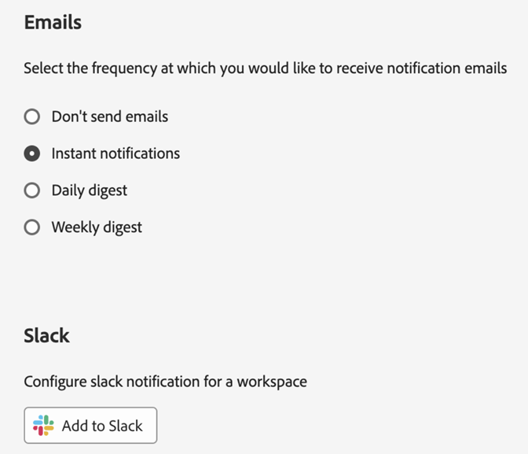

# 계정 환경 설정 및 알림 {#preferences}

Experience Cloud 환경 설정을 찾으려면 **[!UICONTROL 사용자 계정]**  아이콘을 클릭한 다음 **[!UICONTROL 환경 설정]**&#x200B;을 클릭하십시오.

[!UICONTROL Experience Cloud 환경 설정] 페이지에서 다음 계정 기능을 관리할 수 있습니다.

| 기능 | 설명 |
|--- |--- |
| 프로필 | [Adobe 계정 프로필](https://account.adobe.com/kr/profile)을 업데이트하세요. 
Adobe.com에 로그인하거나 제품 및 서비스를 Adobe 하거나 [!DNL Behance]과(와) 같은 공개 사이트에 로그인하면 프로필 사진과 이름이 표시됩니다. |
| 일반 | [조직](../administration/organizations.md)을(를) 선택하십시오.
이 조직은 Experience Cloud에 로그인할 때 사용되는 기본 조직입니다. |
| [!UICONTROL 제품 데이터 수집] | 귀하가 Adobe 제품을 사용하는 방식에 대한 데이터를 Adobe에서 수집하는 데 사용되는 기술을 선택하십시오. |
| 알림 | 제품 [알림](#subscribe-to-notifications-in-experience-cloud) 및 경고를 원하는 방법과 시기를 구성하십시오. <ul><li>경고를 구독할 제품 선택</li><li>알림 유형 구성([!UICONTROL 앱 내], [!UICONTROL 전자 메일] 또는 [Slack](#slack-notifications))</li><li>이메일 알림을 수신할 빈도를 지정합니다. (발송하지 않음, 실시간, 매일 또는 매주)</li><li>경고 우선 순위를 결정합니다. 인앱 경고가 창의 오른쪽 상단 모서리에 몇 초 동안 나타납니다. 또는 경고를 닫을 때까지 경고를 표시할지 여부를 지정할 수 있습니다.</li></ul> |
| [!UICONTROL 맞춤형 학습 권장 사항 및 프로모션] | Adobe 제품에 대해 [개인화된 도움말](personalized-learning.md)을 받을 위치를 선택하십시오. 이 도움말은 이메일, 제품 내 및 Experience League 커뮤니티를 통해 사용할 수 있습니다. |

## Experience Cloud에서 알림 구독 {#notifications}

구독하려는 제품 및 범주를 선택할 수 있습니다. 알림은 [!UICONTROL 알림] 팝오버(인앱), 이메일 또는 [Slack](#slack-notifications)에 표시됩니다(구독에 따라 다름).

이메일 및 Slack 알림은 Experience Cloud에 로그인되지 않은 상황에 유용합니다.

### 인앱 및 이메일 알림 구독

1. Experience Cloud [환경 설정](https://experience.adobe.com/preferences)(으)로 이동합니다.

1. **[!UICONTROL 알림]**&#x200B;에서 **[!UICONTROL 인앱]** 또는 **[!UICONTROL 전자 메일]**&#x200B;을 사용하도록 설정하십시오.

   알림에 대한 변경 사항은 자동으로 저장됩니다.

### [!DNL Slack] 알림 구독 {#slack}

[!DNL Slack] 채널로 Experience Cloud 알림을 보내도록 계정 환경 설정을 구성할 수 있습니다.

**전제 조건**

* Experience Cloud 계정이 있어야 합니다.
* [!DNL Slack] 계정이 있어야 합니다. [!DNL Slack] 관리자가 [!DNL Slack]과(와) Experience Cloud 통합을 활성화합니다.
* 하나 이상의 [!DNL Slack] 작업 영역에 속해 있어야 합니다.

**알림 [!DNL Slack]개를 구독하려면**

1. Experience Cloud [환경 설정](https://experience.adobe.com/preferences)(으)로 이동합니다.

1. [!DNL Slack]을(를) 찾은 다음 **[!UICONTROL Slack에 추가]**&#x200B;를 클릭합니다.

   

   [!DNL Slack]이(가) 설치되어 있으면 응용 프로그램이 열리고 권한 요청 메시지가 표시됩니다. Slack이 설치되지 않은 경우 [권한을 요청](#slack-troubleshoot)해야 합니다.

1. **[!UICONTROL 허용]**&#x200B;을 클릭합니다.

1. **[!UICONTROL 알림]**&#x200B;에서 원하는 제품 및 범주에 대해 [!DNL Slack] 알림을 사용하도록 설정하십시오.

   

   알림에 대한 업데이트는 자동으로 저장됩니다.

### [!DNL Slack]에서 권한 요청(문제 해결) {#slack-troubleshoot}

[!DNL Slack]이(가) 설치되지 않은 경우 **[!UICONTROL Slack에 추가]**&#x200B;를 클릭한 후 Slack이 열리면 _[!UICONTROL 설치 요청]_ 메시지가 표시됩니다. 예:

**Slack에서 권한을 요청하려면**

1. [!DNL Slack]의 **[!UICONTROL Workspace]** 메뉴(오른쪽 상단)에서 작업 영역을 선택하십시오.

1. [!DNL Slack] 작업 영역 관리자에 대한 응용 프로그램 승인을 요청하려면 **[!UICONTROL 제출]**&#x200B;을 클릭하십시오.

1. 응용 프로그램 요청이 승인된 후 [!DNL Slack]에서 알림을 받게 됩니다.

1. [!DNL Slack] 승인을 받은 후 **[!UICONTROL Experience Cloud]**(으)로 돌아가서 [Slack 구독](#slack-notifications)(위에 설명)의 단계를 따릅니다.

### [!DNL Slack]에서 보게 되는 내용

[!DNL Slack]을(를) 통합한 후 [!DNL Slack] 알림에 다음 정보가 표시됩니다.

* 응용 프로그램 이름 _Adobe[!DNL Experience Cloud]_&#x200B;에서 개인 메시지를 받습니다.
* 메시지에는 Adobe [!DNL Experience Platform], Adobe [!DNL Experience Manager] 등과 같은 특정 응용 프로그램에 대한 제품 로고가 포함됩니다.
* Experience Cloud 시 모든 알림을 볼 수 있는 링크입니다.
* Experience Cloud 시 알림 환경 설정을 관리할 수 있는 링크입니다.

## Experience Cloud에서 [!UICONTROL 알림] 및 공지 보기 {#view-notifications}

[!DNL Experience Cloud] 헤더에서 [구독](#notifications)한 알림을 볼 수 있으며 알림을 볼 수도 있습니다.

1. 머리글에서 종 아이콘을 클릭합니다. 

1. **[!UICONTROL 알림]** 또는 **[!UICONTROL 공지]**&#x200B;를 클릭합니다.

   이 위치에서는 제품, 동료 사용자와의 공동 작업 및 기타 관련 업데이트에 대한 중요한 정보를 받을 수 있습니다. 업데이트에는 제품 릴리스, 유지 관리 알림, 공유 항목 및 승인 요청이 포함됩니다.
