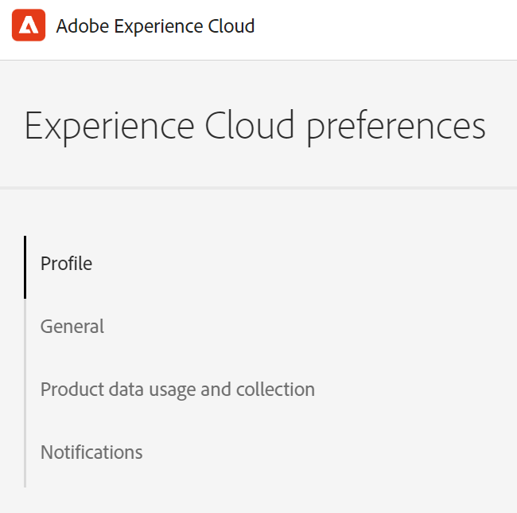

# 계정 환경 설정 및 알림

CX 엔터프라이즈 환경 설정을 찾으려면 헤더에서 **[!UICONTROL Profile]** 을 클릭한 다음 **[!UICONTROL Preferences]**&#x200B;을(를) 클릭합니다.

{width="100" zoomable="yes"}

[!UICONTROL CX Enterprise preferences] 페이지에서 다음 계정 기능을 관리할 수 있습니다.

| 기능 | 설명 |
| --- | --- |
| [!UICONTROL Profile] | [Adobe 계정 프로필](https://account.adobe.com/kr/profile)을 업데이트합니다. 
Adobe.com, Adobe 제품 및 서비스, [!DNL Behance]과(와) 같은 공개 사이트에 로그인하면 프로필 사진과 이름이 표시됩니다. |
| [!UICONTROL General] | [조직](../administration/organizations.md)을(를) 선택하십시오.
이 조직은 CX Enterprise에 로그인할 때 사용되는 기본 조직입니다. |
| [!UICONTROL Product usage data] | CX 엔터프라이즈 애플리케이션을 사용할 때 Adobe과 공유되는 제품 사용 데이터를 제어할 수 있습니다. 이는 조직의 콘텐츠나 데이터 자체가 아니라 당사 제품을 사용하는 방식에 대한 데이터입니다. Adobe은 이 정보를 사용하여 당사의 제품을 개선하고, 향상된 제품 내 지원을 제공하며, 당사의 경험과 커뮤니케이션을 개인화합니다. 
자세한 내용은 [제품 사용 데이터](#product-usage-data)(이 페이지)를 참조하세요. |
| [!UICONTROL Notifications] | 제품 [알림](#subscribe-to-notifications-in-experience-cloud) 및 경고를 원하는 방법과 시기를 구성하십시오. <ul><li>경고를 구독할 제품 선택</li><li>알림 유형 구성([!UICONTROL in-app], [!UICONTROL email] 또는 [Slack](#slack-notifications))</li><li>이메일 알림을 수신할 빈도를 지정합니다. (발송하지 않음, 실시간, 매일 또는 매주)</li><li>경고 우선 순위를 결정합니다. 인앱 경고가 창의 오른쪽 상단 모서리에 몇 초 동안 나타납니다. 또는 경고를 닫을 때까지 경고를 표시할지 여부를 지정할 수 있습니다.</li></ul> |

## [!UICONTROL Product usage data]

Adobe과 공유하도록 선택하는 제품 사용 데이터에는 Adobe 애플리케이션을 사용하고 상호 작용하는 방법에 대한 다음 유형의 정보가 포함되어 있습니다.

* 디바이스 모델 및 운영 체제, 소프트웨어 및 하드웨어 정보, 브라우저 및 디바이스 설정, 고유 식별자(IP 주소, 쿠키 ID 또는 디바이스 ID 등), 설치된 메모리 양, 언어 설정 및 화면 해상도 등의 브라우저 및 디바이스 정보
* 사용하는 기능과 선택한 옵션을 포함하여 Adobe CX Enterprise 앱과 상호 작용하는 방법
* 버전 번호와 같은 Adobe 제품 정보
* 페이지 수, 고유 식별자 등 콘텐츠 및 문서에 대한 정보이지만 콘텐츠 자체는 아닙니다.
* 콘텐츠에 액세스하는 횟수, 앱 내에서 콘텐츠와 상호 작용하는 방법 등의 콘텐츠 사용 정보.
* 충돌 및 오류 로그

Adobe은 이 정보를 사용하여 당사의 제품을 개선하고, 제품 내 및 고객 지원 센터를 통해 지원을 제공하며, 당사의 경험과 커뮤니케이션을 개인화합니다. [개인화된 경험](personalized-learning.md)에 대해 자세히 알아보세요.

## CX Enterprise에서 알림 구독

구독하려는 제품 및 범주를 선택할 수 있습니다. 알림은 [!UICONTROL Notifications] 팝오버(인앱), 이메일 또는 [Slack](#slack-notifications)에 표시됩니다(구독에 따라 다름).

이메일 및 Slack 알림은 CX Enterprise에 로그인하지 않은 경우에 유용합니다.

### 인앱 및 이메일 알림 구독

1. CX Enterprise [환경 설정](https://experience.adobe.com/preferences)&#x200B;(으)로 이동합니다.

1. **[!UICONTROL Notifications]**&#x200B;에서 **[!UICONTROL In-app]** 또는 **[!UICONTROL Email]**&#x200B;을(를) 사용하도록 설정합니다.

   알림에 대한 변경 사항은 자동으로 저장됩니다.

### [!DNL Slack] 알림 구독

CX 엔터프라이즈 알림을 [!DNL Slack] 채널로 보내도록 계정 환경 설정을 구성할 수 있습니다.

**전제 조건**

* CX 엔터프라이즈 계정이 있어야 합니다.
* [!DNL Slack] 계정이 있어야 합니다. [!DNL Slack] 관리자가 [!DNL Slack]과(와) CX 엔터프라이즈 통합을 사용하도록 설정합니다.
* 하나 이상의 [!DNL Slack] 작업 영역에 속해 있어야 합니다.

**알림 [!DNL Slack]개를 구독하려면**

1. CX Enterprise [환경 설정](https://experience.adobe.com/preferences)&#x200B;(으)로 이동합니다.

1. [!DNL Slack]을(를) 찾은 다음 **[!UICONTROL Add to Slack]**&#x200B;을(를) 클릭합니다.

   

   [!DNL Slack]이(가) 설치되어 있으면 응용 프로그램이 열리고 권한 요청 메시지가 표시됩니다. Slack이 설치되지 않은 경우 [권한을 요청](#slack-troubleshoot)해야 합니다.

1. **[!UICONTROL Allow]**&#x200B;을(를) 클릭합니다.

1. **[!UICONTROL Notifications]**&#x200B;에서 원하는 제품 및 범주에 대해 [!DNL Slack] 알림을 사용하도록 설정하십시오.

   

   알림에 대한 업데이트는 자동으로 저장됩니다.

### [!DNL Slack]에서 권한 요청(문제 해결)

[!DNL Slack]이(가) 설치되지 않은 경우 **[!UICONTROL Add to Slack]**&#x200B;을(를) 클릭한 후 Slack이 열리면 _[!UICONTROL Request to install]_&#x200B;메시지가 표시됩니다. 예:

**Slack에서 권한을 요청하려면**

1. [!DNL Slack]의 **[!UICONTROL Workspace]** 메뉴(오른쪽 상단)에서 작업 영역을 선택합니다.

1. [!DNL Slack] 작업 영역 관리자에 대한 응용 프로그램 승인을 요청하려면 **[!UICONTROL Submit]**&#x200B;을(를) 클릭하십시오.

1. 응용 프로그램 요청이 승인된 후 [!DNL Slack]에서 알림을 받게 됩니다.

1. [!DNL Slack] 승인을 받은 후 CX Enterprise **[!UICONTROL Notifications]**(으)로 돌아가서 [Slack에 가입](#slack-notifications)(위에서 설명)하는 단계를 수행합니다.

### [!DNL Slack]에서 보게 되는 내용

[!DNL Slack]을(를) 통합한 후 [!DNL Slack] 알림에 다음 정보가 표시됩니다.

* 응용 프로그램 이름 _Adobe[!DNL CX Enterprise]_&#x200B;에서 개인 메시지를 받습니다.
* 메시지에는 Adobe [!DNL Experience Platform], Adobe [!DNL Experience Manager] 등과 같은 특정 응용 프로그램에 대한 제품 로고가 포함됩니다.
* CX Enterprise에서 모든 알림을 볼 수 있는 링크입니다.
* CX Enterprise에서 알림 환경 설정을 관리하는 링크입니다.

## CX Enterprise에서 [!UICONTROL notifications] 및 공지 보기

[!DNL CX Enterprise] 헤더에서 [구독](#notifications)한 알림을 볼 수 있으며 알림을 볼 수도 있습니다.

1. 머리글에서 종 아이콘을 클릭합니다. 

1. **[!UICONTROL Notifications]** 또는 **[!UICONTROL Announcements]**&#x200B;를 클릭합니다.

   이 위치에서는 제품, 동료 사용자와의 공동 작업 및 기타 관련 업데이트에 대한 중요한 정보를 받을 수 있습니다. 업데이트에는 제품 릴리스, 유지 관리 알림, 공유 항목 및 승인 요청이 포함됩니다.

