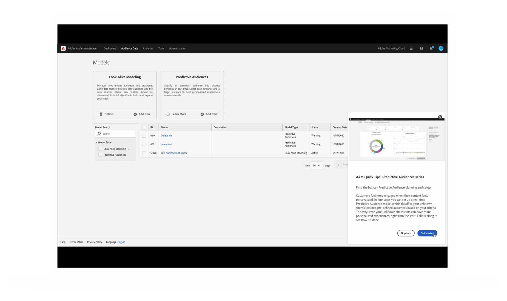

# 개인화된 학습 환경 설정

Adobe은 Adobe 제품에서의 작업을 기반으로 개인화된 유용한 콘텐츠를 제공합니다. 제품 사용 데이터는 이 컨텍스트를 사용자에게 맞춤화하는 방법을 알려줍니다. [CX 엔터프라이즈 환경 설정](https://experience.adobe.com/preferences) 페이지에서 제품 사용 데이터 공유를 옵트인하거나 옵트아웃할 수 있습니다.

<!--
## Personalized training and support recommendations for your Adobe products and services

Receive relevant best practices, tips & tricks, helpful walk throughs, and more based on your use of your Adobe products in each of these three ways...

<table>
<tbody>
  <tr>
    <td>In your Adobe products... </td>
    <td>See pop ups and tool tips for real-time help.</td>
    <td rowspan="3">This could include... <ul><li>Step-by-step guides and helpful tips from Adobe experts</li> 
    <li>Video tutorials and informational walkthroughs</li> 
    <li>In-depth training and education</li> 
    <li>Recommendations for videos and posts</li>
    </ul></td>
  </tr>
  <tr>
    <td>In email Adobe sends you...</td>
    <td>Seeing learning content that relates to your work in your product(s).</td>
  </tr>
  <tr>
    <td>In the Experience League Communities..</td>
    <td>See personalized recommendations for posts and articles based on what you're doing now.</td>
  </tr>
</tbody>
</table>

## Personalized information about Adobe products, services, events, and promotions

Receive tailored opportunities for learning events, research sessions, and integrations based on your work in each of these three ways...

<table>
<tbody>
  <tr>
    <td>In your Adobe products... </td>
    <td>See pop ups and tool tips for invitations and opportunities relevant to you.</td>
    <td rowspan="3">This could include... <ul>
    <li>Invitations to educational webinars and events</li> 
    <li>Opportunities to test and give input on future releases of the features you use</li>
    <li>Tips to use integrations between products you own</li> 
    <li>Highlights for key sessions at the Adobe Summit conference based on your work</li>
    </ul></td>
  </tr>
  <tr>
    <td>In email Adobe sends you...</td>
    <td>Get timely information from Adobe about additional learning opportunities.</td>
  </tr>
  <tr>
    <td>In the Experience League Communities..</td>
    <td>See personalized recommendations for events and services to enhance your learning.</td>
  </tr>
</tbody>
</table>

-->

<!-- 
{width="10%"} 
-->

## 사용자 지정된 학습 정보가 표시되는 모습의 예

### Adobe 제품에서

{width="800"}

### Adobe로부터 수신한 이메일에서

{width="400"}

### Experience League 커뮤니티에서

{width="800"}

<!-- {width="10%"} -->