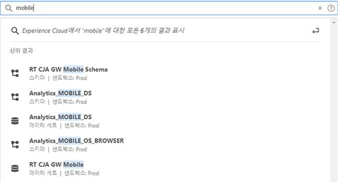
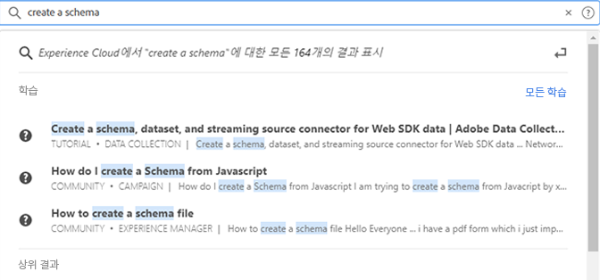

# 오브젝트 및 엔티티에 대한 [!UICONTROL 통합 검색] {#globally-search}

[!UICONTROL 통합 검색]을 사용하면 원활하고 일관성 있는 원클릭 환경에서 검색 가능한 비즈니스 오브젝트 또는 엔티티를 찾을 수 있습니다. 이 검색은 최근에 액세스한 개체도 표시합니다.

## 통합 검색 액세스

통합 검색은 Experience Cloud 헤더의 모든 페이지 상단에서 사용할 수 있습니다. 키보드 단축키 `command /` 또는 `ctrl /`을 사용하여 검색할 수도 있습니다.

이 기능은 현재 다음과 같은 지원되는 제품에 대해서만 사용할 수 있습니다.

* Experience Platform (AEP)
* Journey Optimizer (AJO)

더 많은 콘텐츠가 색인화되면 관련 애플리케이션에 이 기능이 추가됩니다.

## 검색 가능한 오브젝트 및 필드

입력할 때 표시할 액세스 권한이 있는 오브젝트에서 일치하는 상위 결과가 표시됩니다.

당사의 알고리즘은 가장 관련성이 높은 레코드를 먼저 표시합니다. 결과 순서는 다음과 같은 몇 가지 요인에 따라 달라집니다.

기능 및 오브젝트 권한
일치율
정확히 일치하는 항목 유무

검색 가능한 비즈니스 오브젝트는 다음과 같습니다.

* 세그먼트 (이름, 설명, ID)
* 스키마(이름, 설명, ID)
* 데이터 세트 (이름, 설명, ID)
* 소스 (이름, 설명, ID)
* 대상(이름, 설명, ID)
* 쿼리(이름, 설명, ID)
* 메시지(이름, 설명, ID)
* 오퍼(이름, 설명, ID)
* 구성 요소 (이름, 설명, ID)
* 여정 (이름, 설명, ID)

키워드가 탐색 페이지와 일치하는 경우, 탐색 페이지 예제 데이터 세트에 대한 빠른 액세스 링크를 얻을 수 있습니다. 상위 결과 섹션에는 상위 30개 결과가 표시됩니다.

또한 Experience League 및 커뮤니티에서 도움말 문서를 찾을 수 있습니다. 자연어 쿼리가 지원됩니다.

예를 들어 _스키마를 만드는 방법_&#x200B;은 _[!UICONTROL 학습]_ 아래의 Experience League에서 결과를 생성합니다.

검색 알고리즘은 가장 관련성이 높은 레코드를 먼저 표시합니다. 결과 순서는 다음과 같은 몇 가지 요인에 따라 달라집니다.

* 오브젝트에 액세스할 수 있는 사용자 권한
* 일치율
* 정확한 일치
* _[!UICONTROL 상위 결과]_ 섹션에는 상위 30개 결과가 표시됩니다.

검색을 구체화하려면 다음 중 하나를 클릭하십시오.

* **[!UICONTROL 모든 학습]**: Experience League에서 검색을 엽니다.
* **[!UICONTROL 모두 표시...]**: 결과를 세분화하고 필터링할 수 있습니다.

## 통합 검색 기능

통합 검색에는 다음과 같은 기능이 추가되었습니다.

| 기능 | 설명 |
| ------- | ------- |
| 글로벌 언어 지원 | 글로벌 검색은 독일어, 스페인어, 프랑스어, 이탈리아어, 일본어, 한국어, 포르투갈어 및 중국어에 대한 쿼리를 인식하며 검색 결과를 생성합니다. |
| 오타 허용치 | 통합 검색은 고급 알고리즘을 사용하여 강력한 오타 허용치를 제공합니다. 이러한 알고리즘은 오타를 자동으로 편집하고 적절한 검색 결과를 제공합니다. |
| 강조 표시 | 검색 응답은 검색 쿼리에서 일치하는 키워드를 강조 표시하므로 해당 쿼리와 일치하는 섹션 및 단어를 손쉽게 찾을 수 있습니다. 강조 표시는 맞춤법이 틀린 단어에도 적용됩니다. |
| 스니펫 | 검색 응답에서 검색 결과에 대한 스니펫을 볼 수 있습니다. 스니펫은 일치하는 단어와 일치하는 키워드 주위의 일부 콘텐츠를 반환합니다. |
| 정지어 | 영어에서 자주 사용되는 몇몇 단어는 _정지어_&#x200B;로 정의됩니다. 검색 쿼리에 정지어가 포함되는 경우 해당 정지어에는 중요도가 낮게 부여됩니다.  정지어는 다음과 같습니다. _a, an, and, are, as, at, be, but, by, for, if, in, into, is, it, no, not, of, on, or, such, that, the, their, then, there, these, they, this, to, was, will, with_  다른 글로벌 언어에서는 정지어가 지원되지 않습니다. |
| 자연어 쿼리 | Experience League 커뮤니티에서 도움말 문서 또는 토론을 검색할 때 자연어를 사용하여 질문을 입력하고 응답을 얻을 수 있습니다. 검색 예: “스키마를 만들려면 어떻게 해야 합니까?” |
| 따옴표를 사용한 정확한 검색 | 쿼리에 따옴표를 사용하여 정확한 검색을 수행할 수 있습니다. 정확한 일치 쿼리에는 오타가 수정되지 않습니다. 예: “Luma Journey 2022” |
| 필터 | 전체 검색 결과 팝업에 _오브젝트 유형_&#x200B;과 같은 필터 및 기타 오브젝트별 필터를 적용할 수 있습니다. 검색 쿼리를 입력한 다음 Enter 키를 누르면 필터가 포함된 전체 페이지 팝업이 열립니다. |

{style="table-layout:auto"}

## 팝업을 찾을 수 없습니까?

다음 팁을 시도해 보십시오.

* 보다 구체적인 검색어 입력
* 맞춤법 검사
* 완전한 검색어 입력
* 검색하려는 오브젝트에 대한 권한을 보유하고 있는지 확인
