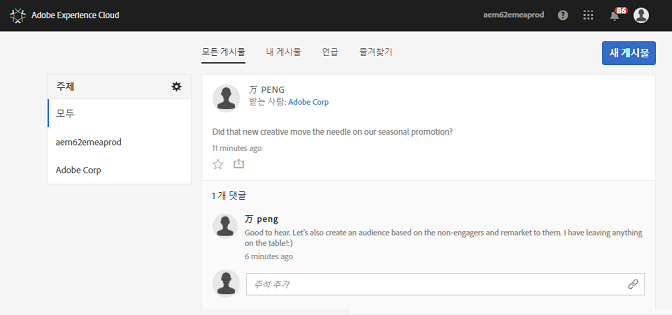

# 피드

Experience Cloud 피드를 사용하여 다른 사용자와 직접 자산 및 Analytics 보고서를 공유하거나 게시하는 방법에 대해 알아봅니다.

처음 Experience Cloud에 로그인한 경우에는 피드가 비어 있을 수도 있습니다. 게시물을 만들어 공유하고 다른 사용자가 컨텐츠를 공유하면 피드가 자동으로 채워져 사용자와 사용자 팀 구성원이 계속 최신 정보를 볼 수 있습니다.

피드의 설정은 다음과 같습니다.

* **항목: 모든 \&lt;조직 이름\&gt;:** 사용자와 공유된 모든 게시물 및 사용자가 액세스할 수 있는 모든 게시물을 표시합니다.
* **항목 관리:** 항목을 팔로우, 언팔로우 또는 제안할 수 있습니다. 또한 관리자가 항목을 승인, 거부, 비활성화 및 만들 수 있습니다.
* **새 게시물:** 그룹 구성원이 볼 수 있는 게시물을 만듭니다.
* **모든 게시물:**&#x200B;피드에 모든 게시물을 표시합니다.
* **내 게시물:** 사용자의 게시물만 표시합니다.
* **언급:** 사용자 또는 사용자 그룹이 언급된 게시물만 표시합니다.
* **즐겨찾기:** 즐겨찾기로 표시한 게시물만 표시합니다.

## 피드에 Analytics 프로젝트 공유 {#section_F2BDF9FEF4394686BAC5051CBE913EE5}

[!UICONTROL Reports &amp; Analytics]에서 Experience Cloud 피드에 보고서를 공유할 수 있습니다.

1. Adobe ID를 사용하여 Experience Cloud에 [로그인](admin-getting-started/getting-started-experience-cloud.md#topic_AC564B6795334DE39359ADD87F52F2E0)합니다.

1. Reports &amp; Analytics로 이동한 후 [프로젝트를 만듭니다](https://marketing.adobe.com/resources/help/en_US/analytics/analysis-workspace/freeform_overview.html).

1. **[!UICONTROL 자세히]** &gt; **[!UICONTROL 공유]**&#x200B;를 클릭합니다.

   

1. 공유 창에서 수신자를 추가한 다음 **[!UICONTROL 공유]**&#x200B;를 클릭합니다.
