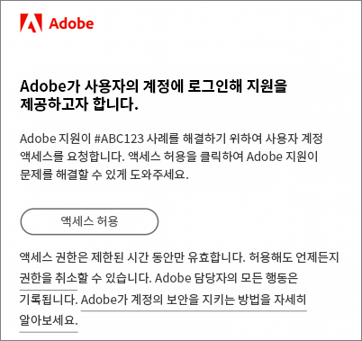

# Experience Cloud FAQ

Experience Cloud를 사용하는 관리자를 위한 브라우저 지원, 일반적인 질문과 답변을 살펴볼 수 있습니다.

+++Experience Cloud에서 지원되는 브라우저는 무엇입니까?

Adobe은 다음 브라우저의 현재 및 이전 두 버전을 지원합니다.

* Microsoft® Edge
* Google Chrome
* Mozilla Firefox
* Safari
* Opera

다른 브라우저 사용은 가능하나 지원이 보장되지는 않습니다.

>[!NOTE]
>
>Experience Cloud 도메인에서 실행 중인 모든 애플리케이션이 전체 브라우저를 지원하는 것은 아닙니다. 확실치 않다면 특정 애플리케이션의 설명서를 참조하십시오.

+++

+++지원되는 언어는 무엇입니까?

Experience Cloud는 Adobe 사용자 계정 환경 설정에 설정되는 각 사용자의 기본 언어를 지원합니다. 현재 지원되는 언어는 다음과 같습니다.

* 중국어
* 영어
* 프랑스어
* 독일어
* 이탈리아어
* 일본어
* 한국어
* 포르투갈어
* 스페인어
* 대만어

응용 프로그램 팀은 글로벌 언어 지원에 전념하고 있지만 모든 응용 프로그램이 위에 언급된 모든 언어로 제공되지 않습니다. 기본 언어가 Experience Cloud 애플리케이션에서 지원되지 않는 경우 보조 언어를 기본값으로 설정할 수 있습니다. [Experience Cloud 사용자 환경 설정](https://experience.adobe.com/preferences)에서 수행할 수 있습니다.

+++

+++Adobe에서 우리 회사에 Adobe Experience Cloud 액세스 비용을 청구합니까?

아니요. Adobe Experience Cloud은 추가 비용 없이 제공됩니다. 그렇지만 특정 핵심 서비스에는 추가 비용이 있을 수 있습니다.

+++

+++우리 회사에서 Experience Cloud 인터페이스를 통해 로그인해야 하는 이유는 무엇입니까?

Experience Cloud 인터페이스에서 제공하는 기능은 귀하의 비즈니스에 새로운 가치를 부여합니다. 또한 향후 애플리케이션에 액세스하기 위한 표준 경로로 사용되며 결과적으로는 다른 개별 애플리케이션 로그인 흐름을 대체하게 됩니다. Experience Cloud를 통해 로그인하면 나중에 원활하게 전환할 수 있습니다.

+++

+++Adobe은 어떻게 내 Adobe 클라우드 환경에 액세스하여 문제를 해결할 수 있습니까?

Adobe 고객 지원 센터는 사용자의 명시적 인증을 요구하는 Adobe 브랜디드 이메일(아래 예)을 수신하는 가장 요청을 제출할 수 있습니다. 액세스 권한은 제한된 시간 동안 부여됩니다. 권한이 부여된 후 언제든지 해당 액세스 권한을 해지할 수 있습니다. Adobe는 Adobe 담당자가 수행한 모든 작업을 기록합니다.

+++

+++프로비저닝이란 무엇입니까?

Experience Cloud의 프로비저닝은 다음을 의미합니다.

* 사용자는 Experience Cloud에 로그인하고 애플리케이션을 연결할 수 있습니다.
* Experience Cloud을 통해 사용할 수 있는 기능을 사용할 수 있습니다.
* 애플리케이션별 로그인 프로세스의 사용을 중단할 준비를 갖출 수 있습니다.
* 애플리케이션에 대한 액세스 제어 권한은 그대로 유지할 수 있습니다.

+++

+++사용자 환경 설정, 알림 및 경고를 관리하려면 어떻게 해야 합니까?

* [계정 환경 설정 및 알림](/help/interface/features/account-preferences.md) 보기

+++

+++제품 프로필 및 사용자 계정 자격 증명을 관리하려면 어떻게 해야 합니까?

* 도움이 필요하면 [Admin Console 사용 안내서](https://helpx.adobe.com/kr/enterprise/admin-guide.html) 를 참조하십시오.

* 사용자 자격 및 제품 관리는 [Adobe Admin Console](https://adminconsole.adobe.com/enterprise)&#x200B;(제품 링크)에서 수행됩니다.

* **중요:** Analytics 관리자는 [Admin Console의 Analytics 사용자 관리](https://experienceleague.adobe.com/docs/analytics/admin/user-product-management/migrate-users/c-migration-tool.html)에서 사용자 ID를 Analytics 관리 도구에서 Admin Console로 마이그레이션하는 작업에 대해 참조하십시오.

+++

+++Experience Cloud에 로그인할 수 없으면 어떻게 해야 합니까?

Admin Console 관리자는 사용자에게 액세스 권한을 부여할 수 있습니다. 사용자에게 로그인 지침이 포함된 이메일이 전송됩니다.

[Adobe 지원 센터에 문의](https://experienceleague.adobe.com/?support-solution=General#support)하여 귀사가 완전히 프로비저닝되었는지 확인해야 할 수 있습니다.

+++

+++사용자가 계정 링크를 관리하려면 어디로 이동해야 합니까?

일부 사용자는 애플리케이션(Analytics) 계정을 Adobe ID 또는 Enterprise ID에 연결해야 할 수도 있습니다.

[Adobe ID에 애플리케이션 계정 연결](../administration/organizations.md)을 참조하십시오.

+++

+++사용자 계정 프로필 및 조직을 관리하려면 어떻게 해야 합니까?

[사용자 계정 관리](../administration/organizations.md)를 참조하십시오.

+++

+++조직이란?

[조직](../administration/organizations.md)은 관리자가 그룹과 사용자를 구성하고, Experience Cloud에서 SSO(Single Sign-On)를 제어할 수 있도록 하는 항목입니다. 조직은 모든 Experience Cloud 제품 및 애플리케이션을 포괄하는 로그인 회사와 같은 기능을 합니다. 대부분의 경우 조직은 회사 이름입니다. 그렇지만 한 회사에 여러 조직이 있을 수 있습니다.

+++

+++IMS 조직 ID는 어디에서 찾을 수 있습니까?

자세한 내용은 [조직 ID 조회](../administration/organizations.md)를 참조하십시오.

+++

+++사용자 중 한 명이 회사를 퇴사할 경우 어떻게 해야 합니까?

애플리케이션 자체에서 액세스 권한이 제거됩니다. 따라서 Experience Cloud에서 또는 직접 로그인을 통해 제품에 액세스할 수 없습니다. Experience Cloud 수준에서도 제거해야 합니다.

+++

+++Adobe ID란?

[ID 유형](https://helpx.adobe.com/kr/enterprise/using/identity.html)을 참조하십시오.

+++

+++사용자의 애플리케이션 계정을 연결할 수 있습니까?

아니요. 사용자는 자체 애플리케이션을 사용자 이름 및 암호에 연결해야 합니다.

+++
