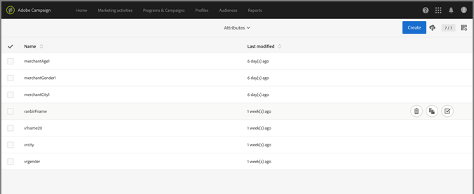

# 캠페인{#campaign}

Adobe Campaign Standard 내에서 오퍼를 사용하고 필드를 공유하는 방법을 알아봅니다.

하나 이상의 폴백 오퍼와 하나의 일반 오퍼를 만든 후 Campaign Standard의 이메일을 사용하여 오퍼 활동을 만들 수 있습니다. 오퍼 활동은 일반 이메일 캠페인에서만 만들 수 있습니다. 트랜잭션 이메일 캠페인(예: 장바구니 포기 이메일 등 이벤트에 의해 트리거되는 반복 이메일)에 추가할 수 없습니다.

오퍼 활동은 이메일 템플릿의 위치에 표시할 수 있는 오퍼 그룹과 폴백 오퍼를 선택하라는 메시지를 표시합니다. 이메일 준비 시 배치, 날짜, 제안 상태 및 고객 프로필 데이터를 기반으로 제공되는 가장 좋은 오퍼가 이메일 준비 시간에 선택됩니다.

## 캠페인에서 오퍼 관리로 속성 [!UICONTROL 공유]{#task_4DFA9A20D7B04E1F9AFF4774D67B6EBC}

오퍼 관리에서 오퍼를 만들 [!UICONTROL 때]특정 오퍼를 수신할 수 있는 프로파일을 제한하는 자격 규칙을 설정할 수 있습니다. 이러한 자격 조건 규칙은 캠페인 프로필에 존재하는 특성(또는 필드)을 기반으로 설정할 수 있습니다. 이러한 필드는 오퍼 관리 자격 조건 규칙 빌더에 표시되기 전에 [!UICONTROL 캠페인에서 공유해야] 합니다.

>[!NOTE]
>
>속성을 공유하려면 Campaign에 관리자 권한이 있어야 합니다.

1. Adobe **[!UICONTROL Campaign]**을 클릭하여 탐색에 액세스합니다.
1. 관리 > **[!UICONTROL 인스턴스 설정]**>**[!UICONTROL &#x200B;오퍼]** 관리로 **[!UICONTROL 이동하고]**속성을****클릭합니다.

   이 페이지에는 이미 공유된 속성이 표시됩니다. 이러한 속성을 편집하거나 삭제할 수 있습니다.

   

   >[!NOTE]
   >
   >현재 자격 조건 규칙에서 오퍼 [!UICONTROL 관리에서] 속성을 사용 중인 경우 삭제할 수 없습니다.

1. **[!UICONTROL 만들기]**를 클릭합니다.

1. 폴더 아이콘을 클릭하여 캠페인 데이터 소스를 정의하고 공유할 요소를 선택합니다.

   

1. 대상 데이터 레이블을 선택합니다.

   오퍼 관리의 자격 조건 규칙 빌더에 표시되는 속성의 [!UICONTROL 이름입니다].

1. **[!UICONTROL 만들기]**를 클릭합니다.

   오퍼를 만들고 편집할 [!UICONTROL 때 오퍼 관리] 자격 조건 규칙 빌더에 속성이 표시됩니다.

   

## Create an offer activity {#task_F63ADDA52BD949779DB491E4D56E664E}

Campaign Standard의 이메일 템플릿 내의 이미지 또는 텍스트 블록에 오퍼 활동을 삽입합니다.

1. 이미지 위치에 오퍼 활동을 삽입하려면 이미지를 한 번 클릭하여 오퍼 삽입 아이콘을 표시합니다.

   

1. (대체 요소):텍스트 블록에 오퍼 활동을 삽입하려면 텍스트 블록을 두 번 클릭하여 오퍼 삽입 아이콘을 표시합니다.

1. [오퍼 활동 만들기] [!UICONTROL 화면의 [활동 세부] 사항] [!UICONTROL 탭에 세부 사항을] 입력합니다.

   | 필드 | 설명 |
   |---|---|
   | 활동 이름 | 활동에 이름을 지정합니다. 이미 다른 오퍼 활동에 사용된 활동 이름은 입력할 수 없습니다. |
   | 배치 | 이 위치에 사용할 배치를 선택합니다. 배치와 일치하는 컨텐츠 표현이 있는 오퍼만 사용자에게 제공되도록 하기 위한 것입니다. 이 배치가 있는 오퍼만 활동 생성 중 나머지 기간 동안 오퍼 목록에 표시됩니다. |

1. 오퍼 [!UICONTROL 선택] 탭에서 활동에 포함할 오퍼를 선택합니다.

   레이블이나 개별 오퍼를 사용하여 오퍼 그룹을 하나씩 선택할 수 있습니다.

   * **레이블을 사용하여 오퍼 그룹 선택:**

      레이블을 사용하여 오퍼 그룹을 선택하려면 규칙 빌더 **[!UICONTROL 탭을]**클릭한 다음 레이블 규칙**[!UICONTROL &#x200B;추가를 클릭합니다]**. 오퍼 활동에 포함할 오퍼를 결정하는 규칙을 만들려면 레이블을 선택합니다. 레이블 _사이에 AND_ 연산자가 나타납니다. 연산자를 AND에서 _OR로_ 변경하려면 _연산자를_&#x200B;클릭합니다.

      

   * **개별 오퍼 선택:**

      개별 오퍼를 선택하려면 오퍼 인벤토리 **[!UICONTROL 탭을]**클릭합니다. 사용자는 오퍼 목록 내에서 오퍼 이름, 오퍼 ID 또는 오퍼에 추가된 레이블별로 검색할 수 있습니다.

      더하기 기호를 클릭하여 선택한 오퍼 섹션에 오퍼를 추가합니다.

      

      오퍼를 규칙 빌더와 오퍼 재고에서 모두 사용할 수 있으려면 다음을 수행해야 합니다.

   * 오늘 날짜 일치
   * 승인 상태가 됩니다.
   * 1단계에서 선택한 배치와 일치하는 배치를 가진 컨텐츠 표현을 만듭니다.

      >[!NOTE]
      >
      >오퍼 재고 탭에 나열된 오퍼는 배치 및 승인 상태로만 필터링됩니다. Adobe Campaign의 이메일에 대해 설정된 타깃팅 기준과 일치하도록 필터링되지 않았습니다.

1. 오퍼 [!UICONTROL 폴백] 탭에서 대체 오퍼를 선택합니다. 대체 오퍼는 다른 오퍼에 대한 자격이 없는 고객에게만 전송됩니다. 목록에서 하나의 폴백 오퍼만 선택할 수 있습니다.
1. 오퍼 활동의 요약을 보고 완료를 **[!UICONTROL 클릭합니다]**.

   각 사용자에게 제공할 최상의 혜택은 이메일 준비 시 다음을 평가하여 결정됩니다.

* **** 배치 확인:모든 오퍼에는 오퍼 활동의 일부로 선택한 배치와 일치하는 컨텐트 표현이 있어야 합니다. 활동 생성 시간과 준비 시간 사이에 오퍼에 대한 배치가 삭제되는 경우(시간이 3분 이상인 경우) 해당 오퍼는 고려되지 않습니다.
* **** 날짜 확인:모든 오퍼는 현재 날짜에 대해 유효해야 합니다(오퍼 전송 날짜가 _아님_ ). 이메일 캠페인을 준비하는 날짜는 제공할 오퍼를 결정하는 날짜입니다. 예를 들어, 2017년 1월 15일에 이메일 캠페인을 준비하고 선택한 오퍼 중 하나가 2017년 1월 16일까지 유효하지 않은 경우 오퍼가 제공되지 않습니다.

* **** 자격 조건 규칙 확인:모든 오퍼는 [자격 조건을](offers.md)충족해야 합니다.

* **** 우선 순위 확인:사용자가 여러 오퍼를 사용할 수 있는 경우 [!UICONTROL 오퍼] 관리에서는 사용자 설정 우선 순위를 사용하여 각 사용자를 표시할 오퍼를 결정합니다.

   이제 이메일을 보낼 준비가 되었습니다. 홈페이지에서 [!UICONTROL 보고서] [!DNL Adobe Campaign] 탭을 선택하여 오퍼의 수행 방식을 확인합니다.

   Adobe Campaign 사용에 대한 자세한 내용은 다음 가이드를 참조하십시오.

* [이메일 만들기](https://docs.campaign.adobe.com/doc/standard/en/CHA_Email_messages_Creating_an_email.html)
* [이메일 보내기](https://docs.adobe.com/content/help/en/campaign-standard/using/testing-and-sending/about-sending-messages-with-campaign.html)
* [동적 보고서 정보](https://docs.campaign.adobe.com/doc/standard/en/RPT_About_reporting_About_dynamic_reports.html)

## 오퍼 보고서

Adobe Campaign은 오퍼를 모니터링하고 해당 영향력을 측정할 수 있는 세 가지 오퍼 차원(오퍼, 오퍼 활동, 오퍼 배치)과 하나의 지표(오퍼 클릭 수)를 제공합니다. 보고서를 보려면 Adobe Campaign Standard의 보고서 탭을 방문하십시오. 보고서를 만들고 다른 오퍼 차원을 보고서 패널에 드래그하여 놓아 데이터 필터링을 시작할 수 있습니다.

Campaign에서 동적 보고서를 만드는 방법에 대한 자세한 내용은 동적 [보고서](https://docs.campaign.adobe.com/doc/standard/en/RPT_About_reporting_About_dynamic_reports.html)정보를 참조하십시오.