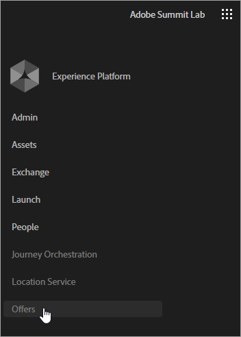

# Adobe 오퍼 관리 {#section_07CBD4C01F4049A5A19781737D2DCD35}

[!UICONTROL 오퍼 관리에서는 Experience Cloud 내의 모든 채널에 걸쳐 만들기, 관리 및 결정을 제공합니다. ] 자격 조건 규칙과 여러 컨텐츠를 각 오퍼 _객체에 연결할 수 있는 중앙 오퍼 카탈로그 역할을 합니다._ 채널 및 위치에 이러한 오퍼를 게시하고 각 상호 작용에서 각 고객을 위한 최적의 제안을 제공할 수 있습니다. 이러한 기능을 통해 고객 경험을 일관되고 효율적으로 관리할 수 있는 최상의 제안을 지속적으로 고객에게 전달할 수 있습니다.

다음과 같은 이점이 있습니다.

* 보다 개인화된 제안을 이메일로 전달하여 이메일 캠페인 성과를 향상시켰습니다.
* 향상된 워크플로우:마케팅 팀은 여러 게재 또는 캠페인을 만드는 대신 단일 배달을 만들어 워크플로우를 향상시킬 수 있으며 템플릿의 서로 다른 부분에 있는 오퍼를 변경할 수 있습니다.
* Adobe Campaign Standard 이메일 캠페인 워크플로우 외부에서 오퍼를 만들고, 관리하고, 승인할 수 있습니다.
* 이메일 캠페인과 고객 간에 오퍼가 표시되는 횟수를 제어합니다.

## 오퍼 액세스 {#task_DEB6F6A4B6E04E15AD3E1817D700688E}

오퍼 관리에 액세스하는 방법을 알아봅니다.

1. 프로비저닝은 Adobe에 문의하십시오.

   Experience Cloud 조직에는 Campaign Standard 인스턴스가 있어야 합니다. Adobe는 Campaign에서 이메일 내에서 오퍼 활동을 만들 수 있는 기능을 활성화할 수도 있습니다.

1. Experience Cloud 탐색 메뉴에서 솔루션 선택기를 클릭한 다음 오퍼를 **[!UICONTROL 클릭합니다]**.

   

   Campaign Standard의 오퍼에 액세스하려면 이메일 템플릿 **[!UICONTROL 내에서]**오퍼 아이콘을 클릭합니다.

   

   Marketing Cloud와 Adobe Campaign 계정에서 이러한 두 항목을 모두 확인하면 시작하는 데 필요한 기능을 사용할 수 있습니다.

## 사용자 및 권한{#concept_81F0ABB07ACC49E099EDCD87AA0436E1}을 참조하십시오 

관리자는 관리 콘솔에서 [!UICONTROL 오퍼 관리에] 사용자를 추가할 수 있습니다. 새 사용자에게 제품 액세스에 대한 지침이 이메일 초대장이 전송됩니다. 사용자가 추가되면 권한을 조정하여 오퍼 관리 전체에서 서로 다른 기능에 액세스할 수 [!UICONTROL 있습니다].

Admin Console 사용에 대한 자세한 내용은 HelpX Admin [Console 설명서를](https://helpx.adobe.com/enterprise/help/aedash.html)참조하십시오.

Campaign에서 표준 사용자는 자동으로 이메일 템플릿에 오퍼 활동을 포함할 수 있는 권한을 갖습니다.

>[!NOTE]
>
>베타의 경우 적절한 권한이 없습니다. 오퍼에 추가된 모든 사용자는 오퍼 관리 내의 모든 기능에 대한 전체 액세스 권한을 [!UICONTROL 가집니다].

## 오퍼 관리를 위한 제품 프로필 만들기

제품 프로필은 제품 내에서 사용자 역할을 만들기 위해 결합할 수 있는 권한 집합입니다. 제품 프로필을 만들고 사용자 또는 그룹이 할당되어야 합니다.

1. Adobe Admin Console [로 이동합니다](https://adminconsole.adobe.com/).

1. 프로세스(예:**[!UICONTROL 오퍼]**)를 클릭합니다.

1. 제품 [!UICONTROL 프로필] 페이지에서 새 프로필을 **[!UICONTROL 클릭합니다]**.

1. 제품 프로필의 이름과 설명을 입력한 다음 완료를 **[!UICONTROL 클릭합니다]**.

1. **[!UICONTROL 저장]**을 클릭합니다.

### 권한 - 정의

관리 콘솔에서 제품 [!UICONTROL 프로필에] 사용할 수 있는 오퍼 관리 권한에 대한 [!UICONTROL 설명입니다].

| 요소 | 설명 |
|--- |--- |
| 오퍼 만들기 및 편집 | 사용자에게 오퍼 관리에서 오퍼를 만들고 편집할 수 있는 액세스 권한을 [!UICONTROL 제공합니다]. 사용자에게 이 권한이 있지만 승인 _오퍼_ 권한이 없는 경우 사용자는 오퍼를 만들고 승인을 위해 제출할 수만 있습니다. 승인되기 전에는 오퍼 활동에 사용할 수 없습니다. |
| 오퍼 삭제 | 사용자에게 오퍼 삭제에 대한 액세스 권한을 제공합니다. |
| 오퍼 승인 | 사용자에게 오퍼를 승인할 수 있는 기능을 제공합니다. 이 권한을 가진 사용자는 승인이 필요한 오퍼에 대해 오퍼 관리에 로그인할 때 알림을 볼 수 있습니다. 사용자에게 이 권한과 오퍼 _만들기 및 편집_ 권한이 있는 경우 단일 워크플로우에서 오퍼를 만들고 승인할 수 있습니다. |
| 오퍼 보관 | 사용자에게 오퍼를 보관할 수 있는 기능을 제공합니다. |
| 레이블 만들기 | 사용자에게 레이블 탭과 오퍼 작성 화면의 인라인 모두에서 레이블을 만들 수 있는 기능을 제공합니다. 이 권한이 없으면 사용자는 오퍼를 만들 때 미리 만들어진 오퍼만 선택할 수 있습니다. |
| 레이블 편집 | 사용자에게 레이블 탭에서 레이블을 편집할 수 있는 기능을 제공합니다. |
| 레이블 삭제 | 사용자에게 레이블 탭에서 레이블을 삭제할 수 있는 권한을 제공합니다. |
| 배치 만들기 | 사용자에게 배치 탭에서 배치를 만들 수 있는 기능을 제공합니다. |
| 배치 편집 | 사용자에게 배치 탭에서 배치를 편집할 수 있는 기능을 제공합니다. |
| 배치 삭제 | 사용자에게 배치 탭에서 배치를 삭제할 수 있는 기능을 제공합니다. **** 참고:오퍼 활동에 사용되지 않는 배치만 삭제할 수 있습니다. |