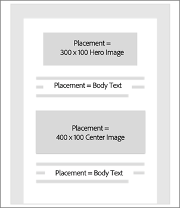

# 배치{#placements}

오퍼 활동에 대한 배치 만들기 및 관리.

## 배치 {#topic_A412442D4168497D981DE1C3AA1C9B61}

오퍼 활동에 대한 배치 만들기 및 관리.

오퍼를 만들기 전에 배치를 만들어야 합니다. 오퍼에 컨텐츠를 추가할 때 컨텐츠 표현을 표시할 배치를 지정합니다. 배치를 사용하면 이메일 캠페인에서 올바른 위치에 올바른 컨텐츠가 표시되도록 제어할 수 있습니다(예: 사각형 이미지가 사각형 배치에 표시되지 않도록 설정).

아래 예에서는 두 개의 서로 다른 크기 이미지에 대한 두 개의 배치와 템플릿의 위쪽과 아래쪽에 표시되는 텍스트에 대한 한 개의 배치가 있습니다.

## Create a placement {#task_89CD5692D86243A2B2E9BD5F7BAF52FB}

1. 배치 [!UICONTROL 탭에서 배치] 만들기를 **[!UICONTROL 클릭합니다]**.

   

1. 배치 이름과 배치 세부 정보를 입력합니다.

   배치(예: 컨텐츠 크기 또는 이메일의 위치 기준)를 여러 가지 방법으로 정의할 수 있습니다.

1. **[!UICONTROL 추가를 클릭합니다]**.
