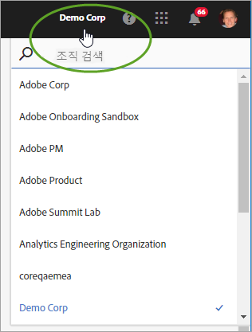
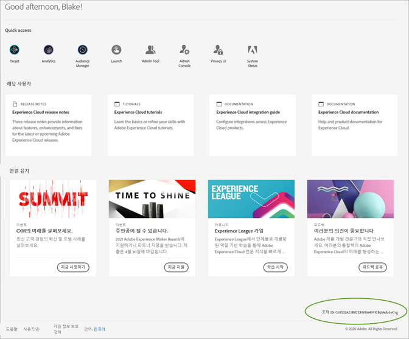

# Experience Cloud 내 조직

Experience Cloud 내 조직 관리 및 전환에 대해 알아봅니다.

## 조직 식별 {#concept_384D169B0B724B799D573B8ECB5C39BF}

** 조직은 관리자가 그룹과 사용자를 구성하고, Experience Cloud에서 SSO(Single Sign-On)를 제어할 수 있도록 하는 항목입니다. 조직은 모든 Experience Cloud 제품 및 애플리케이션을 포괄하는 로그인 회사와 같은 기능을 합니다. 대부분의 경우 조직은 회사 이름입니다. 그렇지만 한 회사에 여러 조직이 있을 수 있습니다.

올바른 조직에 로그인했는지 확인하려면 프로필 아바타를 클릭하여 조직 이름을 확인합니다. 둘 이상의 조직에 대한 액세스 권한을 보유하고 있다면 다른 조직을 확인하고 헤더 표시줄에서 바로 해당 조직으로 전환할 수도 있습니다.

조직이 Federated ID를 사용하는 경우 Experience Cloud를 통해 주소 및 암호를 입력할 필요 없이 조직의 Single Sign-On으로 로그인할 수 있습니다. 이 작업을 수행하려면 `#/sso:@domain` 를 Experience Cloud URL(`https://experience.adobe.com`)에 추가합니다.

예를 들어 조직에 Federated ID와 도메인 `adobecustomer.com`가 있는 경우 URL 링크를 `https://experience.adobe.com/#/sso:@adobecustomer.com`로 설정합니다. 애플리케이션 경로가 첨부된 이 URL을 책갈피로 지정하여 바로 특정 애플리케이션으로 이동할 수도 있습니다. (예: Adobe Analytics의 경우 `https://experience.adobe.com/#/sso:@adobecustomer.com/analytics`.)

## 조직 ID 찾기 {#concept_EA8AEE5B02CF46ACBDAD6A8508646255}

지원을 위해 조직 ID를 찾아야 할 수도 있습니다. **[!UICONTROL 조직]** 메뉴를 사용하여 올바른 조직에 있는지 확인하거나 조직 간에 전환할 수 있습니다.

**조직 ID**&#x200B;는 공급된 Experience Cloud 회사와 연결된 ID입니다. 이 ID는 24자의 영숫자 문자열과 @AdobeOrg(포함 필수)로 구성됩니다.

조직 ID를 보려면 Experience Cloud 랜딩 페이지로 이동하거나( )를 선택한 다음 **[!UICONTROL 관리]**&#x200B;를 선택합니다. [!UICONTROL Experience Cloud에서 시작하기] 페이지 하단 또는 [!UICONTROL 관리] 페이지에서 조직 ID를 찾을 수 있습니다.

## Adobe ID에 애플리케이션 계정 연결 {#task_FD389E78640848919E247AC5E95B8369}

일반적으로 Experience Cloud 관리자는 애플리케이션 및 서비스에 대한 액세스 권한을 부여합니다. 드문 경우이긴 하지만 애플리케이션 자격 증명을 Adobe ID에 연결해야 할 수 있습니다.

1. Experience Cloud로의 초대 이메일에 기재되어 있는 단계를 따릅니다.
1. Adobe ID 또는 Enterprise ID를 사용하여 로그인합니다.
1. 애플리케이션 선택기 선택. ().

   

   액세스 권한이 있는 애플리케이션에 색상이 지정됩니다.
1. 원하는 애플리케이션을 선택합니다.

   

   이 유형의 메시지는 적절한 그룹에 속하거나 애플리케이션에 대한 권한이 있지만, 계정 자격 증명을 아직 Adobe ID에 연결하지 않은 경우 표시됩니다.
1. **[!UICONTROL 계정 연결]**&#x200B;을 선택한 다음 자격 증명을 제공합니다.

## 기본 조직 및 랜딩 페이지 지정 {#concept_6A191B42A9874A9780882903BA18F071}

로그인할 때 사용할 기본 조직 및 랜딩 페이지를 지정할 수 있습니다.

프로필에서 **[!UICONTROL 프로필 편집을 선택합니다]**.

기본 조직 및 랜딩 페이지에서 로그인 환경을 사용자 지정할 수 있습니다.

## 계정 연결 문제 해결 {#concept_DFCB29A3B4834FC59AA29E0BBA301584}

계정 연결에서 비롯되는 문제들에 대한 도움말.

일반적으로, 계정 연결은 Adobe ID가 이전 사용자에게 연결되어 있어서 실패합니다. 계정 연결에 실패하면

* [Adobe 지원에 문의하십시오](https://experienceleague.adobe.com/?support-solution=General#support).
* 문제가 해결되는 동안 여전히 표준 로그인을 사용하여 애플리케이션에 액세스할 수 있습니다.
