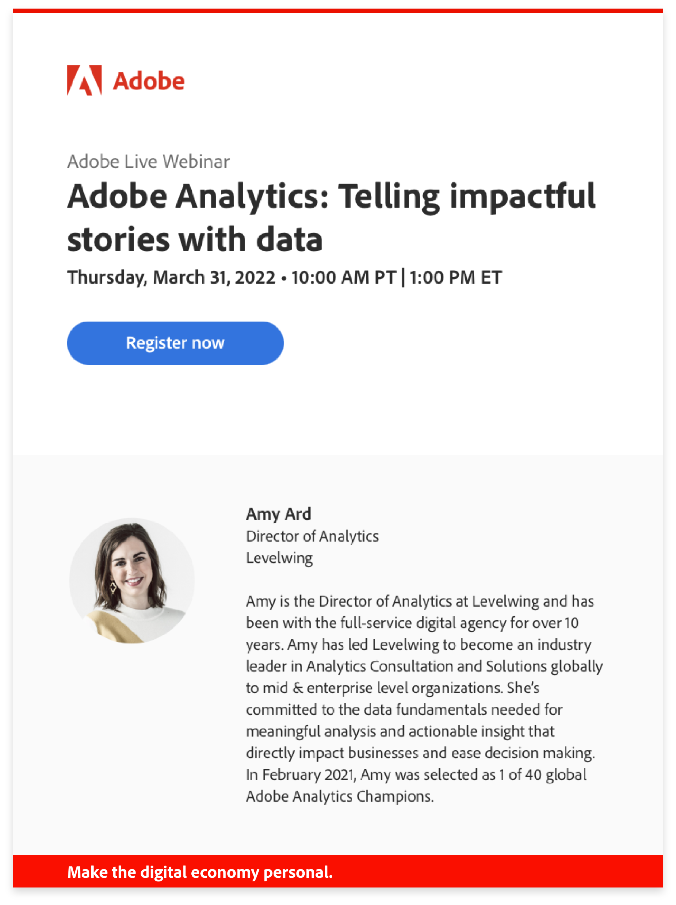

# 맞춤형 학습 권장 사항 및 프로모션

Adobe 제품에 대한 작업에 따라 개인화된 유용한 콘텐츠를 제공할 수 있도록 허용할 수 있습니다. 아래 옵션에서 환경 설정을 선택하면 다음과 관련된 학습 정보가 제공됩니다.

* 기술 수준 및 역할
* 워크플로
* 사용할 가능성이 높은 기능
* 등

{width="10%"}

[사용자 환경 설정](https://experience.adobe.com/preferences/)에서 언제든지 선택 항목을 업데이트할 수 있습니다.

## Adobe 제품 및 서비스에 대한 맞춤형 교육 및 지원 권장 사항

다음 세 가지 방법으로 Adobe 제품을 사용한 후 관련 모범 사례, 팁 및 요령, 유용한 워크스루 등을 받아 보십시오.

<table>
<tbody>
  <tr>
    <td>Adobe 제품에서... </td>
    <td>실시간 도움말은 팝업 및 도구 설명을 참조하십시오.</td>
    <td rowspan="3">여기에는 다음과 같은 항목이 포함되어 있습니다. <ul><li>Adobe 전문가의 단계별 안내서 및 유용한 팁</li> 
    <li>비디오 튜토리얼 및 정보 워크스루</li> 
    <li>심층 훈련 및 교육</li> 
    <li>비디오 및 게시물 추천</li>
    </ul></td>
  </tr>
  <tr>
    <td>Adobe로부터 수신한 이메일에서...</td>
    <td>제품에서 귀하의 작업과 관련된 학습 콘텐츠를 봅니다.</td>
  </tr>
  <tr>
    <td>Experience League 커뮤니티에서..</td>
    <td>현재 하고 있는 작업을 기반으로 한 게시물과 문서에 대한 개인화된 추천을 확인하십시오.</td>
  </tr>
</tbody>
</table>

## Adobe 제품, 서비스, 이벤트 및 프로모션에 대한 개인화된 정보

다음 세 가지 방법으로 작업에 따라 개인화된 학습 이벤트, 연구 세션 및 통합을 위한 기회를 받으십시오.

<table>
<tbody>
  <tr>
    <td>Adobe 제품에서... </td>
    <td>귀하와 관련된 초대 및 기회에 대한 팝업 및 도구 설명을 참조하십시오.</td>
    <td rowspan="3">여기에는 다음과 같은 항목이 포함되어 있습니다. <ul>
    <li>교육 웨비나 및 이벤트 초대</li> 
    <li>사용하는 기능의 향후 릴리스를 테스트하고 의견을 제시할 수 있는 기회</li>
    <li>소유한 제품 간의 통합 사용 팁</li> 
    <li>귀하의 작업을 기반으로 한 Adobe Summit 컨퍼런스의 주요 세션 내용</li>
    </ul></td>
  </tr>
  <tr>
    <td>Adobe로부터 수신한 이메일에서...</td>
    <td>추가 학습 기회에 대해 Adobe에서 시기 적절한 정보를 얻으십시오.</td>
  </tr>
  <tr>
    <td>Experience League 커뮤니티에서..</td>
    <td>학습을 향상시키기 위해 이벤트 및 서비스에 대한 개인화된 추천 항목을 살펴보십시오.</td>
  </tr>
</tbody>
</table>

{width="10%"}

## 이 맞춤형 학습 정보가 표시되는 모습에 대한 예를 참조하십시오.

### Adobe 제품에서

{width="800"}

### Adobe로부터 수신한 이메일에서

{width="400"}

### Experience League 커뮤니티에서

{width="800"}

{width="10%"}
