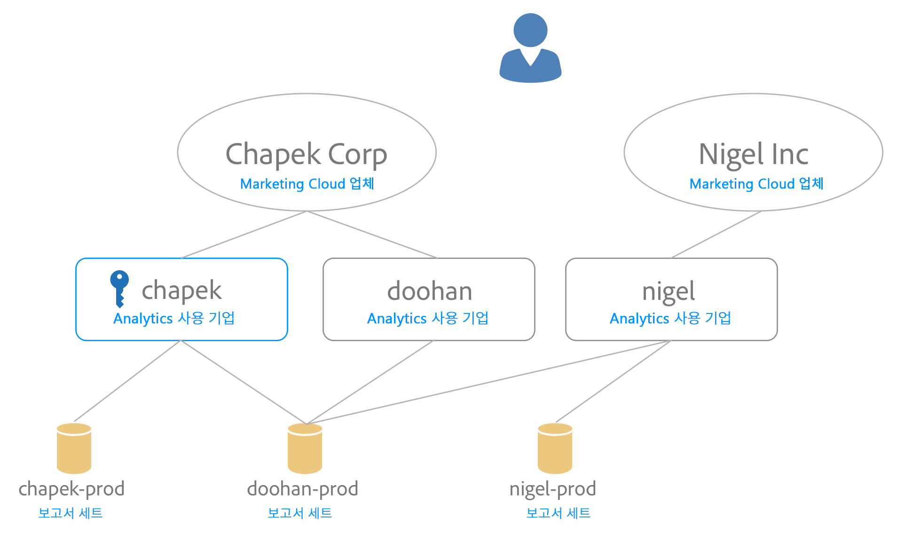

# 조직에 보고서 세트 매핑 {#topic_7C4740559EAC4E0FA5F8DEF886B580DA}

>[!NOTE]
>
>보고서 세트 매핑 기능은 2020년 11월에 더 이상 사용되지 않습니다. 문의 사항이 있으면 고객 지원팀에 문의하십시오.

Experience Cloud 서비스(예: Experience Cloud ID 서비스, [!UICONTROL People])는 개별 보고서 세트 대신 조직과 연결되어 있습니다. 이러한 서비스가 올바르게 작동하도록 하려면 각 Analytics 보고서 세트를 조직에 매핑해야 합니다. 매핑 프로세스는 다음과 같습니다.

* Experience Cloud 조직을 보고서 세트의 기본 조직으로 설정합니다.
* 보고서 세트에 액세스할 수 있는 사용자를 변경하지 않습니다(액세스는 각 사용자에 대한 Adobe Analytics 로그인 계정에 의해 결정됨).

## 요구 사항

매핑할 보고서 세트에 액세스할 수 있는 로그인 회사의 Analytics 관리자여야 합니다. 또한 보고서 세트를 해당 조직에 매핑하려면 이 계정이 [Experience Cloud 조직에 연결](organizations.md#topic_C31CB834F109465A82ED57FF0563B3F1) 되어 있어야 합니다.

지정된 보고서 세트에 액세스할 수 있는 해당 조직의 로그인 회사에 대한 Analytics 관리자 권한이 없는 경우 조직이 회색으로 표시됩니다.

## 조직에 보고서 세트 매핑 {#task_23993FE78DF6455FA8D7BE60686EA16C}

1. [!DNL Analytics] > **[!UICONTROL 관리]** > **[!UICONTROL 데이터 거버넌스]** 에서 데이터 거버넌스를 위한 보고서 세트로 이동합니다( [보고서 세트의 데이터 거버넌스 설정 보기/관리 참조](https://experienceleague.adobe.com/docs/analytics/admin/data-governance/gdpr-view-settings.html?lang=ko-KR)).

1. 각 보고서 세트에 액세스할 수 있는 로그인 회사를 보려면 **[!UICONTROL 로그인 회사에 표시]**&#x200B;를 선택합니다.

   이 보기는 매핑에 대한 올바른 결정을 내리는 데 도움을 주기 위한 것입니다.

1. 보고서 세트 옆에 있는 **[!UICONTROL 매핑된 조직]** 열에서 드롭다운을 선택한 다음 매핑할 조직을 선택합니다.

   Experience Cloud 조직 선택에 대한 팁은 다음 섹션을 참조하십시오.

## 조직에 여러 보고서 세트 매핑 {#task_94955B0D8ABA4CB1A38746ECF8E32711}

1. **[!UICONTROL Experience Cloud]** > **[!UICONTROL 관리]** > **[!UICONTROL 보고서 세트 매핑]**&#x200B;을 선택합니다.

1. 매핑할 보고서 세트를 선택합니다.

   

1. 조직(이 예에서는 Outdoors Inc,)을 선택한 다음 **[!UICONTROL 선택을 클릭합니다]**.

   Experience Cloud 조직 선택에 대한 팁은 다음 섹션을 참조하십시오.

1. **[!UICONTROL 매핑 저장]**&#x200B;을 선택합니다.

## Experience Cloud 조직 선택을 위한 팁 {#mapping-tips}

이 섹션에는 보고서 세트를 매핑해야 하는 Experience Cloud 조직을 선택하는 데 도움이 되는 팁이 포함되어 있습니다.

### 어떤 조직을 선택해야 합니까?

Experience Cloud ID 서비스가 보고서 세트에 배포된 경우, 보고서 세트 매핑 도구에서 선택한 조직이 사이트의 [!DNL visitorAPI.js] 파일에 지정된 것과 동일한 조직인지 확인하십시오. [Experience Cloud ID 서비스 테스트 및 확인](https://experienceleague.corp.adobe.com/docs/id-service/using/implementation/test-verify.html) 의 지침을 사용하여 방문자 ID 서비스에서 사용 중인 조직 ID를 찾을 수 있습니다.

배포가 보고서 세트 매핑 도구에서 선택한 조직과 일치하는지 확인하십시오.

### 일부 조직이 회색으로 표시되는 이유는 무엇입니까?

회색으로 표시되는 조직은 회색으로 표시된 보고서 세트에 매핑할 수 있는 충분한 권한이 없음을 나타냅니다. 다음 예를 생각해 보십시오.

이 다이어그램에서 파란색 키는 관리자 권한을 나타냅니다. 회색 선은 가시성을 나타냅니다.

이 사용자는 두 Experience Cloud 조직에 액세스할 수 있습니다. 이들은 다음을 수행했습니다.

* [!UICONTROL chapek] Analytics 로그인 회사에서 관리자 계정을 [!UICONTROL Chapek] Corp Experience Cloud 조직 계정에 연결했습니다.
* [!UICONTROL doohan] Analytics 로그인 회사에서 비관리자 계정을 [!UICONTROL Chapek] Corp Experience Cloud 조직 계정에 연결했습니다.
* nigel Analytics 로그인 회사에서 비관리자 계정을 Nigel Inc Experience Cloud 조직 계정에 연결했습니다.

다음은 이 사용자가 이러한 보고서 세트에 대해 수행할 수 있는 매핑 작업과 수행할 수 없는 매핑 작업을 나열한 것입니다.

* 이 사용자는 연결된 Analytics 로그인 회사([!UICONTROL chapek])의 관리자이며 자신의 계정이 이 조직에 연결되어 있으므로 [!UICONTROL Chapek-prod] 보고서 세트가 [!UICONTROL Chapek] Corp 조직에 매핑될 수 있습니다.
* [!UICONTROL Nigel-prod] 보고서 세트는 이 보고서 세트를 볼 수 있는 로그인 회사의 관리자가 아니므로 이 사용자가 연결할 수 없습니다.
* 이 사용자는 Experience Cloud 조직에 연결된 로그인 회사([!UICONTROL chapek])의 관리자(doohan Analytics 로그인 회사의 관리자가 아님)이므로 [!UICONTROL Doohan-prod] 보고서 세트를 [!UICONTROL Chapek Corp] 에 매핑할 수 있습니다. 이 사용자가 해당 매핑을 수행할 수 없어도 [!UICONTROL doohan-prod] 보고서 세트 역시 Nigel Inc Experience Cloud 조직에 매핑할 수 있다는 사실을 아는 것이 중요합니다. 이 경우 두 Experience Cloud 조직이 목록에 표시되지만 [!UICONTROL Nigel Inc] 가 회색으로 표시됩니다. 매핑하기 전에 이 사용자는 nigel 로그인 회사의 관리자에게 문의하여 매핑에 가장 적합한 조직을 결정해야 합니다. 처음에 보고서 세트를 만든 조직과 다른 조직을 선택하면 UI에 가능한 충돌 경고가 표시됩니다.

## 자주 묻는 질문 {#section_099E485805994C929FF9C9F75219BEE1}

### 내 보고서 세트 일부가 표시되지 않는 이유는 무엇입니까?

일부 보고서 세트는 다른 로그인 회사에 표시될 수 있습니다. 화면 상단의 드롭다운을 사용하여 현재 로그인 회사를 변경할 수 있습니다.

### 내 보고서 세트 중 하나에서 드롭다운에 나열된 조직 중 일부를 인식하지 못할 경우 어떻게 합니까?

이 목록에는 모든 보고서 세트에 매핑할 권한이 없어도 보고서 세트를 매핑 *할 수 있는* 조직이 모두 표시됩니다. 보고서 세트를 목록에서 회색으로 표시된 보고서 세트 중 하나에 매핑해야 할지 확실하지 않은 경우, 조직의 Experience Cloud 관리자에게 문의하여 가장 적합한 세트를 선택하십시오.

### 로그인 회사에 표시 열의 보고서 세트에 대해 나열된 로그인 회사의 일부를 인식하지 못할 경우 어떻게 합니까?

이 보고서 세트는 어느 시점에서 다른 Experience Cloud 조직의 일부일 수 있는 다른 로그인 회사와 공유되었습니다.

### 다른 조직에서 생성 중인 보고서 세트에 대한 이 &quot;가능한 충돌&quot; 오류는 무엇입니까? 이것이 중요한 이유는 무엇입니까?

이 알림은 보고서 세트 매핑에 대해 정보를 기반으로 결정을 내리는 데 도움이 됩니다. 보고서 세트가 원래 다른 조직에 작성되었고 해당 조직이 이 보고서 세트에 대해 더 적합할 수 있는 경우 알리기 위한 것입니다.

### 보고서 세트가 매핑되었는지 어떻게 알 수 있습니까?

매핑된 보고서 세트는 편집할 수 없는 형식으로 표시됩니다. 매핑을 꼭 변경해야 하는 경우에는 고객 지원 센터에 문의해 주십시오.

### Experience Cloud 조직에 대한 조직 ID만 알 경우 어떻게 합니까? 내 조직 ID의 이름을 찾으려면 어떻게 해야 합니까?

[조직 및 계정 설정](organizations.md)에서 조직 이름을 찾을 수 있습니다.

### 매핑된 날짜 열에 날짜가 표시됩니다. 누가 매핑했습니까?

Analytics 인터페이스의 보고서 세트 변경 로그를 참조하면 변경한 사용자 ID를 확인할 수 있습니다. Suite associated to IMS Organization 이벤트를 찾으십시오.
