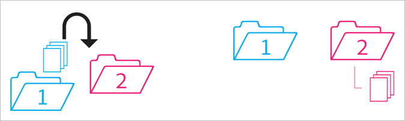
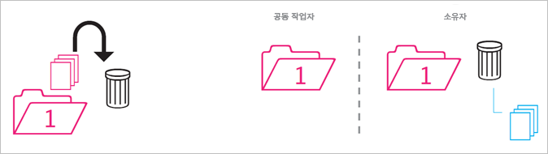
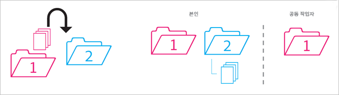
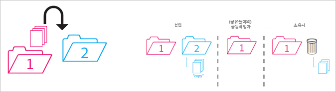
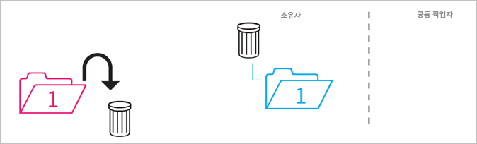
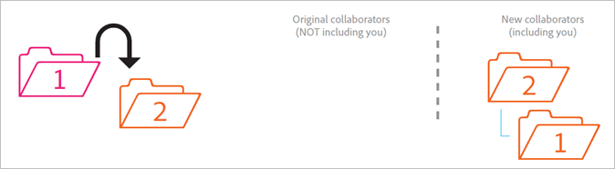
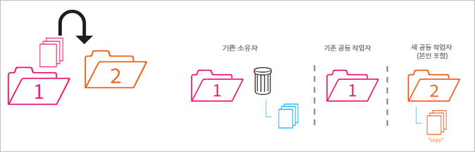
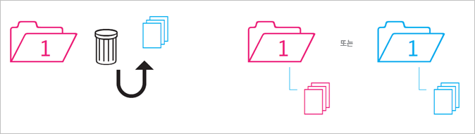

# 공유 폴더 동작

이동, 삭제 및 복원 시 공유 폴더의 동작 방식에 대한 규칙입니다.

>[!NOTE]
>
>공유된 CX 엔터프라이즈 폴더 및 자산은 1:1 관계로 Creative Cloud 데스크탑에 미러링됩니다. CX 엔터프라이즈 사용자가 폴더를 변경 (공유 삭제, 추가 또는 제거)하면 Creative Cloud 데스크톱 및 웹에서 작업이 미러링됩니다. 따라서 폴더가 공유되지 않으면 로컬 시스템에서 폴더 및 에셋이 삭제됩니다. 공유가 제거되면 폴더 및 해당 콘텐츠가 로컬 컴퓨터의 휴지통으로 이동되며 사용자가 컴퓨터에 직접 복원할 수 있습니다.

## 비공유 폴더를 공유 폴더로

비공유 폴더를 공유 폴더로 이동합니다.

**결과**: 두 폴더가 공유됩니다.

## 공유 폴더를 비공유 폴더로

공유 폴더를 비공유 폴더로 이동합니다.

**결과**: 비공유 폴더는 비공유 상태로 유지됩니다. 공유 폴더는 공유된 상태로 유지됩니다.

## 비공유 폴더의 콘텐츠를 공유 폴더로

비공유 폴더의 콘텐츠를 공유 폴더로 이동합니다.

**결과:** 이제 콘텐츠가 공유되고 모든 공동 작업자가 볼 수 있습니다. 콘텐츠 크기에 따라 저장 공간이 증가합니다.

## 보관 및 삭제된 공유 콘텐츠

공유 폴더에 있는 콘텐츠를 보관하거나 삭제합니다.

**결과:** 콘텐츠가 폴더 소유자용으로 보관됩니다. 콘텐츠를 소유하지 않는 공동 작업자는 더 이상 콘텐츠에 액세스할 수 없습니다.

## 소유한 공유 콘텐츠를 비공유 폴더로

소유한 공유 폴더의 콘텐츠를 비공유 폴더로 이동합니다.

**결과:** 이제 콘텐츠가 공유되지 않습니다. 공유 폴더의 공동 작업자는 더 이상 콘텐츠에 액세스할 수 없습니다.

## 소유하지 않은 콘텐츠를 비공유 폴더로

다른 사람이 소유한 공유 폴더의 콘텐츠를 비공유 폴더로 이동합니다.

**결과:** 콘텐츠가 비공유 폴더에 나타나고 공유 폴더에서 제거됩니다. 공유 폴더의 공동 작업자는 더 이상 콘텐츠에 액세스할 수 없습니다. 콘텐츠가 공유 폴더 소유자용으로 보관됩니다.

소유자 및 편집자는 소유하지 않은 콘텐츠를 이동할 수 있지만 조회자는 이동할 수 없습니다. 소유자 및 편집자가 콘텐츠를 이동하는 경우, 모든 사용자의 공유 폴더에서 사용할 수 없게 됩니다.

## 보관 또는 삭제된 소유 폴더

소유하는 공유 폴더를 보관(웹을 통해)하거나 삭제(데스크탑을 통해)합니다.

**결과:** 폴더가 공유되지 않고 보관됩니다. 공동 작업자는 더 이상 폴더에 액세스할 수 없습니다.

## 공유 폴더를 다른 공유 폴더로

소유한 공유 폴더를 소유 또는 소유하지 않은 다른 공유 폴더로 이동합니다.

**결과:** 폴더가 폴더 2로 이동되면 새 공동 작업자와 공유됩니다.

## 공유 콘텐츠를 다른 공유 폴더로

공유 폴더의 콘텐츠를 다른 공유 폴더로 이동합니다.

**결과:** 콘텐츠가 폴더 2에 나타나고 이제 새 공동 작업자와 공유됩니다. 콘텐츠가 폴더 1에서 제거되고 소유자에게는 보관된 것으로 표시되지만, 다른 공동 작업자는 더 이상 콘텐츠에 액세스할 수 없습니다.

## 보관 위치에서 복원된 콘텐츠

공유 폴더의 보관 위치에서 콘텐츠를 복원합니다. 콘텐츠가 보관처리된 당시 콘텐츠를 소유한 상태였습니다.

**결과:** 콘텐츠가 공유 폴더로 복원되고 모든 공동 작업자가 다시 액세스할 수 있습니다. 공유 폴더가 더 이상 존재하지 않으면 해당 콘텐츠는 원래 상위 폴더의 공유되지 않은 사본에 저장됩니다.
