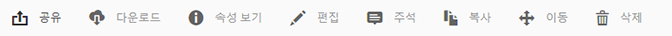
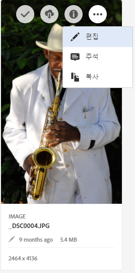
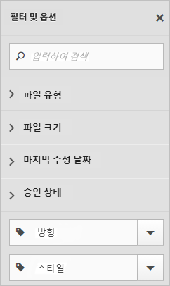
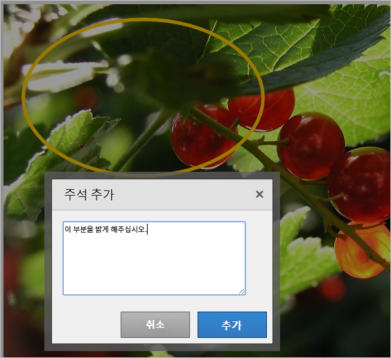
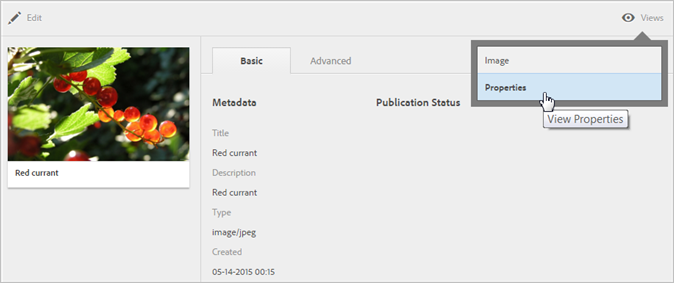

# CX 엔터프라이즈 Assets 개요

CX Enterprise Assets 는 애플리케이션 간에 공유할 수 있는 마케팅 준비가 끝난 에셋에 대해 중앙 집중식 단일 저장소를 제공합니다. 자산은 디지털 문서, 이미지, 비디오, 오디오 또는 그 일부로, 다양한 표현물과 하위 자산(예: [!DNL Photoshop] 파일의 레이어, [!DNL PowerPoint] 파일의 슬라이드, PDF의 페이지, ZIP에 있는 파일)을 가질 수 있습니다.

자산 서비스에는 다음이 포함됩니다.

* 자산 스토리지, 관리 인터페이스, 임베드된 선택 인터페이스(애플리케이션에서 액세스).
* Creative Cloud, CX 엔터프라이즈 협업 및 CX 엔터프라이즈 애플리케이션과의 통합

자산을 사용하면 일관성 및 브랜드 준수가 향상되며 마켓 출시 속도도 빨라집니다. 다음과 같은 애플리케이션의 워크플로를 능률화할 수 있습니다.

* **[!DNL Adobe Target]**: A/B 및 다변량 테스트 환경 만들기
* **[!DNL Ad Cloud]**: 다양한 채널 및 캠페인에서 광고 단위 개발
* **[!DNL Adobe Campaign]**: 이메일 뉴스레터 및 캠페인에 자산 배치

## CX Enterprise Assets 로 이동

## 도구 모음 액세스

자산(또는 자산 디렉터리)으로 이동한 다음 **[!UICONTROL Select]**&#x200B;을(를) 클릭합니다.

도구 모음에서 검색, 타임라인, 렌디션, 편집, 주석 달기 및 다운로드를 포함한 기능에 빠르게 액세스할 수 있습니다.

>[!NOTE]
>
>자산을 [!DNL Target]에서 성공적으로 삭제하려면 먼저 Adobe Target 활동에서 자산을 제거해야 합니다.

## 자산 편집

자산을 편집하면 다음을 포함한 기능을 사용할 수 있습니다.

* 자르기
* 회전
* 뒤집기

## 자산 검색

키워드, 파일 형식, 크기, 마지막 수정 날짜, 게시 상태, 방향 및 스타일별로 검색할 수 있습니다.

## 자산에 주석 달기

이미지에 원이나 화살표를 그려서 **[!UICONTROL Annotate]**&#x200B;을(를) 클릭하고 동료가 검토할 수 있도록 자산에 주석을 답니다.

## 전체 화면 Assets 보기 및 확대/축소

전체 자산 이미지를 보고 확대/축소를 활성화하려면 **[!UICONTROL Views]** > **[!UICONTROL Image]**&#x200B;을(를) 클릭합니다.

## 자산 속성 보기

속성을 사용한 카드 보기, 목록 보기, 열 보기 중 선택하여 자산을 쉽게 찾을 수 있습니다.

자산의 속성을 보려면 **[!UICONTROL Views]** > **[!UICONTROL Properties]**&#x200B;을(를) 클릭하십시오.

## 사용량 보고서 실행

사용자 수, 사용한 저장소 및 전체 자산을 참고하십시오.

**[!UICONTROL Tools]** > **[!UICONTROL Reports]** > **[!UICONTROL Usage Report]** 클릭

