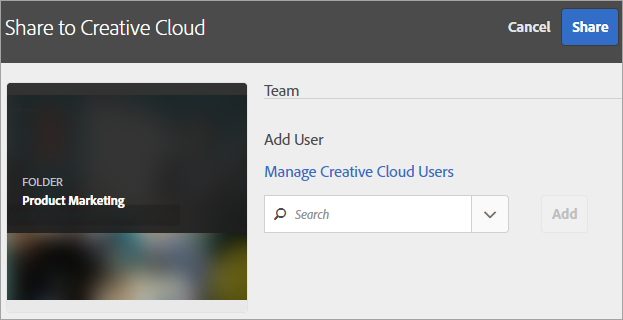

# Experience Cloud 자산 폴더 공유

Experience Cloud와 Creative Cloud 간에 폴더 및 에셋을 공유합니다. 공유 에셋에 공동 작업을 수행하고, 주석을 달고, Adobe Target과 같은 Experience Cloud 애플리케이션에서 사용합니다. 공유 폴더는 Experience Cloud에서 가져와야 합니다.

**공유의 이점**

* 검토, 승인 및 게시 단계에서 크리에이티브 프로덕션 워크플로 능률화
* 여러 위치에서 처리 중인 파일 및 버전을 관리하는 데 드는 시간 절약
* 크리에이티브 에셋을 보다 효과적으로 추적 및 관리
* 엔터프라이즈 보안 강화
* 크리에이티브 고객과 마케터 간에 파일을 쉽게 공유, 저장 및 전송

Creative Cloud 사용자가 에셋에 액세스하려면 Experience Cloud에 허용 목록에 포함되어야 합니다. [Creative Cloud 사용자 관리](manage-cc-users.md)를 참조하십시오.

**Experience Cloud 자산 폴더를 공유하려면**

1. 에셋 폴더에서 **[!UICONTROL Creative Cloud로 공유]**&#x200B;를 클릭합니다.

   
1. Creative Cloud로 공유 페이지에서 사용자를 검색한 후 **[!UICONTROL 추가]**&#x200B;를 클릭합니다.

   

1. **[!UICONTROL 공유]**&#x200B;를 클릭합니다.
1. [!DNL Creative Cloud] 데스크탑을 시작하고(또는 브라우저의 [!UICONTROL Creative Cloud 파일] 페이지로 이동) 요청 알림을 찾습니다.

   
1. 요청을 열고 **[!UICONTROL 승인]**&#x200B;을 클릭합니다.

   
1. 폴더 콘텐츠에 액세스하려면 **[!UICONTROL 폴더 열기]**(또는 **[!UICONTROL 웹에서 보기]**)를 클릭합니다.

   
1. 공유 에셋에 주석을 추가하여 계속합니다.

   Creative Cloud에서 이미지를 선택한 다음 **[!UICONTROL 활동]**&#x200B;을 클릭하여 이미지에 주석을 추가할 수 있습니다. 주석은 [!DNL Creative Cloud] 및 [!DNL Experience Cloud]의 에셋에서 동기화됩니다.

   

   Experience Cloud에서 이미지를 선택한 다음 타임라인 아이콘을 선택하여 이미지에 주석을 추가합니다. 주석은 Creative Cloud 및 Experience Cloud의 에셋에서 동기화됩니다.

   

1. 폴더 공유를 취소하려면 **[!UICONTROL Creative Cloud을 사용하여 공유]**([3단계](share.md)와 유사)를 클릭한 후 X를 선택하고 **[!UICONTROL 공유]**&#x200B;를 클릭하여 사용자를 제거합니다.

   

   Creative Cloud 사용자를 모두 제거했으면 폴더 공유가 취소되고 Creative Cloud 사용자는 더 이상 액세스할 수 없습니다.

공유 자산을 사용하는 다른 방법에는 활동의 이미지에 대한 Adobe Target의 [오퍼 라이브러리](https://experienceleague.adobe.com/docs/target/using/experiences/offers/manage-content.html?lang=ko)에서 자산을 로드하거나 교체하는 것이 포함됩니다.

Creative Cloud에 폴더를 공유하면 폴더에 Creative Cloud 로고가 표시됩니다.

관련 도움말:

* [Creative Cloud 도움말 - 파일 관리 및 동기화](https://helpx.adobe.com/kr/creative-cloud/help/sync-creative-cloud-files.html)
* [Creative Cloud 도움말 - 다른 사용자와 공동 작업](https://helpx.adobe.com/kr/creative-cloud/help/collaboration.html)
* [Creative Cloud 도움말 - 공동 작업 FAQ](https://helpx.adobe.com/kr/creative-cloud/help/collaboration-faq.html)

## Adobe Target과의 에셋 공유 정보 {#section_B7CD64CAB35D43A4B12957B304072DC9}

[!DNL Adobe Target]에서 활동을 만들면 [!UICONTROL 오퍼 라이브러리]에서 이미지를 변경하여 공유 이미지 에셋을 사용할 수 있습니다.

[!DNL Target] 도움말에서 [오퍼 라이브러리](https://experienceleague.adobe.com/docs/target/using/experiences/offers/manage-content.html?lang=ko)를 참조하십시오.