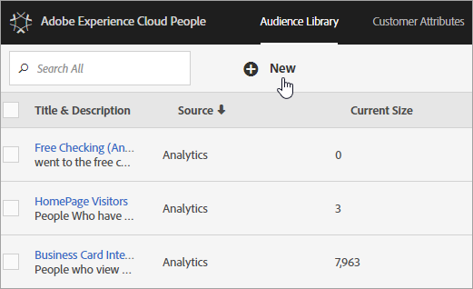

# CX 엔터프라이즈 대상

[!DNL Audience Library]은(는) CX Enterprise의 대상을 표시합니다. 대상자는 방문자의 컬렉션입니다([!DNL CX Enterprise] ID 목록). 방문자 데이터를 대상자 세분화로 변환하는 작업을 관리할 수 있습니다. 이와 같이 대상을 만들고 관리하는 것은 세그먼트를 만들고 사용하는 것과 비슷합니다. 대상자 세그먼트를 제품 및 서비스에 공유할 수도 있습니다 [!DNL CX Enterprise].

다음과 같은 다양한 소스에서 대상자를 만들거나 파생할 수 있습니다.

* [!DNL CX Enterprise]에서 새로 만든 항목
* [!DNL CX Enterprise]에 게시된 [!DNL Analytics]개 세그먼트
* [!DNL Audience Manager]

**실시간 및 기존 대상자**

실시간 타겟팅 사용 사례를 파악하기 위해 소스에 관계없이 모든 대상자에 액세스할 수 있습니다. 하지만 Analytics에서 Audience Manager로 공유한 대상자는 실시간 타겟팅에 액세스할 수 없습니다. 시스템은 다음과 같은 두 가지 방식으로 대상자를 평가합니다.

* Analytics에서 가져온 기존 대상자는 4시간마다 평가됩니다. 처리 및 공유에 걸리는 총 시간은 최대 8시간입니다. 기존 대상자에는 항상 재방문자가 포함됩니다.
* 실시간 대상은 CX Enterprise Audiences에서 소싱되며 실시간으로 평가됩니다.

## 애플리케이션에서 대상자가 사용되는 방식

다음 표에서는 CX 엔터프라이즈 애플리케이션에서 대상이 사용되는 방식을 설명합니다.

| 솔루션 | 설명 |
| --- | --- |
| CX 엔터프라이즈 대상 | 대상 라이브러리를 사용하여 대상을 기본적으로 만들고, 관리하고, 공유합니다. 다음과 같은 작업을 수행할 수 있습니다.<ul><li>원시 분석 속성을 사용하여 실시간 대상을 사용합니다.</li><li>대상을 결합하여 복합 대상을 만들고 실시간 및 내역 데이터 연결.</li><li>예상 대상 크기의 그래픽 보기를 참조하십시오.</li></ul> 만들려는 대상자 유형에 대한 추천 사항은 [대상자 만들기 옵션](https://experienceleague.adobe.com/docs/experience-cloud-kcs/kbarticles/KA-16471.html?lang=ko)을 참조하십시오. |
| Analytics | 세그멘테이션에서 세그먼트를 빌드하여 보고서 세트와 함께 결합한 다음 세그먼트를 CX Enterprise에 게시할 수 있습니다. 세그먼트를 게시하면 CX Enterprise의 [!DNL Audience Library] 페이지에 표시됩니다. 자세한 내용은 [!DNL Analytics] 도움말의 [CX Enterprise에 세그먼트 게시](https://experienceleague.adobe.com/docs/analytics/components/segmentation/segmentation-workflow/seg-publish.html)를 참조하십시오. 대상자는 [!DNL Adobe Target] 및 [!DNL Audience Manager]에서 전달된 캠페인 경험의 타깃팅된 대상으로도 사용할 수 있습니다. [!DNL Adobe Analytics]에서 대상을 공유하고 활성 캠페인에서 사용하도록 선택하면 지난 90일 동안 세그먼트 정의 기준을 충족한 방문자 프로필이 [!UICONTROL Audience Services]&#x200B;(으)로 전송됩니다. 공유 대상자에 대한 제한이 75개로 늘어났습니다. [!DNL Analytics]에서 CX Enterprise로 공유한 대상은 2천만 명의 고유 구성원을 초과할 수 없습니다. 또한 캐싱으로 인해, Analytics에서 삭제된 보고서 세트는 삭제가 CX Enterprise에 표시되는 데 12시간이 필요합니다. |
| Mobile Services | [!UICONTROL Device Types] 보고서의 Sunburst 시각화를 사용하여 모바일 트래픽을 분석합니다. |
| [!DNL Target] | [ID 서비스](https://experienceleague.adobe.com/docs/id-service/using/home.html)는 방문자 ID 및 데이터를 여러 애플리케이션에서 사용하기 위해 실행 가능한 하나의 프로필에 통합합니다. Adobe Analytics의 세그먼트 만들기 프로세스 동안 [!UICONTROL Publish to CX Enterprise] 확인란을 선택하면 Adobe Target의 사용자 지정 대상 라이브러리 내에서 세그먼트를 사용할 수 있습니다. [!DNL Analytics]나 [!DNL Audience Manager]에서 만들어진 세그먼트는 [!DNL Target]의 활동에 사용할 수 있습니다. 예를 들어 [!DNL Analytics]에서 만들어진 대상자 세그먼트 및 [!DNL Analytics] 전환 지표에 따라 캠페인 활동을 만들 수 있습니다. |
| [!DNL Audience Manager] | 공유 대상자는 [!DNL Audience Manager] 세분화에서 사용할 수 있습니다. 모든 CX Enterprise 대상은 기본적으로 다음을 제공하는 [!DNL Audience Manager]에서 사용할 수 있습니다.<ul><li>기본 제공 자동화(애플리케이션 워크플로에서 공유 및 소비되는 방식에 관계없음)</li><li>오프사이트 대상</li><li>유사 잠재고객 모델링</li></ul> |
| 캠페인 | <ul><li>다른 Adobe CX 엔터프라이즈 애플리케이션의 공유 대상을 Adobe Campaign으로 가져옵니다.</li><li>공유 대상자의 양식에서 받는 사람 목록 내보내기. 이러한 공유 대상은 사용하는 다른 Adobe CX 엔터프라이즈 애플리케이션에서 사용할 수 있습니다.</li></ul> |
| Advertising Cloud | 대상자를 대상으로 사용합니다. |

{style="table-layout:auto"}

>[!IMPORTANT]
>
>방문자가 Analytics에서 공유한 대상자 자격을 얻으면 4~8시간이 지연된 후에 [!DNL Target], Ad Cloud 및 Campaign Standard에서 정보를 실행할 수 있습니다.

## 대상자 라이브러리 인터페이스 요소

[!DNL CX Enterprise]은(는) 기본적인 실시간 대상 식별을 사용하여 대상을 만들고 관리하기 위한 라이브러리를 제공합니다.

**[!UICONTROL CX Enterprise]** > **[!UICONTROL Experience Platform]** > **[!UICONTROL People]** > **[!UICONTROL Audience Library]**

| 요소 | 설명 |
| --- | --- |
| 신규 | [대상자 만들기](https://experienceleague.adobe.com/en/docs/core-services/interface/services/audiences/create). |
| 제목 및 설명 | 대상자를 식별하고 설명하는 열 머리글입니다. |
| 작성자 | 대상자 세그먼트를 만든 사용자입니다. |
| 소스 | 대상자가 만들어진 위치를 식별합니다.<ul><li>**분석:** Adobe Analytics에서 만든 후 CX Enterprise에 게시한 세그먼트입니다.</li><li>**CX Enterprise:** 새 대상 [CX Enterprise Audiences에서 생성됨](https://experienceleague.adobe.com/en/docs/core-services/interface/services/audiences/create).</li><li>**Audience Manager:** Audience Manager에서 만든 대상은 CX 엔터프라이즈 대상에 자동으로 표시됩니다.</li></ul> |
| 현재 크기 | 현재 대상자 크기입니다. |
| 활성 | 세그먼트의 활성 상태입니다. |

{style="table-layout:auto"}

## Adobe Analytics에서 대상 게시

자세한 내용은 Adobe Analytics 설명서의 [CX Enterprise에 세그먼트 게시](https://experienceleague.adobe.com/en/docs/analytics/components/segmentation/segmentation-workflow/seg-publish)를 참조하십시오.
