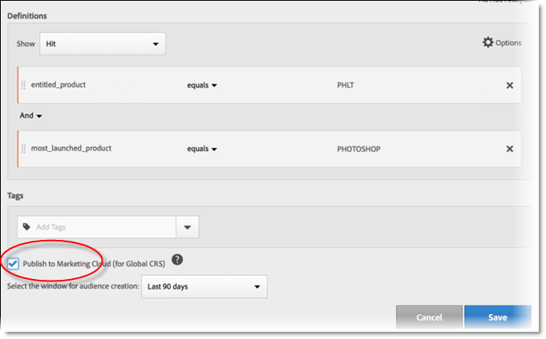

# 고객 속성 소스를 만들고 데이터 파일 업로드

고객 특성 원본(`.csv` 및 `.fin` 파일)을 만들고 데이터를 업로드합니다. 준비가 되면 데이터 소스를 활성화할 수도 있습니다. 데이터 소스가 활성화되면 속성 데이터를 Analytics 및 Target과 공유합니다.

## 고객 속성 워크플로 {#concept_BF0AF88E9EF841219ED4D10754CD7154}


>[!IMPORTANT]
>
>이 기능에 액세스하려면 고객 속성 제품 프로필(고객 속성 - 기본 액세스)에 사용자를 지정해야 합니다. **[!UICONTROL Admin Console]** > **[!UICONTROL 제품]**(으)로 이동합니다. *고객 특성*&#x200B;이 [!UICONTROL 제품 프로필] 중 하나로 표시되면 작업을 시작할 수 있습니다. 고객 특성 그룹에 추가된 사용자의 경우 Experience Cloud 인터페이스 왼쪽에 [!UICONTROL 고객 특성] 메뉴가 표시됩니다.
>
>고객 특성 기능을 사용하려면 사용자가 응용 프로그램 수준 그룹(Adobe Analytics 또는 [!DNL Target])에도 속해야 합니다.

## 데이터 파일 만들기 {#create-data}

이 데이터는 CRM에서 가져온 엔터프라이즈 고객 데이터입니다. 이 데이터에는 멤버 ID, 권한 있는 제품, 최근에 실행한 제품 등을 비롯하여 제품에 대한 가입자 데이터가 포함될 수 있습니다.

1. `.csv` 파일을 만듭니다.

   >[!NOTE]
   >
   >이 프로세스 뒷부분에서 `.csv` 파일을 끌어서 놓아 파일을 업로드합니다. 하지만 [FTP를 통해 업로드](t-upload-attributes-ftp.md#task_591C3B6733424718A62453D2F8ADF73B)하는 경우 `.fin`와 같은 이름의 `.csv` 파일도 필요합니다.

   샘플 엔터프라이즈 고객 데이터 파일:

   

1. 계속하기 전에 파일을 업로드하려면 [데이터 파일 요구 사항](crs-data-file.md)의 중요 정보를 검토하십시오.
1. 아래 설명된 대로 [고객 속성 소스를 만들고 데이터를 업로드](t-crs-usecase.md)합니다.

## 속성 소스를 만들고 데이터 파일 업로드 {#create-source}

Experience Cloud의 새 고객 속성 소스 만들기 페이지에서 다음 단계를 수행합니다.

>[!IMPORTANT]
>
>고객 속성 소스를 만들거나, 수정하거나 삭제할 때, ID가 새 데이터 소스와의 동기화를 시작하기 전에 최대 한 시간이 지연됩니다. 고객 속성 소스를 만들거나 수정하려면 Audience Manager에 관리 권한이 있어야 합니다. 관리 권한을 얻으려면 Audience Manager 고객 지원 센터 또는 컨설팅에 문의하십시오.

1. [!DNL Experience Cloud]에서 메뉴  아이콘을 선택합니다.
1. **[!UICONTROL 고객 특성]**&#x200B;을 선택하세요.

   [!UICONTROL 고객 특성] 페이지에서 기존 특성 데이터 원본을 관리하고 편집할 수 있습니다.

   

1. **[!UICONTROL 새로 만들기]**&#x200B;를 클릭합니다.

   

1. [!UICONTROL 고객 특성 만들기 Source] 페이지에서 다음 필드를 구성합니다.

   * **[!UICONTROL 이름:]** 데이터 속성 소스의 이름입니다. [!DNL Adobe Target]의 경우, 속성 이름에는 공백을 포함할 수 없습니다. 공백이 있는 속성이 전달되면 [!DNL Target]이 이를 무시합니다. 지원되지 않는 다른 문자는 `< , >, ', "`입니다.

   * **[!UICONTROL Description:]** (선택 사항) 데이터 속성 소스에 대한 설명입니다.

   * **[!UICONTROL Alias ID:]** 특정 CRM 시스템과 같은 고객 속성 데이터의 소스를 나타냅니다. [!UICONTROL 별칭 ID]은(는) [!UICONTROL 고객 특성 Source] 코드에 사용되는 고유 ID입니다. ID는 고유해야 하고 공백 없는 소문자로 이루어져야 합니다. Experience Cloud에서 고객 특성 소스에 대한 [!UICONTROL 별칭 ID] 필드에 입력한 값은 구현(Mobile SDK의 Platform Data Collection 또는 JavaScript을 통해)에서 전달되는 값과 일치해야 합니다.

     >[!IMPORTANT]
     >
     >별칭 ID가 여러 서비스에 저장되고 둘 사이에 프로필을 매핑하는 데 사용되므로 별칭 ID와 연결된 데이터 소스를 삭제해도 별칭 ID는 사용할 수 없습니다.

     별칭 ID 는 추가 고객 ID 값을 설정하는 특정 영역에 해당합니다. 예:

      * **태그:** 별칭 ID는 [Experience Cloud ID 서비스](https://experienceleague.adobe.com/docs/experience-platform/tags/home.html) 도구의 [!UICONTROL 고객 설정]에 있는 *통합 코드* 값에 해당합니다.

      * **방문자 API:** 별칭 ID는 각 방문자와 연결할 수 있는 추가 [고객 ID](https://experienceleague.adobe.com/docs/id-service/using/reference/authenticated-state.html)에 해당합니다.

        예를 들어 *&quot;crm_id&quot;*:

        ```
        "crm_id":"67312378756723456"
        ```

      * **iOS:** 별칭 ID는 [visitorSyncIdentifiers:identifiers](https://experienceleague.adobe.com/docs/mobile-services/ios/overview.html?lang=ko-KR)의 *&quot;idType&quot;*&#x200B;에 해당합니다.

        예:

        `[ADBMobile visitorSyncIdentifiers:@{@<`**`"idType"`**`:@"idValue"}];`

      * **Android™:** 별칭 ID는 [syncIdentifiers](https://experienceleague.adobe.com/docs/mobile-services/android/overview.html?lang=ko-KR)의 *&quot;idType&quot;*&#x200B;에 해당됩니다.

        예:

        `identifiers.put(`**`"idType"`**`, "idValue");`

        별칭 ID 필드 및 고객 ID와 관련된 데이터 처리에 대한 자세한 내용은 [여러 데이터 소스 활용](crs-data-file.md#section_76DEB6001C614F4DB8BCC3E5D05088CB)을 참조하십시오.

   * **[!UICONTROL 네임스페이스 코드:]** AEP WebSDK 구현의 일부로 [IdentityMap](https://experienceleague.adobe.com/en/docs/experience-platform/web-sdk/identity/overview)을(를) 사용할 때 이 값을 사용하여 고객 특성 소스를 식별하십시오.

## 파일 업로드 {#upload}


1. 파일 업로드를 클릭합니다.

2. `.csv` 또는 `.zip` 또는 `.gzip` 데이터 파일을 드래그 앤 드롭 창으로 드래그 앤 드롭합니다.

>[!IMPORTANT]
>
>특정 데이터 파일 요구 사항이 있습니다. 자세한 내용은 [데이터 파일 요구 사항](crs-data-file.md) 을 참조하십시오.

파일을 업로드한 후에는 이 페이지의 [!UICONTROL 파일 업로드] 제목 아래에 있는 테이블 데이터가 표시됩니다. 스키마의 유효성을 검사하거나, 구독을 구성하거나, FTP를 설정할 수 있습니다.


* **[!UICONTROL Unique customer ID:]** 이 특성 소스에 업로드한 고유한 ID 수를 표시합니다.

* **[!UICONTROL 고객 제공 ID가 Experience Cloud 방문자 ID로 별칭 지정됨:]** 몇 개의 ID가 Experience Cloud ID에 별칭이 지정되었는지 표시합니다.

* **[!UICONTROL 별칭 개수가 많은 고객 제공 ID:]** 별칭 지정된 Experience Cloud 방문자 ID가 500개 이상인 고객 제공 ID 개수를 표시합니다. 이러한 고객 제공 ID는 개인을 나타내기보다는 일종의 공유 로그인을 나타낼 수 있습니다. 시스템은 이러한 ID와 연결된 속성을 최근에 별칭으로 지정된 500개의 Experience Cloud 방문자 ID에 배포하며 별칭 수가 10,000개가 될 때까지 이 작업을 계속합니다. 그러면 시스템은 고객 제공 ID를 무효화하고, 연결된 속성을 더 이상 배포하지 않습니다. —>

## 스키마 유효성 검사 {#validate-schema}

유효성 검사 프로세스를 사용하여 표시 이름 및 설명을 업로드된 속성(문자열, 정수, 숫자 등)에 매핑할 수 있습니다. 스키마를 업데이트하여 속성을 삭제할 수도 있습니다.

[스키마 유효성 검사](validate-schema.md)를 참조하십시오.

속성을 삭제하려면 [(선택 사항) 스키마를 업데이트(속성 삭제)](t-crs-usecase.md)를 참조하십시오.

## (선택 사항) 스키마 업데이트(속성 삭제) {#task_6568898BB7C44A42ABFB86532B89063C}

스키마에서 속성을 삭제 및 교체하는 방법.

1. [!UICONTROL 고객 특성 편집 Source] 페이지에서 **[!UICONTROL Target]** 또는 **[!UICONTROL Analytics]** 구독([!UICONTROL 구독 구성] 아래)을 제거하십시오.
1. [업데이트된 필드가 있는 새 데이터 파일을 업로드합니다](t-crs-usecase.md).

## 구독 구성 및 속성 소스 활성화 {#task_1ACA21198F0E46A897A320C244DFF6EA}

구독을 구성하면 Experience Cloud과 애플리케이션 간에 데이터 흐름이 설정됩니다. 속성 소스를 활성화하면 데이터가 가입 중인 애플리케이션으로 유입될 수 있습니다. 업로드한 고객 레코드는 웹 사이트 또는 애플리케이션에서 들어오는 ID 신호와 대조됩니다.

[구독 구성](subscription.md)을 참조하십시오.

**속성 소스를 활성화하려면**

[!UICONTROL 새로 만들기 또는 고객 특성 편집 Source] 페이지에서 [!UICONTROL 활성화] 제목을 찾은 다음 **[!UICONTROL 활성]**&#x200B;을 클릭합니다.


## Adobe Analytics에서 고객 속성 사용 {#task_7EB0680540CE4B65911B2C779210915D}

이제 Adobe Analytics과 같은 애플리케이션에서 데이터를 사용할 수 있으므로 데이터에 대해 보고하고 분석하여 마케팅 캠페인에서 적절한 조치를 취할 수 있습니다.

다음 예에서는 업로드한 속성에 따른 [!DNL Analytics] 세그먼트를 보여 줍니다. 이 세그먼트는 최근에 실행한 제품이 Photoshop인 [!DNL Photoshop Lightroom] 가입자를 보여 줍니다.



Experience Cloud에 게시한 세그먼트는 Experience Cloud 대상 및 Audience Manager에서 사용할 수 있습니다.

## Adobe Target에서 고객 속성 사용 {#task_FC5F9D9059114027B62DB9B1C7D9E257}

[!DNL Target]에서는 대상자를 만들 때 [!UICONTROL 방문자 프로필] 섹션에서 고객 속성을 선택할 수 있습니다. 모든 고객 특성은 목록에 접두사 `crs.`이(가) 있습니다. 필요에 따라 이러한 속성을 다른 데이터 속성과 결합하여 대상자를 구성합니다.


[!DNL Target] 도움말에서 [새 대상자 만들기](https://experienceleague.adobe.com/docs/target/using/audiences/create-audiences/audiences.html)를 참조하십시오.
