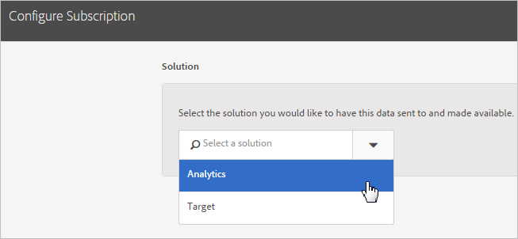

# Experience Cloud에서 구독을 구성하는 방법

솔루션 데이터 소스 및 가입 구성에 대해 알아봅니다. 가입을 통해 Experience Cloud과 솔루션([!DNL Analytics] 및 [!DNL Target]) 간에 고객 속성 데이터 흐름을 사용할 수 있습니다.

예를 들어 Adobe Analytics 가입을 구성하면 특성 데이터를 보고서에서 사용할 수 있습니다. Adobe Target을 사용하는 경우 타깃팅 및 세그멘테이션을 위해 고객 속성을 업로드할 수 있습니다.

**[!UICONTROL 고객 특성 소스]** > **[!UICONTROL 새 고객 특성 소스 만들기]** > **[!UICONTROL 새로 만들기]**

| 요소 | 설명 |
|--- |--- |
| 솔루션 | **Adobe Analytics** &#x200B;를 선택하고, 속성 데이터를 받을 보고서 세트와 포함할 속성을 지정합니다. **Adobe Target** &#x200B;타깃팅 및 세그멘테이션을 위해 고객 속성을 업로드할 수 있습니다. 이 기능은 특성 데이트를 기반으로 하여 테스트를 타깃팅하거나 Analytics의 세그멘테이션에 데이터를 사용할 수 있도록 하려는 경우 유용합니다. 방문자를 위해 업로드한 고객 속성 데이터는  **[!DNL Target]** > 대상에서 로그인 시 사용할 수  **있습니다**. 여러 데이터 소스가 지원됩니다. 웹 사이트에서 [고객 ID를 설정](core-services.md)할 때 별칭 중 하나 이상이 [!DNL Target]에 등록되어 있는지 확인합니다. |
| 보고서 세트(Analytics) | Analytics에서 가져온 보고서 세트입니다. 단일 속성 소스 내에서 총 10개를 초과하는 보고서 세트를 Analytics 가입에 추가할 수 없습니다. 포함할 보고서 세트를 선택할 때는 다음 제안을 고려하십시오.<ul><li>인증된 공통 고객 세트를 포함하는 보고서 세트를 선택합니다. 한 보고서 세트의 인증된 고객이 다른 보고서 세트의 인증된 고객과 겹치지 않으면 이러한 보고서 세트를 다른 특성 소스로 분리하십시오.</li><li>가능한 경우 속성 소스에 포함된 보고서 세트가 비슷한 트래픽 볼륨을 발생해야 합니다.</li></ul> 인증된 공통 고객 세트가 있는 보고서 세트가 10개보다 많은 경우 추가 고객 속성 소스를 구성하고 각각이 최대 10개의 보고서 세트를 포함하도록 할 수 있습니다. |
| 포함할 속성(Analytics 및 [!DNL Target]) | 솔루션으로 보낼 속성입니다.  가입을 구성하고 속성을 선택할 때 보유하고 있는 솔루션에 따라 다음과 같은 제한이 _보고서 세트에 대해_ 적용됩니다.<ul><li>Foundation: 0개</li><li>Select: 3개</li><li>Prime: 15개</li><li>Ultimate: 200개</li><li>Standard: 총 3개</li><li>Premium: 보고서 세트당 200개</li><li>[!DNL Target] 표준: 5개</li><li>[!DNL Target] Premium: 200개</li></ul> **참고:** Analytics Premium으로 업그레이드할 때 추가 속성은 24시간 후에 사용할 수 있습니다. 이 시간 중에 속성 가입 최대값 오류가 표시될 수 있습니다. |

{style=&quot;table-layout:auto&quot;}
