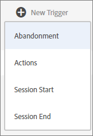
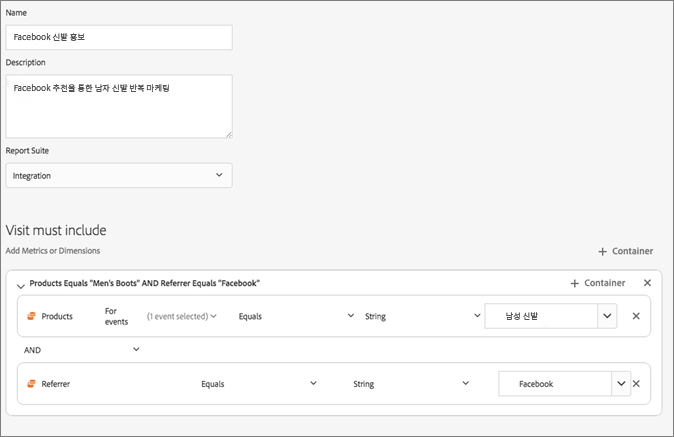

# Experience Cloud 트리거

[!UICONTROL Triggers] Experience Cloud에서 주요 소비자 행동을 식별, 정의 및 모니터링한 다음 교차 애플리케이션 커뮤니케이션을 생성하여 방문자를 다시 참여하도록 할 수 있습니다.

## 트리거 개요 {#topic_4F21FCE9A64E46E8B6D51F494FA652A7}

실시간 의사 결정 및 개인화에서 트리거를 사용할 수 있습니다. 예:

* 장바구니 포기 또는 제품이 제거된 장바구니 포기에 대한 재마케팅의 신속한 구성
* 불완전한 양식 및 애플리케이션
* 사이트에서의 모든 작업 또는 작업 순서

>[!NOTE]
>
>[!UICONTROL 트리거] 사용에 관한 자세한 내용은 [Campaign Standard](https://experienceleague.adobe.com/docs/campaign-standard/using/integrating-with-adobe-cloud/working-with-campaign-and-triggers/using-triggers-in-campaign.html?lang=ko-KR)에서 확인하실 수 있습니다.

### 트리거 유형

일반적으로 트리거는 마케팅 캠페인을 시작하는 데 15-90분 정도 걸릴 수 있습니다. 이것은 데이터 수집 구현, 파이프라인 로드, 정의된 트리거의 사용자 지정 구성 및 Adobe Campaign의 워크플로에 따라 달라집니다.

* **포기:** 방문자가 제품을 보고 장바구니에 추가하지 않을 경우에 실행할 트리거를 만들 수 있습니다.
* **작업:** 예를 들어 뉴스레터 등록, 이메일 구독 또는 신용카드 신청(확인) 후에 동작할 트리거를 만들 수 있습니다. 유통업의 경우 회원 프로그램에 등록한 방문자를 대상으로 트리거를 만들 수 있습니다. 미디어 및 엔터테인먼트에서는 특정 프로그램을 시청하고 설문 조사에 응답하기를 원하는 방문자를 대상으로 트리거를 만들 수 있습니다.
* **세션 시작 및 세션 종료:** 세션 시작 및 세션 종료 이벤트에 대한 트리거를 만듭니다.

## Experience Cloud 트리거 만들기 {#task_821F37183AC045E5AC8EED20317598FE}

트리거를 생성하고 트리거 조건을 구성합니다. 예를 들어, 장바구니 포기와 같은 지표 또는 제품 이름과 같은 차원과 같이, 방문 중의 트리거 규칙에 대한 기준을 지정할 수 있습니다. 규칙이 충족되면 트리거가 실행됩니다.

>[!NOTE]
>
>현재 트리거는 100개로 기술적 제한이 있습니다.

1. Experience Cloud에서 를 선택한 다음 **[!UICONTROL 데이터 수집/실행]**&#x200B;을 선택합니다.
2. [!UICONTROL 트리거] 카드에서 **[!UICONTROL 트리거 관리]**&#x200B;를 선택합니다.
3. **[!UICONTROL 새 트리거]**&#x200B;를 선택한 다음 트리거 유형을 지정합니다.

   

4. 다음 필드를 작성하고 지표 및 차원 항목을 규칙 컨테이너로 드래그하여 트리거를 구성합니다.

   | 요소 | 설명 |
   |--- |--- |
   | [!UICONTROL 이름] | 이 트리거의 이름입니다. |
   | [!UICONTROL 설명] | 이 트리거 및 이를 사용하는 방법 등에 대한 설명입니다. |
   | [!UICONTROL 보고서 세트] | 이 트리거에서 사용하는 Analytics [보고서 세트](https://experienceleague.adobe.com/docs/analytics/admin/manage-report-suites/report-suites-admin.html?lang=ko-KR) 입니다. 이 설정은 사용할 보고 데이터를 식별합니다. |
   | 포함 필수 방문 배제 필수 방문 작업 없음 이후의 트리거 메타데이터 포함 | 발생을 원하는 기준이나 방문자 행동과 발생을 원하지 않는 행동을 정의할 수 있습니다. 예를 들어 다음과 같은 간단한 장바구니 포기 트리거를 위한 규칙을 만들 수 있습니다.<ul><li>포함 필수 방문: [!UICONTROL 장바구니 추가] (지표) 및  [!UICONTROL 존재함]. (특정 제품 보기 또는 브라우저 유형과 같은 기준으로 규칙을 세분화할 수 있습니다.)</li><li>배제 필수 방문:  [!UICONTROL 체크아웃].</li><li>작업 없음 이후의 트리거: 10분</li><li>[!UICONTROL 메타데이터 포함]: [!DNL Campaign] 차원 또는 방문자 행동과 관련된 변수를 추가할 수 있습니다. 이 필드는 정확한 재마케팅 이메일을 만들기 위해 Adobe Campaign에서 사용할 수 있습니다.</li></ul> 규칙에 중요하다고 결정하는 기준에 따라  [!UICONTROL Any],  [!UICONTROL And] 또는  [!UICONTROL Or] 로직을 컨테이너 내에 또는 컨테이너 간에 지정할 수 있습니다. |
   | [!UICONTROL 컨테이너] | [!UICONTROL 컨테이너] 는 트리거를 정의하는 규칙, 조건 또는 필터를 설정하고 저장하는 위치입니다. 동시에 발생하기를 원하는 이벤트의 경우, 동일한 컨테이너에 있어야 합니다. 각 컨테이너는 히트 수준에서 독립적으로 처리됩니다. 예를 들어 AND 연산자로 두 개의 컨테이너가 연결된 경우 두 개의 히트 수가 요구 사항을 충족하면 규칙이 유효할 수 있습니다. |
   | 후에 새로운 세션 시작 | 세션 시작 및 세션 종료 이벤트에 대한 트리거를 만듭니다. |

   {style=&quot;table-layout:auto&quot;}

5. **[!UICONTROL 저장]**&#x200B;을 선택합니다.
6. [!DNL Adobe Campaign]에서 [실시간 재마케팅](https://experienceleague.adobe.com/docs/campaign-standard/using/integrating-with-adobe-cloud/working-with-campaign-and-triggers/about-adobe-experience-cloud-triggers.html?lang=ko-KR) 에 트리거를 사용합니다.

### 예제 트리거

Experience Cloud 트리거 예:

#### 장바구니 포기 트리거

예를 들어 다음 페이지에서는 방문 중에 본 제품에 기반하여 [!UICONTROL 장바구니 포기] 트리거를 사용할 수 있는 규칙을 보여 줍니다.

#### 레퍼러 트리거

다음 트리거는 제품이 남성용 부츠이고 레퍼러가 Facebook인 히트일 때 동작합니다. 두 기준(*제품* 및 *레퍼러*)은 동일한 히트에서 평가될 수 있도록, 동일한 컨테이너에 추가되어야 합니다.

